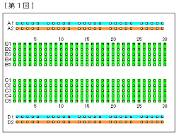
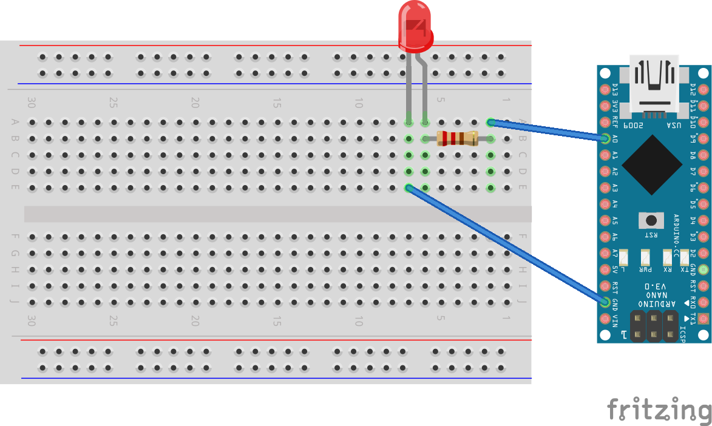

# Lチカをしてみよう
## 回路をつくろう
LEDチカチカさせるといっても、動かす回路がなかったら何もできません。  
ということで回路を組んでみましょう。  
簡単な回路を組むにはブレッドボードと呼ばれる板を使います。  

  
ブレッドボードは以上のように電気的に接続されています。  
これを利用して回路を作成します。  

今回の回路図はこちら↓  
  
LEDのアノード側をデジタルピン、カソード側をGNDに接続してください。

## プログラムを書こう
Arduinoは、今までとはすこし考え方を変えてプログラムしなければいけません。
ArduinoIDEを開き、デフォルト状態を少し眺めて見ましょう。  

```C
void setup() {
  // put your setup code here, to run once:

}

void loop() {
  // put your main code here, to run repeatedly:

}

```
こんな感じになってると思います。
これについて説明しましょう。  


Arduinoのプログラム(スケッチと言います)は、Setup部とループ部に分かれています。  
Setup部は起動時に一度だけ実行される(run once)関数です。  
ピンの設定や宣言など、何度も実行する必要のないものをここに書きます。  

ループ部は、Setup以降ずっと実行されます(run repeatedly)。  
今回は、ピン設定をSetup、Lチカさせる部分をループ部に書いていきます。  

## 実際のコード
```C
//出力を11番ピンにした例
void setup(){
  pinMode(11, OUTPUT);
}
  
void loop(){
  digitalWrite(11, LOW);
  delay(100);
  digitalWrite(11, HIGH);
  delay(100);
}
```
さあ解説していきましょう。  

`pinMode(11, OUTPUT);`  
pinModeは、ピンの初期設定をする関数です。  
第一引数は設定したいピンの番号、第二引数はピンのモードです。  
INPUT、OUTPUT、INPUT_PULLUPの中から選びます。PULLUPについては後ほど。  

`digitalWrite(11, LOW);`  
digitalWriteは、指定したピンから、電流を流します。  
第一引数は流したいピンの番号、第二引数は電流のモードです。  
HIGH/LOWに対応してON/OFFをします。  

`delay(100)`  
指定した秒数(ミリ秒)停止します。  

これを実行すると、0.1秒間隔でLEDがチカチカするでしょう。  

2023/08/03 written by Kohki S.  
ひとこと:ロボットが動かん。