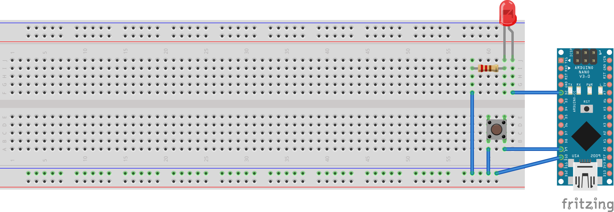

# デジタル入力を使おう
## ボタンを使ってみよう
今までは、とくにこちら側からArduinoに働きかけることはなく、勝手に無限ループをくりかえしていました。  
しかし、このままでは「ボタンが押された際に動きをかえる」みたいなことはできないわけです。  
そこで今回はボタン入力を使えるようにしてみましょう。  

## 回路を作ろう
いままでの回路にはボタンがのせられていないので、ボタンを載せた版の回路を組んでみよう。  
回路はこちら↓
  


## プログラム
今回中心となる処理は、「ボタンが押されたときにLEDを点灯する処理」です。  
これを踏まえて見てみてください。

```C
//入力 10番ピン 出力を5番ピンにした場合
void setup(){
  pinMode(10, OUTPUT); //ピンの初期設定 (出力)
  pinMode(5, INPUT); //(入力)
}
  
void loop(){
  int swich; //スイッチの状態を入れる変数
  
  swich = digitalRead(5); //5番ピンの状態を読み取る。
  digitalWrite(10, swich); //swichに書きこまれている HIGH/LOW によって、digitalWrite()が動作する。  
}
```

`pinMode(5, INPUT); `  
ピンの初期設定です。INPUTとすることで入力モードにできます。  

`int swich; //スイッチの状態を入れる変数`  
つづりが違うじゃないかって？  
Switchは、C言語の予約後なので使えません。  
変えるなら'int led_toggle_switch'みたいにしてもいいかも。

`swich = digitalRead(5); //5番ピンの状態を読み取る。`  
digitalReadは、返り値として引数で指定したピンの状態を返します。  

`digitalWrite(10, swich);`  
引数に変数を指定することもできます。

## 以上！
Arduinoはなんとなくわかってればいいのでこのへんで。  
STMをやりましょう。

2023/08/03 written by Kohki S.  
ひとこと:わざわざ書かなくてもよかったんじゃ...?