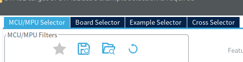
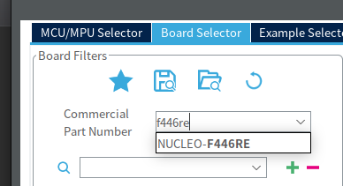
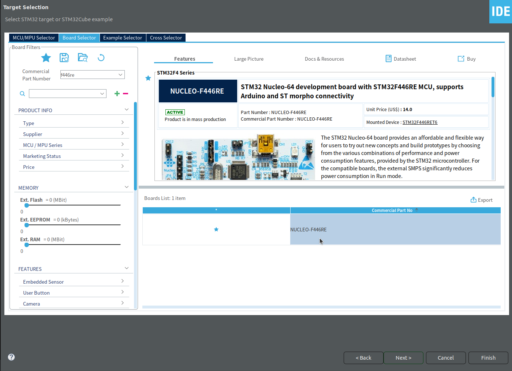
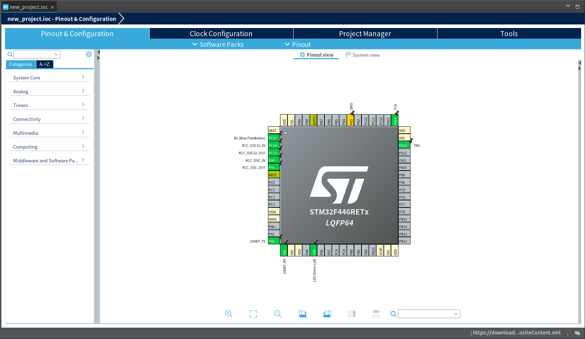

# チュートリアルといえば
## Lチカしてみよう
チュートリアルといえばLチカでしょう、ということでやっていきます。  
Arduinoだったら回路を組むところなんですが、なんとNucleoボードにはLEDが載っております。便利なものは使ったほうがいいでしょ。

## CubeIDEの使い方(プロジェクト作成編)
慣れればお手の物。

1. CubeIDEを起動  
   初回起動時は何個か設定があります。
2. ワークスペースを選択  
   デフォルトのものでも良いですが、ワークスペース内にプロジェクトが増えすぎるとバグるので、ほどほどに分けたほうが良いでしょう。
3. 上のタブから「Board Selector」を選択  
   
4. 「Commercial Parts Number」にボード名を入力  
   今回は「F446re」と入力してね  
     
5. 下の方にでてくる「NUCLEO-F446RE」を選択し、「Next」を押す
   
6. 次の画面でプロジェクト名と使用言語を選択  
   **わかりやすい名前をつけよう。大事。**  
   言語はどっちでもいいですが、C++が動けばCも動くのでC++でいいかも。  
   ただしC++を使う際は注意しないとうまく行きません(後述します)
   
7. 「Finish」をぽちー  
   色々出てくるダイアログは「Yes」連打でよし

## CubeIDEの使い方(ピン設定とか編)
チュートリアルついでに解説をします。  
STMには、ピンと呼ばれるインターフェイスがあり、通常はそれを用いて開発を行います。  
各端子には兼用機能があり、それぞれピン設定をすることで変更することができます。(UARTやCAN、I2C、GPIOやPWMなどが割当できます)  
ピン設定は、C言語で書かれたソースファイルをいじることでもできますが、めんどくさいのでGUIをつかって行います。  
1. .iocファイルを開き、「Pinout&Configuration」を開きます
   