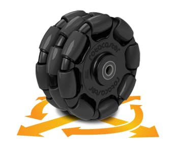
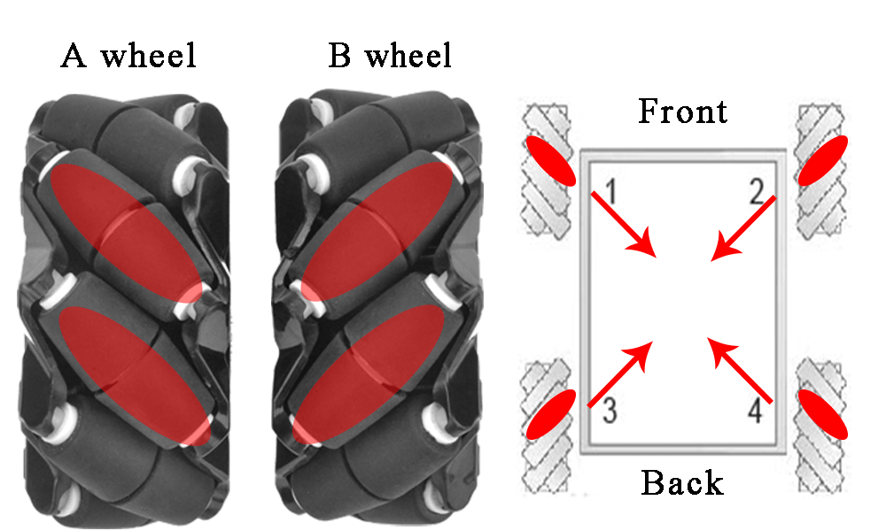

# オムニホイールとメカナムホイール
## オムニホイールって何？
オムニホイールとは、回転方向と垂直に回転するローラーを備えたホイールのことです。  
このローラのおかげて前後以外の方向に移動することができ、全方向移動ができるようになります。  
  

## メカナムホイールって何?
メカナムホイールとは、回転方向に対して斜め45度に傾いたローラーのついたホイールのことです。オムニホイールと同じく全方向移動ができます。
  
画像:https://osoyoo.com/ja/2019/11/08/metal-chassis-mecanum-wheel-robotic-for-arduino-mega2560-lesson1-robot-car-assembly/

# どうやって制御するの？
書き始めると日が暮れそうなので参考文献読んでね(はぁと)

# 参考文献  
オムニホイール制御の計算法 https://zenn.dev/k_kuroguro/articles/2653b3d92536da  
メカナムホイールロボットの制御 https://sgrsn1711.hatenablog.com/entry/2019/01/13/002459  

2023/12/11 written by Kohki S.  
ひとこと:職務放棄だぁ？  
知らん。時間がないんじゃ時間が