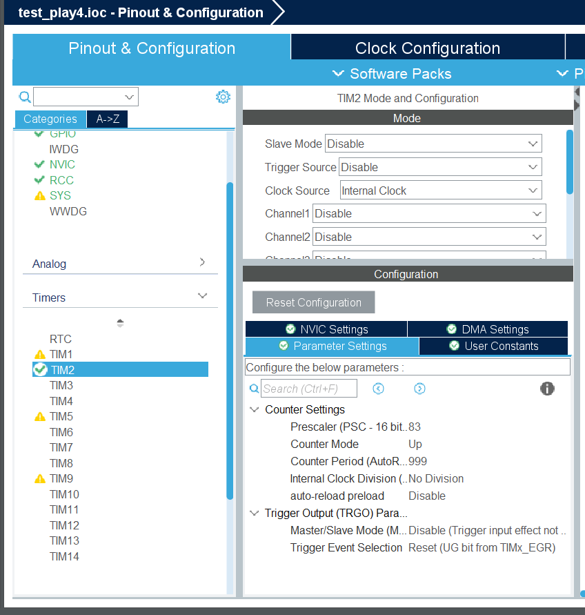
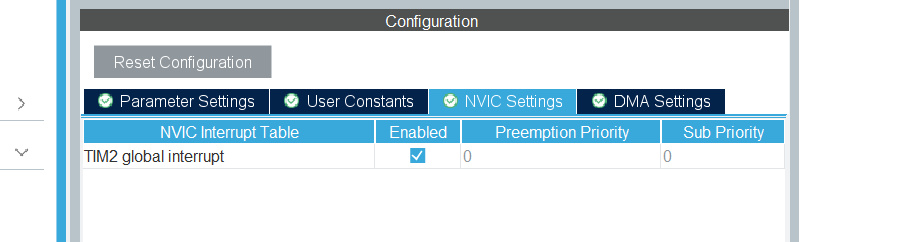
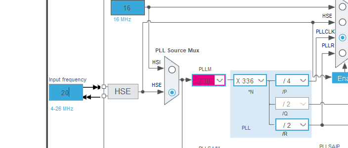
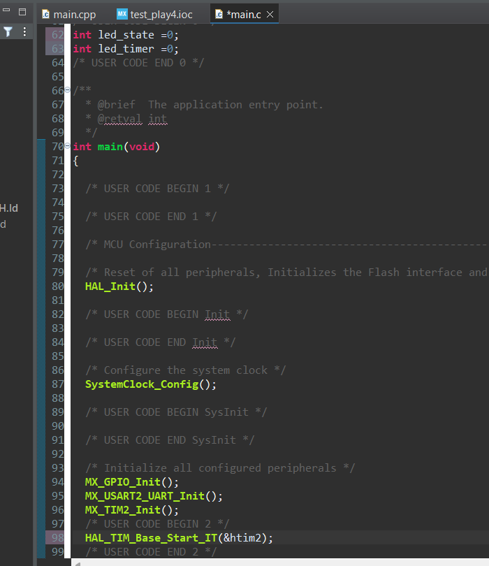

# タイマー割り込みをしよう
## タイマー割り込みとは?
今回はタイマー割り込みをやります。タイマー割り込みは、タイマーが設定した時間に達したときにCPUに通知し、割り込み処理を行う仕組みです。つまりは一定間隔で処理をするのです。割り込みの中では恐らく最も簡単です。  
## 早速やってみよう
今回は基板に載っているLEDを使って、0.3秒点灯→0.5秒消灯を繰り返させることを目標とします。  
これぐらいならHAL_Delayやれば割り込みしなくていいだろと思った方もいるかもしれませんが、HAL_Delayの間はなにも動くことができません。そのため、タイマー割り込みすることでHAL_Delayを使わず、かつその間に別の動作もできるような方法にするのです。  
今回はF446REを使ってやります。著者が使う基板の回路図によるとLEDが3つあり、それぞれのPINがLED1:PA10,LED2:PC5,LED3:PC4だったのでこいつを一定間隔でGPIOでやります。早速STMを起動して新しいプロジェクトを作ります。  
PIN設定の画面を開いたら、回路図に従ってPA10,PC4,5をGPIO_Output設定します。次に、下の画像のようにTimerからTIM2を選択し、Clock SourceをInternalClockに設定します。  



TIMは選択しますがChannelは設定しません。これは、PWMなどはタイマーを使って出力しますが、今回は単純に一定間隔で割り込み処理を呼び出すだけだからです。Prescalerは今回のAPB1timerclockが84MHzなので83,LEDは基本1kHzにするのでCounter Periodは999に設定します。  
ParameterSettingsの横にあるNVICSettingsを開くと、下の画像のようにTIM2 global interruptというものが出てきます。これは、TIM2の割り込みを有効化するかどうかを決めることができます。今回は割り込みをするのでEnabledはチェックを入れましょう。  



設定できたら、Clock Configurationを開きます。  
下の画像のようにクロックをHSEにし、Input frequencyを20にします。これは前にも言いましたが、使う基板に載っているクロックに刻印されている周波数を使います。著者の基板では20でした。  
APB1timer clockを84にしてEnterを押します。  



Ctrl + sで保存し、コードが自動生成されます。  
## コーディングをしよう
タイマー割り込みに使う関数がコチラ  
`HAL_TIM_Base_Start_IT(&htim2); `と`void HAL_TIM_PeriodElapsedCallback(TIM_HandleTypeDef *htim){}`です。どちらもHALライブラリの関数ですね。  
`HAL_TIM_Base_Start_IT(&htim2);`は割り込み開始の関数です。UARTでも似たような関数がありましたね。こいつは1回呼び出せばいいので、main関数に書きます。  
`void HAL_TIM_PeriodElapsedCallback(TIM_HandleTypeDef *htim){}`はタイマー割り込み処理の関数です。タイマーが一定のカウントまで到達するとこの関数の中の処理を開始します。前回同様これはUSER CODE BEGIN 4の下に書きます。一例ですが、今回は下の様な感じのコードを書きました。  
```cpp
void HAL_TIM_PeriodElapsedCallback(TIM_HandleTypeDef *htim)
{
  if (htim->Instance == TIM2) { // TIM2からの割り込み
    led_timer++;
    if (led_state == 0 && led_timer >= 500) {  // 消灯500ms経過
      HAL_GPIO_WritePin(GPIOA, GPIO_PIN_10, GPIO_PIN_SET);
      HAL_GPIO_WritePin(GPIOC, GPIO_PIN_4, GPIO_PIN_SET);
      HAL_GPIO_WritePin(GPIOC, GPIO_PIN_5, GPIO_PIN_SET); 
      led_state = 1;
      led_timer = 0;
    }
    else if (led_state == 1 && led_timer >= 300) { // 点灯300ms経過
      HAL_GPIO_WritePin(GPIOA, GPIO_PIN_10, GPIO_PIN_RESET);
      HAL_GPIO_WritePin(GPIOC, GPIO_PIN_4, GPIO_PIN_RESET);
      HAL_GPIO_WritePin(GPIOC, GPIO_PIN_5, GPIO_PIN_RESET);
      led_state = 0;
      led_timer = 0;
    }
  }
}
```
`htim->Instance == TIM2`でTIM2からの割り込みであることを確認し、led_timerを増やしていきます。tim2の周期は1kHzなので、1秒に1000回割り込みをします。つまり、1ミリ秒ごとに割り込みをするわけです。そのたびにled_timerを増やすことで、現在何秒経過したかが分かります。  
予めled_stateとled_timerは0にしておいて、消灯からスタートします。led_timerが500、つまり消灯から0.5秒経過したら点灯させ、led_stateを1にします。led_stateの値で、現在消灯か点灯どちらなのかが分かります。main関数の中と変数の宣言はそれぞれ下の画像のようにしました。  



書き終わったら、main.cをmain.cppにしてbuildをします。0error , 0warningsになればOKです。エラーが出た場合、設定したtimと割り込み開始関数にかいたtimの番号が違っている場合があります。  
ST-Linkを接続し、虫のマークを押してDebugし、再生ボタンを押せば基板にある小さなLED達が点滅します。Debugできない場合は、ST-Linkの接続不良か、モバイルバッテリーなどの電源供給ができていない可能性があります。  
うまくできたら、今回の目標は達成です。お疲れさまでした。次回はCAN通信をやります。お楽しみに!

2025/09/16 NAMATAMAGO314