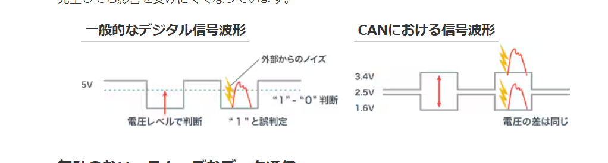
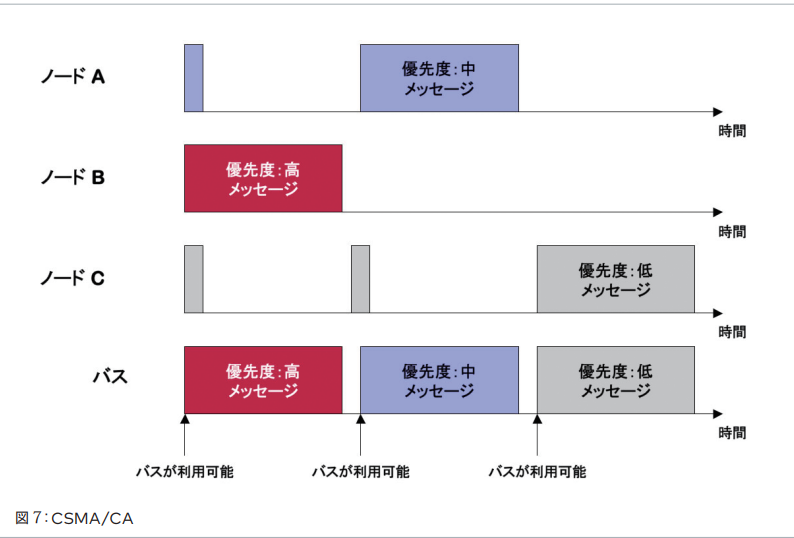
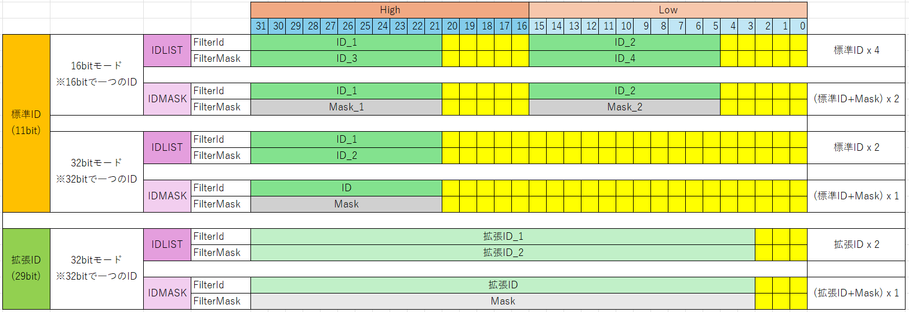
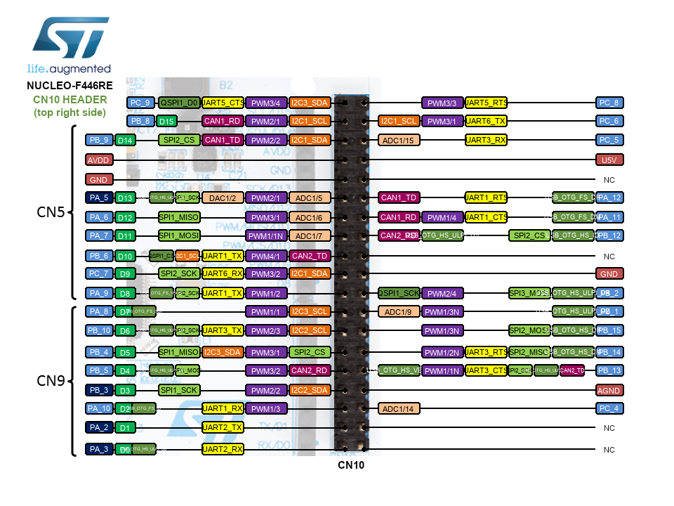
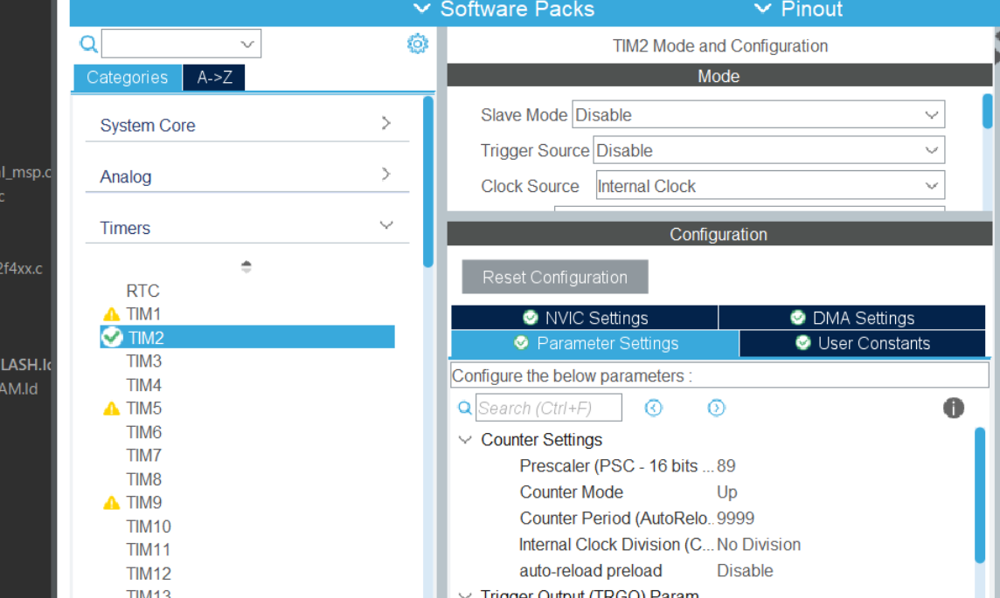
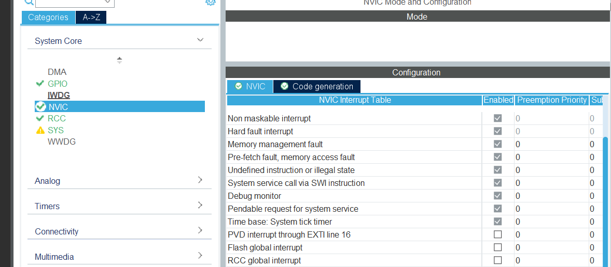
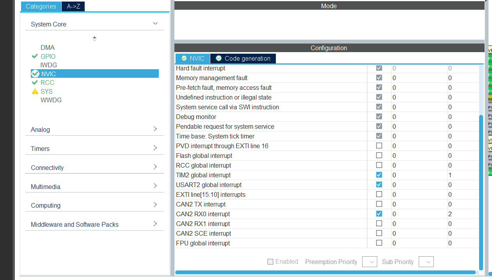
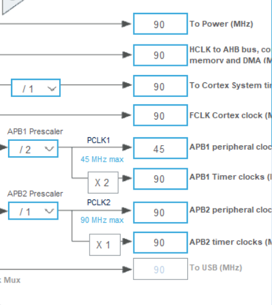

# CAN通信をやろう
## CAN通信とは?
今回やるのはCAN通信です。CANはController Area Networkの略で、今までのUARTやGPIOとは違う点がいくつかあります。  
前回やったUARTはマイコンと一つのデバイス間で行われる1対1の通信ですが、CANはマイコン一つに対し複数のデバイスと通信することができ、たった2本のケーブルで行うことができます。  
また、他の通信ではモーターの回転量などの情報を取得するためにはこちら側から関数で取得する必要がありますが、CAN通信ではモーターから勝手に送られてきます。CANはノイズに強いという特徴も持っています。これは、UARTなどは一つの線で電圧の大きさでデータのやり取りを行いますが、CANはCAN_HighとCAN_Lowの二線の電圧の差の大きさで通信をしています。  
そして、通信中に何らかの影響でノイズが入り、電圧が乱れてしまうことがあります。CAN以外の通信だと、この場合通常通りの通信ができなくなります。しかし、CANの場合は2線があり、ノイズは必ず両方に同じだけ影響するので結局のところ差が保たれ、通常通りに通信ができます(下の画像の通り)。これがCANがノイズに強い理由です。  



同じ線で複数の機器と通信できるのは、CAN IDという識別用のIDを機器それぞれが持っていて、それによって判別ができるからです。CANIDは16進数であらわされ、「0x100」や、「0x03A」といった感じになっています。0xは、この数字が16進数であることを表しています。今回はモーターからCANを受け取ってCAN割り込みをするのですが、その際もメーカーによってあらかじめモーター固有のIDを決められています。  
### CANフィルター(feat.回路班)
CAN通信はたくさんのマイコン、PCなどを接続することができます。そうすると大きな問題が出てきます。  
「優先順位をどう決めるか」です。  

優先順位については、IDの数が小さい方が優先されます。具体的な優先順位の決め方は後述しますが、読まなくて結構です。  
「IDが小さいほうが優先されるから、重要な通信のIDを小さい数にした方が良い」ということだけ覚えておいてください。  
まあ、十分速いのであんまり気にしなくてもよい。  
例)非常停止とモーターを回す指令なら、非常停の方が大事なので小さくする、など  

興味があればどうぞ↓  
例えばIDが0x350と0x314と0x271の通信が同時に行われようとしたとしましょう。  
それぞれを16進数から11bitの2進数(後で説明しますが、IDは基本11bitなので)に変換すると  
```cpp
0x350 -> 0b01101010000  
0x314 -> 0b01100010100  
0x271 -> 0b01001110001  
```  
になります。優先順位の決め方は、「上の桁から順番に見ていって他のIDが1のときに0になってたやつが優先される」です。  
この場合、  
①まず、3つのIDが競合します。左から3bit目が1,1,0になっているため、0x271が優先され、0x271の情報が送られます  
②残っているのは2つで、0x271が送信終了した後、また競合します。今度は左から5bit目で0と1になって、0x314が送信できます  
③送信終了後、0x350は競合がいないので、無事、0x350が送信されます  
なお、③のときに0x271がもう一回送ろうとしたら、0x271が優先されます。  
このように比較するため、IDの数が小さい方が優先されます。  

  

さて、ここまでCANの説明をしてきましたが、もっと詳しく知りたい方はググってください  
これもおすすめです↓  
[初めてのCAN/CANFD](https://cdn.vector.com/cms/content/know-how/VJ/PDF/For_Beginners_CAN_CANFD.pdf)  

では本題に入りましょう。  
```cpp  
  CAN_FilterTypeDef filter;
  filter.FilterIdHigh         = 0x001 << 5;    // フィルターID1
  filter.FilterIdLow          = 0x002 << 5;    // フィルターID2
  filter.FilterMaskIdHigh     = 0x003 << 5;    // フィルターID3
  filter.FilterMaskIdLow      = 0x004 << 5;    // フィルターID4
  filter.FilterScale          = CAN_FILTERSCALE_16BIT; // 16モード
  filter.FilterFIFOAssignment = CAN_FILTER_FIFO0;      // FIFO0へ格納
  filter.FilterBank           = 0;
  filter.FilterMode           = CAN_FILTERMODE_IDLIST; // IDリストモード
  filter.SlaveStartFilterBank = 14;
  filter.FilterActivation     = ENABLE;

  HAL_CAN_ConfigFilter(&hcan1, &filter);
```  

以上がフィルターの設定になります  

1行目で"CANFilterTypeDef"という型のfilterという名前の構造体を定義しています  
2行目以降の"filter.～～"はfilterという名前の構造体の中の～～という意味になります。  
少し飛んで7行目は、受け取った情報をどこに保存するか、ということを定義しています。STM32において、CANで受け取った情報はFIFO0(フィフォゼロ)かFIFO1のどちらかに保存されます。それぞれ3つずつ、受け取った情報を保存できるMailBoxがあります。このFIFOに情報を保存するかを判別するのがfilterになります。また、CANが2つあるマイコンはそれぞれにFIFO0,FIFO1があります。  
11行目はCANのフィルターを有効にするか、を定義します。有効にするときはENABLE、無効にするときはDISABLEにします。有効にしないと使えないので、基本的には有効にしましょう  

最後の行のHAL_CAN_ConfigFilterはCANのフィルターの設定をする関数です。これより上の行は"CAN_FilterTypeDef filter;"の値を決めていっただけです。  HAL_CAN_ConfigFilterの引数を見てください。第一引数はcan1かcan2を選択します。CANがひとつしかない場合、&hcanとなります。第二引数は"CAN_FilterTypeDef filter;"のポインタを渡します。なので、  
```cpp
HAL_CAN_ConfigFilter(&hcan1,&filter);  
```
になります。  

まあ、ここまではテンプレ通りに書けば問題ないでしょう。本題の本題に入ります。  

フィルターにはリストモードとマスクモードがあります。リストモードは設定したいフィルターをひとつひとつ羅列していきます。必要なIDが少ないときはこれでいいでしょう。
マスクモードはフィルターIDとマスクをセットにして使います。  
仕組みは簡単です。「フィルターIDとマスクの論理積と受信したIDとマスクの論理積が一致したら受けとる」です。  
例えば、0x010～0x01FのIDをすべて受け取るとします。  
2進数に変換すると、00000010000～00000011111です。勘のいい皆さんならお気づきかもしれませんが、右から4bitまでは0でも1でもどちらでもいいのです。つまり、左から7bitが"0000001"であればすべて受け取るようにすればよいのです。  
まあ、論理積というのは軽く知っていれば良いです。実際に使うときは、以下の表のようにすれば良いです。  
|      When      |   ID   |   MASK   |
|:--------------:|:------:|:--------:|
|       1        |   1    |     1    |
|       0        |   0    |     1    |
| どちらでもいい  | 0 or 1 |     0    |  

簡単にまとめると、MASKは一致していないといけないbitは1, どっちでもいいbitは0にすればよいのです。  

では、先ほどの例に戻ります。IDは0x010(0b00000010000)として、MASKは左から7bitは一致してなければならず、それより右の4bitはどちらでもいいので、0b11111110000 = 0x7F0とすればよいです。  

では、これをプログラムにしていきましょう。  
ちょっと間が空いたので再掲します。  
```cpp  
  CAN_FilterTypeDef filter;
  filter.FilterIdHigh         = 0x001 << 5;
  filter.FilterIdLow          = 0x002 << 5;
  filter.FilterMaskIdHigh     = 0x003 << 5;
  filter.FilterMaskIdLow      = 0x004 << 5;
  filter.FilterScale          = CAN_FILTERSCALE_16BIT;
  filter.FilterFIFOAssignment = CAN_FILTER_FIFO0;
  filter.FilterBank           = 0;
  filter.FilterMode           = CAN_FILTERMODE_IDLIST;
  filter.SlaveStartFilterBank = 14;
  filter.FilterActivation     = ENABLE;

  HAL_CAN_ConfigFilter(&hcan1, &filter);
```  
9行目のFilterModeでリストモードかMASKモードか設定します。この場合は"CAN_FILTERMODE_IDLIST;"なので、リストモードです。MASKモードにする場合は、  "CAN_FILTERMODE_IDMASK;"(語尾が変わっただけ)にします。  

下の表を見てください。  

  

表のように、32bitx2で構成される"フィルターバンク"という、フィルターの情報を保存できるやつがあります。  
2～4行目でそれぞれ表の位置にアクセスしています。  
上記のプログラムはこのフィルターバンク32bitx2をどう使うかを設定しています。  
filter.FilterScaleで16bitモードか32bitモードかを選択します。  
これが結構重要なのですが、黄色いマスは他の情報が入るので、空けなければなりません。  
しかし、単純に  
filter.FilterIdHigh = 0x001;  
のようにすると、FilterIdHighの領域のなかで、右詰めされてしまいます。しかし、表を見て分かる通り、左詰めしなければなりません。そのため、ビットシフトという、ビットをずらす操作をします。先ほどの例のプログラムは5bit左にシフトしなければなりません。それを行っているのが、" << 5"です。  
使う価値がないので使いませんが、32bitモードの通常のIDを使う場合は21bit左にシフトする必要があるため。" << 21"となります。  

少し難しいのが拡張IDです。ロボコンでは使う必要はない(2025年現在)ので、軽く説明だけします。読み飛ばしても結構です。  
29bitのうち、上から16bitをHigh, 下13bitをLowに入れます。  
方針としては、  
(1)3bit左シフト  
(2)16bit右シフト→Highに代入  
(3)(1)と0xFFFFの論理積(and)をLowに代入  
こんな感じです。参考用に置いておきます(0x01ABCDE0～0x01ABCDEFをMASKモードで受け取る例)  
```cpp  
filter.FilterIdHigh     = (0x01ABCDE0 << 3) >> 16;
filter.FilterIdLow      = (0x01ABCDE0 << 3) & 0xFFFF;
filter.FilterMaskIdHigh = (0x1FFFFFF0 << 3) >> 16;
filter.FilterMaskIdLow  = (0x1FFFFFF0 << 3) & 0xFFFF;
```  
さて、残るはあと二つ  
```cpp  
filter.FilterBank           = 0;  
filter.SlaveStartFilterBank = 14;  
```  
ですね。  
フィルターバンクは32bitx2のやつでしたね。じつは、このフィルターバンクが14個か28個あり、それぞれ0～13(または0～27)の番号が振られています。基本的にCANが2つあるマイコンは28個、1つのマイコンは14個らしいです。  
そのうちのどれを使うかを定義するのがfilter.FilterBankです。  
CANが二つあるマイコンは、フィルターバンクをCAN1とCAN2で共通になっています。  
そこで、SlaveStartFilterBankでCAN2で使うフィルターバンクの一番最初の番号を定義します。そのプログラムの中で、最も先に定義されたものが採用されます。この値は0～28で、0のときフィルターバンクを全てCAN2で使い、CAN1の受信はできなくなります(送信はできる)  
逆に、28にすると、CAN2の受信ができなくなります。  
また、偶数はCAN1、奇数はCAN2などという風に分けることはできず、N未満はCAN1、N以上はCAN2という風に分ける必要があります。  
特に事情がない場合は、14に設定しておけば良いでしょう  
当たり前ですが、CANが一つしかない場合は関係ありません  

まとめ  
```cpp  
  CAN_FilterTypeDef filter;                           　//filterという名前の構造体を定義
  filter.FilterIdHigh         = 0x001 << 5;             //IDや
  filter.FilterIdLow          = 0x002 << 5;             //Maskを
  filter.FilterMaskIdHigh     = 0x003 << 5;             //定義
  filter.FilterMaskIdLow      = 0x004 << 5;             //する
  filter.FilterScale          = CAN_FILTERSCALE_16BIT;  //16bitモードか32bitモードかの選択
  filter.FilterFIFOAssignment = CAN_FILTER_FIFO0;       //受信したデータの保存先(FIFO0 or FIFO1)
  filter.FilterBank           = 0;                      //使用するフィルターバンク(0～13 or0～27※マイコンによって違う)
  filter.FilterMode           = CAN_FILTERMODE_IDLIST;  //フィルターのモード(IDLIST or IDMASK)
  filter.SlaveStartFilterBank = 14;                     //CAN2のフィルターバンクの始まり(この場合0～13：CAN1,14～27：CAN2)
  filter.FilterActivation     = ENABLE;                 //フィルター(有効：ENABLE, 無効：DISABLE)

  HAL_CAN_ConfigFilter(&hcan1, &filter);                //定義した構造体を関数に入れてフィルター設定完了  
  ```  
※この関数を実行したら、CAN_FilterTypeDef filterの中身は不要なので、二つ以上フィルターバンクを使う場合は、もう一度定義し直せばよいです。  
```cpp  
  CAN_FilterTypeDef filter;  

  ～～フィルターとかモードとかの定義～～  
  HAL_CAN_ConfigFilter(&hcan1, &filter);  

  ～～もう一度別の設定を定義～～  
  HAL_CAN_ConfigFilter(&hcan1, &filter);  
 
  ～～今度はCAN2で～～  
  HAL_CAN_ConfigFilter(&hcan2, &filter);  
```
練習問題  
CAN1で、0x100～0x108と、0x001を受け取り、CAN2で0x201～0x204を受けとるフィルター設定を書いてみましょう  

ヒント(右から読んでね)  

うよ考で別は801x0と701x0～001x0  

### 送信メッセージの形
UARTでは、送信するメッセージは二進数に変換してストップビットやパリティビットを付け加えて送信していました。CAN通信も独自の加工をして送信しています。  
CANで送信するメッセージは下のような形をしています。  

[SOF][ID][RTR][IDE][r0][DLC][DATA][CRC][ACK][EOF]  

メッセージにさまざまなものがくっついているのが分かります。  
- SOF: Start of Frame(フレーム開始)
- ID: CAN ID(11bit)
- RTR: Remote Transmission Request
- IDE: Identifier Extension(IDの長さを示す)
- DLC: Data Length Code(送信データのバイト数)
- DATA: データ部分(0～8bit)
- CRC: Cyclic Redundancy Check(データの破損チェック)
- ACK: Acknowledgment(メッセージ受信成功の合図)

それぞれの機能はこんな感じで、特に重要なのはID,DLC,DATAで、この3要素は私たちの制御に深くかかわってきます。  
## 早速やってみよう 
今回はロボマスモーターというCANで動くモーターを動かします。  
STMのLiveExpressionでマイコンに目標値(ロボマスモーターの目標スピード)を設定→CANでロボマスに送信→ロボマスから情報受信→PCにUARTで送信  
このような手順で今回はやっていきます。  
早速STMを起動して新しいプロジェクトを作ります。F446REを使います。  
CAN通信も当然Tx(送信)とRx(受信)が必要です。今回は公式が出している基板(NUCLEO基板)を使います。PIN配置は公式が出しているシートから確認します。下の画像のように、CAN2_TxがPA2,RxがPA3,USART2TxがPB13,RxがPB12でした。

  

今回はCAN割り込みとUART割り込みとタイマー割り込みをします。ロボマスから送られるCANはUARTに比べて速度がとても速いので、受信するたびにPCに送信するのではなく、一定時間たったら送ります。そのためにタイマー割り込みを使うのです。今回はAPB1timerclockを90MHzにする予定なので、下の画像のようにClockSourceをInternalClockに、Prescalerを89,Counter Periodを9999にして、10Hzの通信速度でPCに送信します。  

  

前回同様Enabledのチェックを入れるのを忘れずに。USART2も前のようにModeをAsynchronousにし、Enabledのチェックを入れます。  
次に、下の画像のようにConnectivityからCAN2を選択し、ModeのActivatedにチェックを入れ、パラメータをこのように設定してください。  

  

Prescalerは以前説明したので大丈夫だと思います。その下のTime Quanta in Bit...は、サンプリングポイントというものを設定するための値です。Segment1と2があります(以降TSeg1,2と呼ぶ)。Baud Rateはcanの通信速度の様なもので、CANは基本的に1Mbps(1000000bps)です。その下のReSynchronization Jump...(これ以降SJWと呼ぶ)は、これまたサンプリングポイントのための値です。ここは基本的に1に設定しておきます。Baud Rateの計算式は下の通りです。  

 Baud Rate = (APB1timerclockの値(単位はHz))/(Prescaler*(SJW+TSeg1+TSeg2))  

計算が心配な人のためにボーレート計算ツールを作っておきました。  

[CANボーレート計算機](https://www.desmos.com/calculator/qr4m3il6hh?lang=ja)  

NVICSettingsをクリックし、下の画像のようにCAN2 RX0 interruptにチェックを入れます。今回はCANを受信したら割り込みを行うので、RXの割り込みを有効にします。受信したメッセージはFIFOというものに格納されるのですが、FIFOにはFIFO0とFIFO1があります。基本的にFIFO0を使うので、RX0を有効にするのです。  

  

それができたら、下の画像のようにSystem CoreからNVICをクリックしてください。  



ここでは、割り込み設定や割込み処理の優先順位などを設定できます。今回のように、タイマー割り込みやCAN割り込みなど複数の割り込みがある場合、同時に割り込みが発生したときの優先順位を決める必要があります。数字が2列並んでいますが、右の列では先ほど言ったような優先順位を決めることができます。数字が小さいほど優先順位が上になります。今回は画像の通りに設定してください。  

  

次に、CloclkConfigurationを開きます。
いつものように基板の外部クロックの刻印を確認し、それに応じてInput frequencyを設定し、HSEを選択します。APB1timerclockは、下の画像のように90MHzにしてください。理由は特にないですが、なんかうまくいったので90にしました。  
ちゃんと知りたい人はデータシートを読みましょう by回路班 



Ctrl + sで保存し、コードが自動生成されます。  
## コーディングをしよう
CAN割り込みに使う関数がコチラ  
`HAL_CAN_Start(&hcan〇);`と`HAL_CAN_ActivateNotification(&hcan〇, CAN_IT_RX_FIFO0_MSG_PENDING);`と`void HAL_CAN_RxFifo0MsgPendingCallback(CAN_HandleTypeDef *hcan){}`です。全てHALライブラリの関数です。  
`HAL_CAN_Start(&hcan〇);`は通信開始の関数で、今回はCAN2なので〇には2が入ります。`HAL_CAN_ActivateNotification(&hcan〇, CAN_IT_RX_FIFO0_MSG_PENDING);`は特定の条件を満たすと割込み関数を呼ぶもので、今回の様な`CAN_IT_RX_FIFO0_MSG_PENDING`の場合はCANでメッセージを受信したときに割り込みが発生するようになっています。〇には2が入ります。  `voidHAL_CAN_RxFifo0MsgPendingCallback(CAN_HandleTypeDef *hcan){}`は割り込み処理の内容を書きます。一例ですが、下のような感じです。  
```cpp
void HAL_TIM_PeriodElapsedCallback(TIM_HandleTypeDef *htim){
	char msg[64];
	sprintf(msg, "Angle:%d, Torque:%d, Velocity:%d\r\n",data[0], data[1], data[2]);
	HAL_UART_Transmit(&huart2, (uint8_t*)msg, strlen(msg), 100);
}

void HAL_CAN_RxFifo0MsgPendingCallback(CAN_HandleTypeDef *hcan){
    CAN_RxHeaderTypeDef RxHeader;
    CAN_TxHeaderTypeDef TxHeader;
    uint8_t TxData[8] = {0};
    uint32_t TxMailbox;
    TxHeader.StdId = 0x200;
    TxHeader.RTR = CAN_RTR_DATA;
    TxHeader.IDE = CAN_ID_STD;
    TxHeader.DLC = 8;
    
    HAL_CAN_GetRxMessage(hcan, CAN_RX_FIFO0, &RxHeader, RxData);
    for(int i=0;i<3;i++){
    	data[i] = (uint16_t)RxData[2*i]<<8|RxData[2*i+1];
    }
    TxData[0] = (send_data >> 8) & 0xFF;
    TxData[1] = send_data & 0xFF;
    HAL_CAN_AddTxMessage(hcan, &TxHeader, TxData, &TxMailbox);
}
```  

機器不足のためここまでで一旦停止。


# さいごに
これにて、ロボコンの低レイヤーがやるべき基本制御はコンプリートです。よく頑張りました。自分をいっぱい褒めてあげましょう。しかし、これはまだ本当に基本的な制御に過ぎません。ここから先、自分の力で楽しく質のいい制御をやっていくためには経験や知識、発想力が重要になってきます。自分からすすんで仕事を見つけ、知識を蓄えながらリラックスしてやっていけばきっと、頼れるロボコ二ストの一人として輝けると思います。  
調べる力、楽しむ心、そして自信。この3つを大切にしてください。  

ここから先、「GitHub」についての資料と、「PID制御」などの少し発展した制御の資料も書くかもしれません。お楽しみに!  
### 回路図提供してくれたT君からあなたへ
データーシートを見ましょう。そしてAIの情報は鵜呑みにせずに情報元をきちんと調べましょう。   

2025/09/17 NAMATAMAGO314


