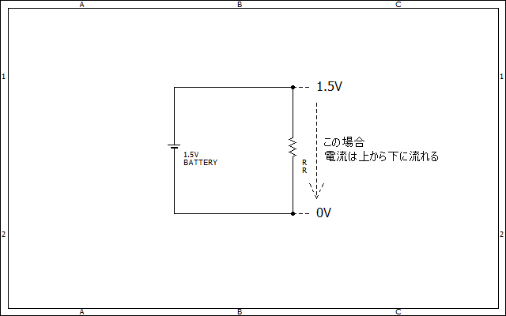
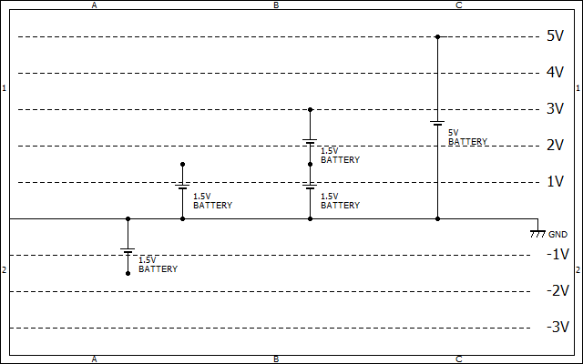
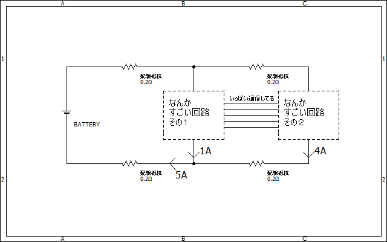
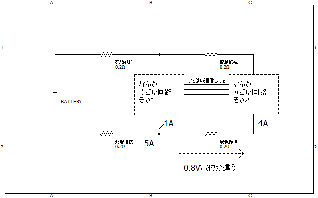

# GNDってなんだろう  
基板や回路図を見ていて「GND」という表示を見たことはありますか？  
今回は電子工作をする上で一番と言ってもいいぐらい大切な概念、GNDについて初心者向けに書いていこうと思います。  

## 電位とは  
GNDとは何たるかを説明する前に、まずは電位の概念を理解しましょう。  
ご存じの通り、電流は電圧の高い所から低い所に流れます。  
  
よく電気は水の流れにたとえられますよね。
水が高い所から低い所へ流れるように、**電気も電位の高い所から低い所に流れます**。
電圧という言葉はつまりは電位差、つまり「電位の差」のことを指しています。

## GNDは電位の基準点  
GNDとは何たるかを一言で説明するとするならば、**GNDは電位の基準点**という風になります。  
どういう意味でしょうか。  
下の図を見てみてください。  

  

複数の電圧源（電池）がGNDに接続されていますね。  
GNDのイメージとしてはこんな感じで、電圧が0Vとなっている場所と考えることができます。  
GNDにどのように電源が繋がれていても、**GNDの電位はは常に0Vです**。  

電位を標高に例えるとするならば、GNDは海抜0m地点、ということになりますね。

## 回路を組む上でのGNDの重要性  
GNDは電位の基準点、という風に際ほど書いたように、安定したGNDが確保されていることが安定した回路を製作する上での大前提となります。  
やわらかい地盤の上では安定した家を建てることができないのと同じように、GNDが不安定では安定した回路を制作することはできません。  

では、どうすれば安定したGNDを確保することができるのでしょうか。
答えは簡単。GNDラインの配線抵抗[^1]が極力小さくなるようにすればいいのです。  

次のような回路を考えてみましょう  
  
二つの回路があってその間でいろいろ通信していますね。  
しかし二つの回路の間には配線による電気抵抗が存在しています。  
この二つの回路のマイナス側の電位差はどれほどでしょうか  

オームの法則を思い出してみましょう。V=IRっていうやつですね。  
今回はI=4A,R=0.2ΩなのでV=IR=4*0.2=0.8Vの電位差があることが分かります  
  
0.8Vぐらいなんてことないように感じるかもしれませんが、回路によってはかなり大きな誤差になってしまいます。  
とくにアナログな信号でデータを送る光センサーや加速度センサーなどでは大変なことになってしまいます。[^2]  

このような電位差が発生しないようにするにはGNDの配線抵抗が極力小さくなるようにするのが最も効果的です。**GNDラインの配線は極力太く短く**すると良いでしょう。  

[^1]:まあ正確には配線インピーダンス（交流の電気に対する抵抗もふくんだやつ）ですが。  
[^2]:例えば[KXR94-2050](https://akizukidenshi.com/catalog/g/gM-05153/)という加速度センサーの場合ですが、このセンサーは感度が660mV/gなので0.8V変化すれば結果が1.2gも変わってしまうことになります。あ、このgは重力加速度ですよ