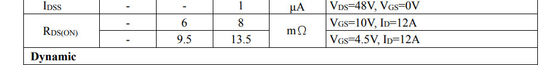
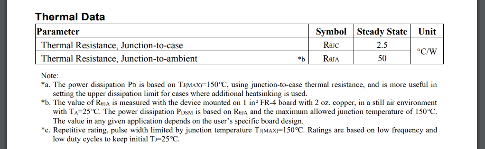
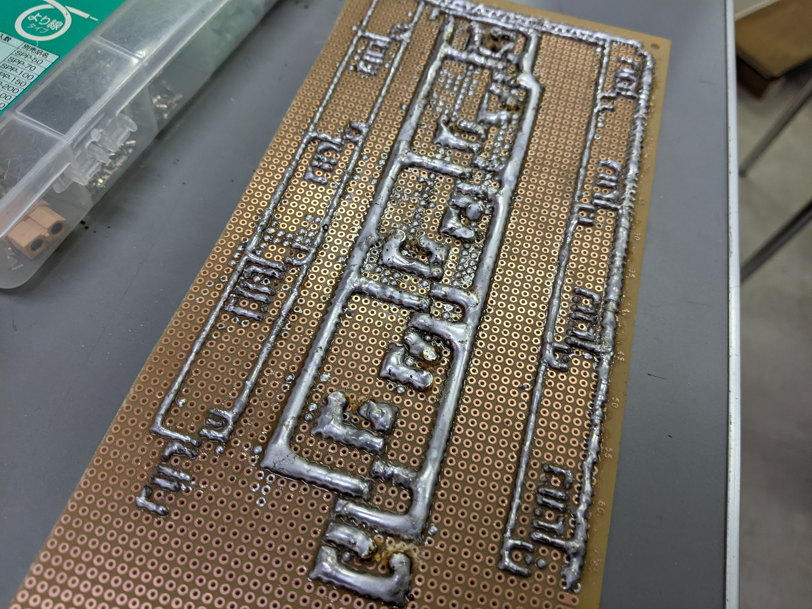
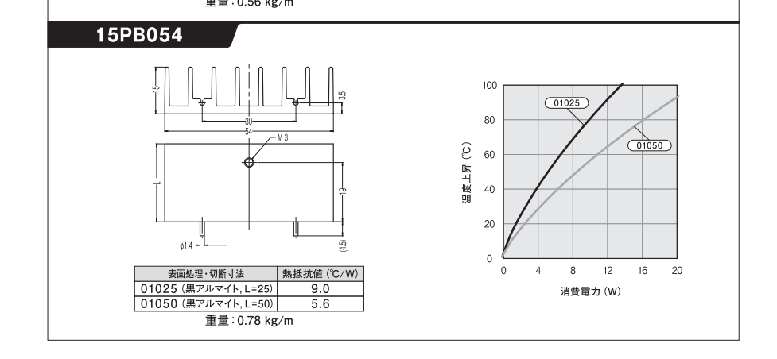
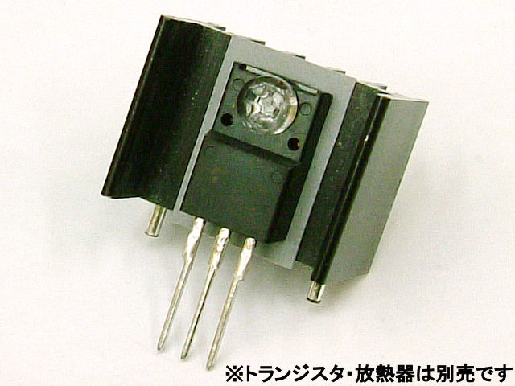
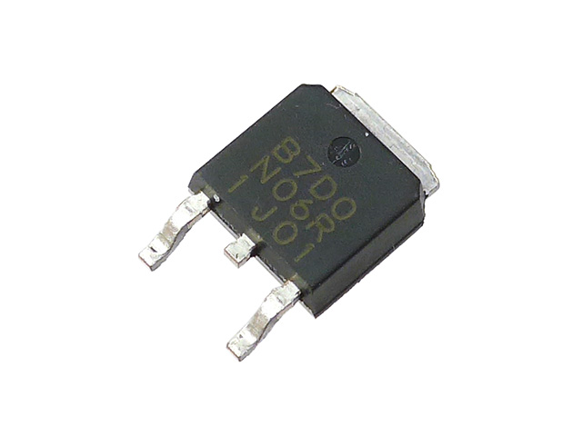
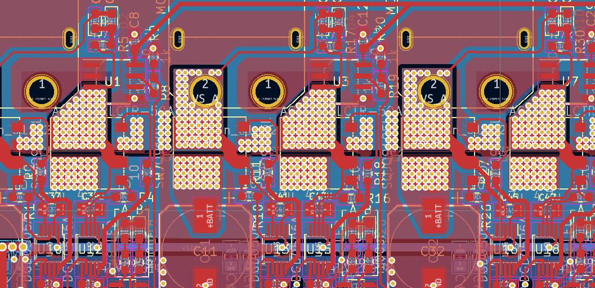

# PCB基板における熱設計のいろは  

モタドラなどのパワー系基板において、部品の放熱を効率的に行うためにはしっかりとした熱設計が不可欠です。  
ということで、ここでは表面実装に関する基本的な熱設計のやり方について書いていこうと思います。  

## 熱設計をするべき場所  

そもそも論として、どの部品に大して熱設計をすべきかどうか、ちゃんと見極める必要があります。基本的には部品のパッケージと消費電力を見て、真面目に考えるか、それとも適当に済ませるかを判断します。  
目安としてはこんな感じ。  


| パッケージ | 目安となる消費電力 | ありがちな部品 |
| :---: | :---: | :---: |
| TO-252 | 1W | リニアレギュレータ |
| D2PAK | 3W | つおいMOSFET |
| SOT-23 | 0.3W | ちいさいリニアレギュレータ |

あ、パッケージの写真とかは[~~こちらの記事~~（まだ書いてないヨ）](../circuit_parts/parts_package.md)を参照するといいかも。  

この表は完全な主観です。なのであくまで参考程度に。  
これらを超えそうな場合はちょっと真面目に放熱を考えましょう。  

ちなみに、瞬間的な最大消費電力に関しては基本的に無視してOKです。熱設計を必要とするのは**連続して高負荷がかかる箇所**になります。

## どれぐらい熱くなるか調べよう  

熱設計を考える前に、まずはどれくらい部品が熱くなるのか把握しておきましょう。
取敢えず、このMOSFET（60V53A）で連続20A級モタドラを作ることを想定して考えてみましょう。  
https://akizukidenshi.com/catalog/g/gI-17191/  
ちなみにパッケージはTO-252です。

### 消費電力を考える  

データシートを見てみると、このようにON抵抗が記述されています。  
  
ゲート電圧は12Vちゃんと印加すると仮定して、Ron=8mΩとして計算すると  

```math
Pon=RI^2=8[mΩ]*20^2=3.2[W]
```  

うーん、そこそこ大きい。
では、このとき具体的に何度ぐらいまで温度上昇するのでしょうか。  
データシートをよく見てみるとこんな項目があります。  
  
なんか温度に関わってそうな [℃/W] とかいう単位がありますね。  
単位の意味としてはそのままで、**1[W]につき何度温度上昇するか**、という意味の単位になります。  

さて、**Thermal Resistance,Junction-to-case**というものがありますね。直訳すると、「ジャンクション[^1]からケース（パッケージ）の間の熱抵抗」という意味です。  
内部の半導体素子からパッケージ表面までの間に存在する熱移動を妨げる要素の量を表しています。  
…なんか分かりづらいですよね。  
まあ、**部品に熱容量無限大のヒートシンクをくっつけた時の温度上昇**を意味した単位って解釈していいと思います。逆に言えば、どれだけ頑張って冷却してもこれ以上は冷えません。許容損失などの値もこの値から計算できます。  

そしてもひとつ、**Thermal Resistance,Junction-to-ambient**というものがあります。訳すと「ジャンクション[^1]から周囲への熱抵抗」という意味になります。  
周囲ってなんやねんっていう話ですが、データシートの下の方に意味が書いてあります。
" The value of RθJA is measured with the device mounted on 1 in²FR-4 board with 2 oz. copper, in a still air environment
with TA=25°C. The power dissipation PDSM is based on RθJA and the maximum allowed junction temperature of 150°C.
The value in any given application depends on the user’s specific board design"  

訳すと、「RθJA の値は、2 ozの 1 in²FR-4 ボード[^2]にデバイスを実装して測定を行った。 銅と空気の温度はTA=25℃で。 消費電力 PDSM は、RθJA と最大許容接合部温度 150°C に基づいています。特定のアプリケーションでの値は、ユーザー固有のボード設計によって異なります。」  

まあ要はそれなりの面積の銅箔を持つ基板に実装して温度上昇を測定したらRθJAの値になったよ～～っていう話です。  

さてそれでは、実際にどれくらいの温度になるのか計算してみましょう。  
一旦RθJAの方の値を参照して計算しましょう。  
熱抵抗に消費電力を掛けて、周辺温度を足せば温度を求められます。  

```math
T_{RθJA}=3.2[W]*50[℃/W]+25[℃]=185[℃]
```

いや草。これは真面目に設計しないと厳しそうですね…。でもヒートシンクを使わないと死ぬかと言われると、本気で熱設計すればぎりぎり耐えそうな気もします。  

というわけで、ヒートシンクを使わなくても~~ギリギリ~~耐えるような基板設計をしていきましょう。  

## 冷える基板設計  

基本的に、表面実装部品の放熱は基板を介して行います。そのため、如何に基板に熱を伝えるか、そして基板の熱容量・放熱性を如何に大きくするかというのが、熱設計における肝となります。  

#### 手段1:銅箔を広くする  

基本的に基板の銅箔面積を広くすればするほど、放熱性能は高くなります。  
要は銅箔をヒートシンクにするっていうことですね。簡単ですが確実な効果を見込めます。  

#### 手段2:サーマルビアを打ちまくる  

銅箔を広げようと思っても、他の部品の干渉などといった要因から限界があります。そういう時は基板の他の層に熱を逃がすようにしましょう。  
また、ビアに使用される銅によって熱容量の増加も見込むことができます。  

サーマルビアの間隔は1.2mm程度が良いとされているそうです。

#### 手段3:銅箔を厚くする  

上の二つを頑張ったとしても、不安は残ると思います。そんな時は思い切って銅箔自体を厚くしましょう。  
銅箔を厚くしても表面積は増えないので放熱性は変わらないのではないか、と考えるかもしれませんが、そもそも放熱するためには熱を一度拡散させる必要があるため非常に効果があります。

>**はんだ盛り盛り森鴎外はどうなん？**  
>許容電流を増やすための手法として、基板のマスクをはがして銅箔を盛りまくる、という事例をよく見かけます。  
>  
>しかしはんだ自体の熱伝導率はかなり低いため、放熱という点においてはほとんど効果は無いと思います。  
>ただし、熱容量の確保という点においては期待できるため、瞬間的な負荷ののみを考えればいい場合は一概に悪とは言い切れません  

>**マスクを剥ぐのはどうなの？**  
>
>基板の放熱性を上げるために、はんだマスクを一部切り取って銅箔部分を露出させる設計も時々見かけます。  
>しかし、実際の所放熱性能自体はレジストの有無でほとんど変化は無い様です。

## ヒートシンクの使い方  

さて、ここまでPCB設計を頑張ることによって放熱性を向上させる方法を解説してきました。  
しかし、現実には上記の項目を完璧に実装することは不可能です。そんな時には素直にヒートシンクを使いましょう。  

ヒートシンクを使うとは言っても、単純に発熱部品に貼り付ければいいというわけではありません。しっかりと部品の熱が伝わるように設置する必要があります。  

### ヒートシンクの性能の見方  

ヒートシンクを使用することにしたとしても、どのくらいの性能が期待できるのか分からないと不安ですよね。  
ヒートシンクの性能についても、基本的に熱抵抗の形で表されます。  
例として、秋月の[このヒートシンク](https://akizukidenshi.com/catalog/g/gP-05051/)を見てみましょう。  
  
このヒートシンクは54x50mmなので、熱抵抗は下の品番もの、よって熱抵抗は5.6[℃/W]となります。  
1[W]につき5.6℃温度上昇するっていうことですね。  

ちなみに商品によっては熱抵抗の表記が無い場合があります。勘で選定しましょう。  

>**ヒートシンクの圧力損失**  
>
>ヒートシンクの性能の一つに圧力損失[mmH2O]と呼ばれるものがあります。  
>要はフィンの間を流体が通り抜ける際の抵抗っていう意味ですね。  
>まあ強制空冷とかをしない場合はそんなに気にしなくて大丈夫です。  

### ヒートシンクの取り付け方  

フィン付きのスルーホール部品であれば、素直にねじ止めすればOKです。  
  
では表面実装部品の場合はどうするべきなのでしょうか。  

### 表面実装部品の場合  

よく見かけるヒートシンクの取り付け方として、発熱部品のパッケージの上から貼り付ける方法があります。  
しかし、多くの部品のパッケージは樹脂製であり、そのため熱抵抗が非常に大きいです。  
  
部品表面はまだ触れる温度だったとしても、実際の半導体部分はｸｿﾃﾞｶ温度だったりするのはよくある話です。  

では、どこにヒートシンクを設置するのが最適解なのでしょうか。  
正解は基板の銅箔部分、つまり部品の熱が伝わっている部分です。  

基本的に表面実装の場合、熱は  
**部品->基板銅箔->ヒートシンク**  
という流れで受け渡しましょう。  

しかし、基板表面は他の部品が密集していて中々ヒートシンクと銅箔を接着する面積が確保できませんよね。  
そんな時は基板裏にヒートシンクを設置しましょう。  
え？基板自体はほとんど熱を通さないじゃないかって？？  
そのためにサーマルビアを開けまくって熱を伝えるんですよ。  
  

## 参考データ  
物体から大気への熱伝導率:10～14[W/m^2K]  
銅の熱伝導率:0.94[W/m^2K]

[^1]:超要約すると半導体の発熱箇所という意味  
[^2]:厚さ2oz,25.4x25.4mmの銅箔をもつ基板