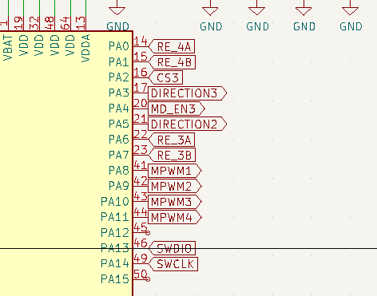
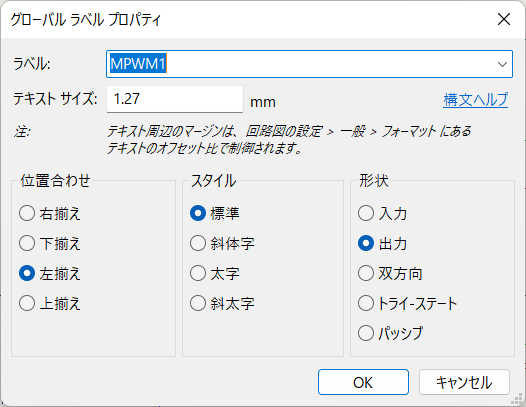
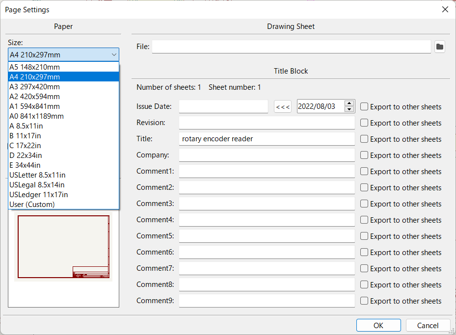
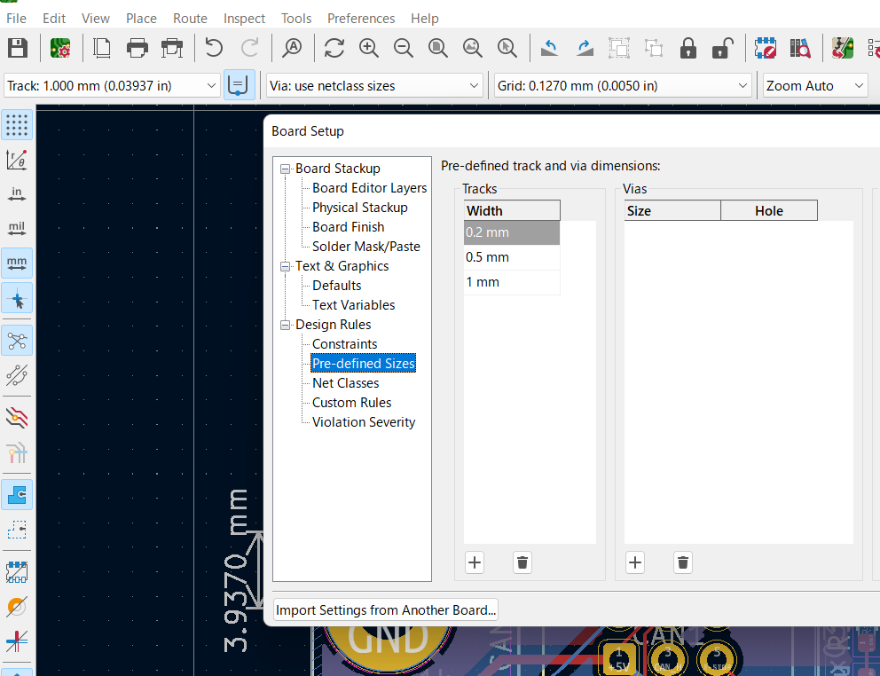

# kicadを教える会（2022/08/03）  

### 用意するもの  

- PC  
  - kicadインストール済み（5,6どちらでも良い）
- つよいこころ

### あると良いもの  

- マウス  
- githubのアカウント  
- †圧倒的やる気†

# kicadってなんぞや  

- 回路設計のために使用するソフト  
- 回路図から配線図まで設計はこれひとつでできる  

### 今日最低限できるようになってほしいこと  

- 回路図を写経できる  
- いい感じの部品を割り当てる
- 配線図を描く

# 回路図を描こう  

設計の流れは大まかに  
**部品配置　→　配線接続　→　アノテーション　→（ERC→）　部品割り当て**  

### よく使う部品  
|  部品  |  シンボル名  |  ライブラリ  |  備考  |
| ---- | ---- | ---- | ---- |
|  抵抗  |  R  |  device  |    |
|  可変抵抗  |  R_Variable  |  device  |    |
|  コンデンサ  |  C  |  device  |    |
|  電解コンデンサ  |  C_Polarized  |  device  |    |
|  プッシュスイッチ  |  sw_push  |  switch  |    |
|  コネクタ  |  Conn_0nx0m  |  connector_geneic  |  n:行　m:列  |
|  ダイオード  |  D  |  device  |    |
|  ツェナーダイオード  |  ZD  |  device  |    |
|  LED  |  LED  |  device  |    |
|  NPNトランジスタ  |  Q_NPN_BCE  |  device  |  "BCE"の部分はピンアサインに依存  |
|  PNPトランジスタ  |  Q_PNP_BCE  |  device  |  "BCE"の部分はピンアサインに依存  |
|  NchMOSFET  |  Q_NMOS_GDS  |  device  |  "GDS"の部分はピンアサインに依存  |
|  PchMOSFET  |  Q_PMOS_GDS  |  device  |  "GDS"の部分はピンアサインに依存  |
|  LED  |  LED  |  device  |    |
|  arduino nano  |  arduino_nano  |  MCU_module  |    |  

### イケメンな回路図を書くコツ  

#### ラベルを使おう  

- ラベルを使うことで配線に名前を付けられる  
    - なんのための線なのか明示されているととみんな幸せ  
  
- ちゃんと入力ピンなのか出力ピンなのか分かるようにしよう  
  

#### 狭くなったら素直に回路図を大きくしよう  
  
- ページ設定から変更できる  
  
時々ギチギチに部品を詰めた回路図を見かけるがダサいので止めましょう  

## フットプリント割り当て  

アノテーションできたらシンボルにフットプリンを割り当てましょう  

### よく使うフットプリントライブラリ  

|  部品  |  ライブラリ名  |  備考  |
| ---- | ---- | ---- |
|  抵抗（リード）  |  Resistor_THT  |  普通の抵抗はR_Axial_DIN207_L6.3  |
|  抵抗（表面実装）  |  Resistor_SMD  |  1608Metric HandSolder  |
|  コンデンサ（表面実装）  |  Capasitor_SMD  |  1608Metric HandSolder 4.7uFは2012  |
|  LED（表面実装）  |  LED_SMD  |  1608Metric HandSolder  |
|  コネクタ  |  Robocon_connector  |    |
|  部室のダイオード  |  Robocon_Diode  |  SMAF  |

表面実装はSMD、リード部品はTHT  
トランジスタとかのフットプリントはggrks

# 配線図を描こう  

|  配線太さの例  |    |
|  --  |  --  |
|  CMOS信号線  |  0.2~0.3  |
|  ﾁｮｯﾄ電流が流れる線  |  0.5  |
|  電源線  |  1.0  |  

ここから線の幅は増やせる  
  
なんか英語モードになってるけど気にしたら負け  

## 配線用語  

- ベタ  
  - いちいち線を繋いでいてはめんどくさいので銅箔をベタ塗すること
  - 基本的にGNDでベタを貼る
- ビア  
  - 配線を裏に回すときに使う  
  - 高速な信号（クロックなど）の信号線にはなるべく使わないようにしよう  
- シルク  
  - R1とかC12みたな基板上に表示される文字類
  - 整えないとダサいのでいい感じにするとよい

# 課題  

[このPDFの回路図](encoder_read.pdf)を写経して基板を作る  
フットプリントの割り当ては[enc_reader_footprint_list.csv](enc_reader_footprint_list.csv)を参照  
基板外形は指定しないが、69x40mm程度に収めるのを目標にすると良いかもしれない

***
### 夏休み中にできるようになってほしいこと  

- 自分で考えた回路図を描いて、それを基板に起す  

### 一年生の間にできるようになってほしいこと  

- ユーザビリティを考慮した設計  
  - コネクタの一とか
- 未知の部品の使い方を自分で調べてそれを使用した回路図を描けるようになる  

### いつかできるようになってほしいこと  

- 階層シート  
  - 同じ構造を繰り返すような時に便利
  - プログラミングの関数のようなイメージ（？）
- 自動配線
  - なんやかんややったことないので開拓して欲しい
- pythonスクリプトを使いこなす
  - （色々使い道がありそうだけどあんましわからん）