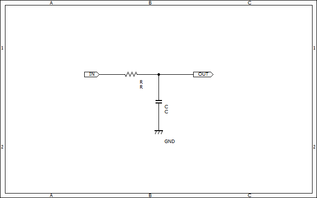

# ローパスフィルタ(LPF)

  ロボコンの回路では、センサーに入ってくる高周波のノイズや電源のリップル成分が制御を行う上での問題になります。そんな時、高周波成分を遮断し低周波成分を通過させるローパスフィルタを利用することができます。  
  ここではロボコンで使われるような簡単なローパスフィルタ回路を簡単に紹介します。  

  ちなみに、アナログ回路≒フィルタ回路と言っていいほどフィルタの奥は深いため、興味があったら調べてみるといいと思います。  

  あと~~めんどくさいので~~ここで紹介するのはパッシブなフィルタだけです。アクティブフィルタは自分で調べてネ。

## 一次のローパスフィルタ  

リアクタンス[^1]成分が一つのフィルタ

### RCローパスフィルタ  

  
抵抗とコンデンサを使用した最も基本的なローパスフィルタです。
カットオフ周波数は  

```math
f_C = \frac{1}{2\pi CR}
```

で求めることができます。  

## 二次のローパスフィルタ  

リアクタンス成分が二つのフィルタ

### LCローパスフィルタ  

  
コイルとコンデンサを使用したローパスフィルタです。
カットオフ周波数[^2]は  

```math
f_c=\frac{1}{2\pi \sqrt{LC}}
```

で求めることができます。  

なお上図のフィルタは**入力側のインピーダンスが低く、出力側のインピーダンスが高い場合**に向いています。  
逆に、入力側のインピーダンスが高く、出力側のインピーダンスが低い場合は下図のような構成のフィルタが用いられます。
  

LC-LPFはRC-LPFと比較してジュール熱による損失が小さいため、**電源ラインなど大電流を流すような用途**に向いています。  

まあ基本的にコイルが入ると大型化しがちなので信号線では使わないですね。電源ライン用です。

## 三次のローパスフィルタ  

リアクタンス成分が三つのフィルタ

### π型フィルタ  

  

  コイル一つとコンデンサ二つを使用したローパスフィルタです。
入力・出力ともにコンデンサが接続されているため、**入出力両方のインピーダンスが小さい**場合に使用されます。  

### τ型フィルタ  

  
コイル一つとコンデンサ二つを使用したローパスフィルタです。
入力・出力ともにコイルが接続されているため、**入出力両方のインピーダンスが高い**場合に使用されます。  

## フィルタと微積分(超簡易版)  

```math
f(t)=\sin\frac{t}{2}
```
```math
g(t)=\sin2t
```

という二つの関数を考えてみます。  
この二つの関数を微積分してみるとどうなるでしょうか。  

|  | $f(t)$ | $g(t)$ |
| :---: | :---: | :---: |
| $\frac{d}{dt}$ | $\frac{1}{2}\cos \frac{t}{2}$ | $2\cos 2t$ |
| $∫dt$ | $-2\cos \frac{t}{2}$ | $-\frac{1}{2}\cos 2t$ |  

この表をみて何か気づいたことはありますか？そうですね。微積分をすることによって**振幅が変化**しています。このことはこのように言い換えることもできます。  

|  | 低周波 | 高周波 |
| :---: | :---: | :---: |
| 微分 | 減衰 | 増幅 |
| 積分 | 増幅 | 減衰 |  

ここまできたらフィルタと数学の関連性がなんとなく分かりますかね。  

具体例で考えてみましょう。  

  

一次のCR-LPFですね。この回路にはリアクタンス成分としてコンデンサが負荷と並列に挿入されています。  
コンデンサの両端の電圧を電流で表すとどうなるでしょうか？  

```math
v_C(t)=\frac{1}{C}\int i_C(t)dt
```

ですね。つまりコンデンサの電圧は電流の積分値なわけです。ここまで来たらばなんとなくわかると思いますが、コンデンサの容量リアクタンス**積分器**として働くので、この回路はLPFとして動作するわけです。  

では、逆にコンデンサをコイルに置き換えてみるとどうなるでしょうか。  

  
コイル両端の電圧はどう表されますか？  

```math
v_L(t)=L\frac{di_L(t)}{dt}
```

ですね。つまりこの回路においてはコイルの誘導リアクタンスが**微分器**として働くのでハイパスフィルタ（HPF）として動作します。  


[^1]:リアクタンスはインピーダンスの虚部（交流に対する抵抗みたいな）をさします。コイルによって発生する誘導リアクタンスと、コンデンサによって発生する容量リアクタンスがあります。ちなみにリアクタンスとレジスタンスをあわせたものがインピーダンスです。  
[^2]:カットオフ周波数はフィルタによって信号が減衰し始める（-3dB以下になる）周波数を示します。