# オペアンプの使用例  

オペアンプはアナログ回路においては一番と言っていいぐらい重要で便利な素子です。是非使いこなせるようになりましょう。  

## そもそもオペアンプって何ぞや  
オペアンプは下図のような回路図記号で表される回路部品です。  
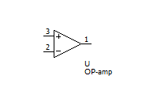  
オペアンプは**非反転入力**（図の3番ピン）、**反転入力**（図の2番ピン）、**出力**（図の1番ピン）の3つのピンからなる部品です。  
~~電源がないジャマイカ？？省略されているだけです。~~  
ではこの部品はどのような動作をするのでしょうか。  答えは簡単、反転入力と非反転入力の間の電位差を増幅するだけです。  

式で表すとこんな感じ。  

```math
V_{out}=A(V_{IN+}-V_{IN-})
```

なお、  

- $V_{IN+}$ : 非反転入力の電位
- $V_{IN-}$ : 反転入力の電位
- $A$ : オープンループゲイン（理想的には無限大）  

です。  

簡単ですね。でもこれだとただのコンパレータと何が違うんやんけってなると思います。  
オペアンプの真髄は**負帰還**をかけられる、という点にあります。  
つまり出力された信号からフィートバック回路を通して入力に様々なゲインをかけられますよ。っていうことです。  

### イマジナリーショート（仮想短絡）[^1]  
イマジナリーショートはオペアンプの働きを説明する上で最も良く用いられる考え方で、**オペアンプは非反転入力と反転入力の間の電位差が0になるような電圧を出力する**という考え方です。  
言ってしまえば  

```math
V_{IN+}=V_{IN-}
```

になるようにオペアンプががんばってくれる、ということです。

………良くわかりませんね。具体例で考えてみましょう。  

次のような回路を考えます。  
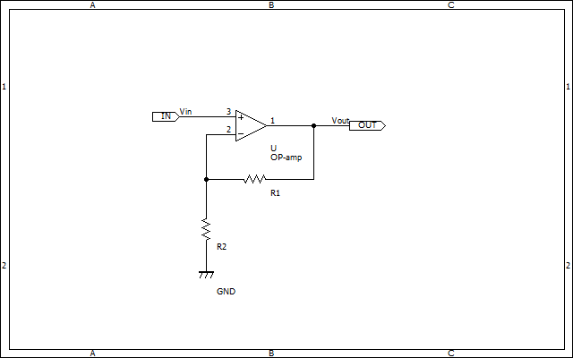  
オペアンプの出力がR1とR2によって分圧されて反転入力端子に入っていますね。  
ではまず、この回路において $V_{IN-}$ はどのような電圧になるのでしょうか。分圧則より  

```math
V_{IN-}=\frac{R_2}{R_1+R_2} V_{OUT}
```

となりますね。  
さて、ここで非反転入力端子に $V_{IN+}$ が入力されているとします。 $V_{OUT}$ はどんな電圧になるでしょうか。  
ここで、先ほど述べたイマジナリーショートの**非反転入力と反転入力の電位が同じになるようになる**という考えを持ってきます。  
つまり $V_{IN-}=V_{IN+}$ として計算するということですね。  
で、 $V_{IN-}$ はすでに求めたので、代入してみると  

```math
V_{IN+}=\frac{R_2}{R_1+R_2} V_{OUT}
```

変形して  

```math
V_{OUT}=(1+\frac{R_1}{R_2}) V_{IN+}
```

となります。なんとなく分かったでしょうか。こんな具合にオペアンプは負帰還とイマジナリーショートによって入力を増幅することができます。

## よくある回路例  

オペアンプを活用するありがちな回路を紹介していきます。

### 非反転増幅回路  

  

```math
V_{OUT}=(1+\frac{R_1}{R_2}) V_{IN+}
```

さっき上で紹介した回路ですね。微小な電圧を増幅する時にどうぞ。  

### 反転増幅回路  

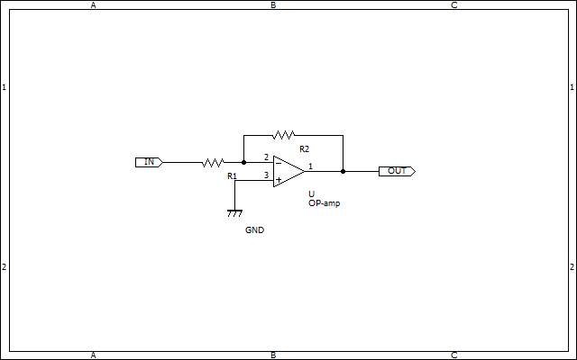  

```math
V_{OUT}=-\frac{R_2}{R_1}V_{IN}
```

今度は出力が反転する回路です。正負電源を使っていないと負電圧は当然出力できないので気を付けましょう。

### ボルテージフォロワ  

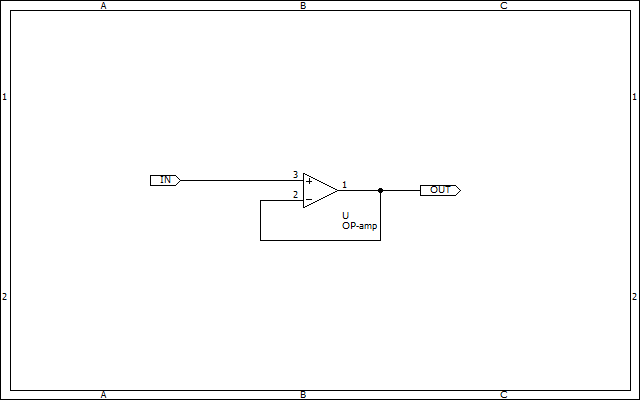  

```math
V_{OUT}=V_{IN}
```

ボルテージフォロワは入力電圧をそのまま出力する回路です。意味ないやんけって思われるかもしれませんが、オペアンプの入力インピーダンスは非常に高いため、高インピーダンスな電圧源（＝あまり電流を出力できないセンサーとか）をマイコンなど他の機器に接続する時などに間に挟んだりします。  
なお、オペアンプによっては推奨されていない回路だったりするので注意しましょう[^2]。  
また、負荷に容量成分があると不安定化しやすい回路なので注意しましょう。  
https://cc.cqpub.co.jp/system/contents/1206/

### 差動増幅回路  

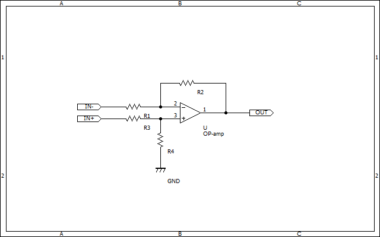  

```math
V_{OUT}=\frac{R_{1}+R_{2}}{R_{1}} \frac{R_{4}}{R_{3}+R_{4}}V_{IN+}-\frac{R_{2}}{R_{1}}V_{IN-}
```

んー長い。というわけで $R_1=R_3,R_2=R4$ としまして  

```math
V_{out}=\frac{R_{2}}{R_{1}}(V_{IN+}-V_{IN-})
```

こちらは二つの入力電圧の差を増幅する回路です。シャント抵抗などを使用するハイサイド電流アンプや、コモンモードノイズが発生するような状況で使用できます。

### 積分回路  

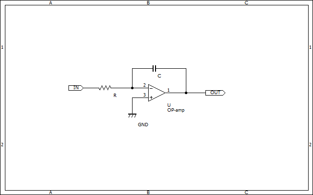  

```math
V_{OUT}=-\frac{1}{RC}\int V_{IN}dt
```

入力を積分して反転出力する回路です。  

ちなみに非反転型もあります。  
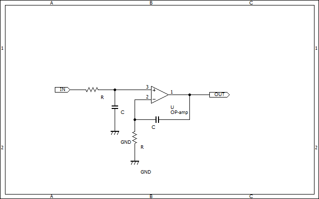  
抵抗とコンデンサはそれぞれ同じ物を使用しましょう。  

### 微分回路  

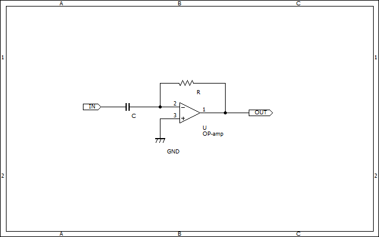  

```math
V_{OUT}=-RC\frac{dV_{IN}}{dt}
```

入力を微分して反転出力する回路です。  

### 非反転加算回路  

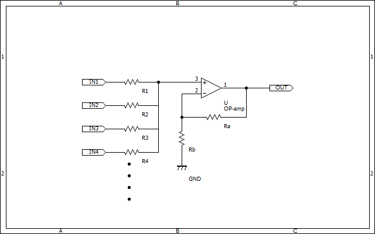  
$R_{1}=R_{2}=R_{3}=R_{4}=...=R_{n}=R$ として、  

```math
V_{OUT}=\frac{R/(N-1)}{R+R/(N-1)}(1+\frac{R_{a}}{R_{b}})(V_{IN1}+V_{IN2}+V_{IN3}+V_{IN4}+...+V_{INn})
```

## ちょこっと応用

オペアンプのイマジナリーショートを便利に使っていきましょう。  

### リニアレギュレータ（3端子レギュレータ）  

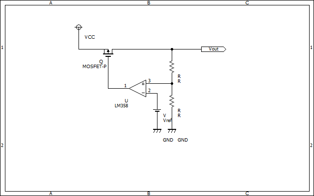  
おなじみ3端子レギュレータもオペアンプを使うことで実現することができます。  
オペアンプの非反転入力には出力電圧が入ってきますが、オペアンプがその電圧がVrefと同じになるように制御してくれます。  
まあもちろんこのままでは直ぐに発振してしまうので出力の電源ラインにコンデンサを挿入して発振を防止する必要があります。  

### 電子負荷  

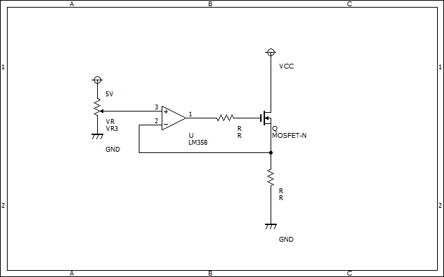  
これはあまりロボコンではなじみはないかもしれませんが、電源の試験などに良く用いられる電子負荷と呼ばれる回路です。  
電子負荷の反転入力には流れている電流に比例した電圧が入力されるので、VCCの値が変動してもMOSFETには常に同じ電流を流すように制御できます。  

## 位相補償  

オペアンプは便利な素子ですが、下手に使うと発振して上手く動かなくなってしまう場合があります。  
そこで、位相補償コンデンサを挿入します。  

そもそも何故発振するのかですが…

ｳｰﾝ説明ムズw
このサイト読めww
https://www.marutsu.co.jp/pc/static/large_order/opamp3_20220419


[^1]:イマジナルショートとも言います。が、個人的にイマジナリーの方がカッコいい気がしたのでイマジナリーで行きます。  
[^2]:参考　https://www.nisshinbo-microdevices.co.jp/ja/faq/10018.html