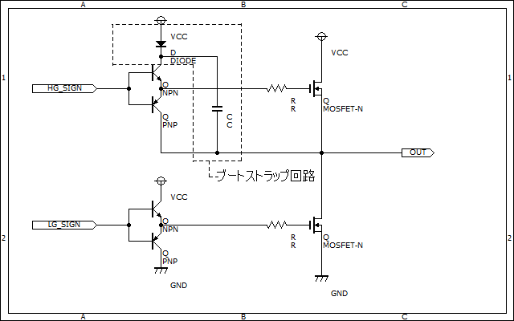
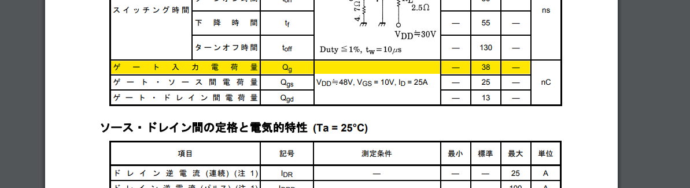

# ブートストラップ  

モタドラなどでハイサイドにNch-MOSFETなどを使用したいとき、ゲート電圧の確保が問題となる場合が良くあります。そんな時に良く使われるのがブートストラップ回路です。  

  

ブートストラップ回路は一般的なプッシュプル回路にダイオードとコンデンサを追加するだけで構成できる超簡単な回路です。  

## コンデンサの選定  

チャージポンプに使用するコンデンサ（ブートストラップコンデンサともいう）は、基本的にドライブするMOSFETのゲート容量とスイッチング周波数をもとに選定します。  
ブートストラップコンデンサに必要な最低限の電荷量は次の式から求めることができます。  
**Q = 2*Qg + Ipbs/f**  

- Qg : ハイサイド素子のゲートの電荷容量  
- f : 周波数  
- Ipbs : ハイサイドドライバの消費電流  

あとはQ = CV の式からCの値を求められますね。ただしこの式は最低限の容量なので実際はこれを15倍程度の容量の物を使用するのが良いそうです。  
ただ、上の式ではゲートドライバ内部の容量による電荷消費や、電解コンデンサを使用した場合の漏れ電流などが考慮されていません。そこまで考えるのはまあまあめんどくさいので
**C = Qg*30 / V**  
程度の簡単な計算式で求めてしまっても大丈夫です。というか基本的に大きくて困ることは無いので余裕を持った容量のコンデンサを選定しましょう。  
あ、Vの値は電源電圧からダイオ―ドの順方向電圧とかを引いたものを代入しようね。  
ちなみにQgはMOSFETのデータシートをみれば書いてあります。
例：[2SK2232](https://akizukidenshi.com/catalog/g/gI-02414/)  
  

耐圧はゲートに印加したい電圧分確保されていれば大丈夫です。

## ダイオードの選定  

コンデンサの電荷が漏れてしまうことを防ぐためにできる限り速いダイオードを使用すると良いでしょう。

## 注意点  

- コンデンサに蓄えられた電荷が抜けきってしまうと当然ゲートに電圧を加えることはできません。なので**duty比100%の動作はできません。**  
- 回路を見れば分かるようにローサイドスイッチを一度ONにしないとコンデンサに電荷はチャージされません。使用できるのは、定常時にローサイドスイッチがONになっているような回路のみになります。  
- ブートストラップコンデンサに積層セラミックコンデンサを使用する場合は[DCバイアス](../circuit_parts/Capasitor_DC_bias.md)による容量低下を考慮する必要があります。まあ大きめのコンデンサを選んでおけばOKっていうことです。