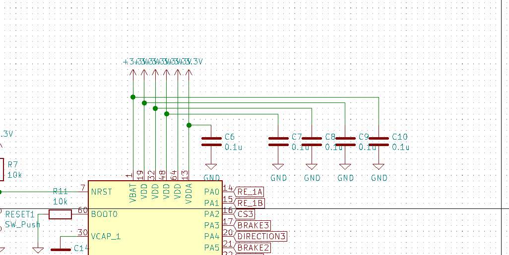
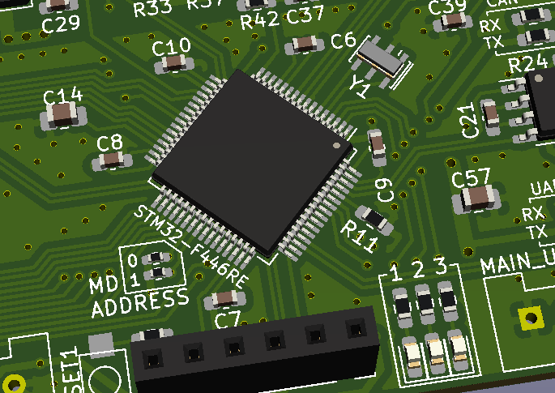
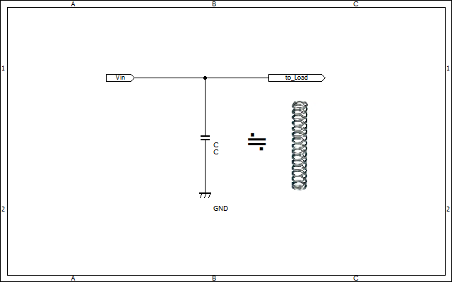

# バイパスコンデンサ（パスコン）  

マイコンやオペアンプ、ゲートドライバなどのICへの電源には基本的に低ノイズな電圧源が求められます。  
しかし、理想的な電源を用意することは不可能なため、バイバスコンデンサ（パスコン）と呼ばれるコンデンサを挿入することで電源品質をある程度向上させることが良くあります。  
  
この0.1uFのコンデンサがバイパスコンデンサです。  
~~ちなみにこの回路は余り良くない例ですが、まあパスコンの説明には問題ないので使いました（言い訳乙）~~

## 設置する場所  
基本的には電源ピンのできる限り近くに設置しましょう。  
  
電源ピンから離れた場所に設置してしまうと、配線抵抗やインダクタンスによって効果が薄れてしまいます。配線パターンの途中でノイズを拾ってしまう可能性もありますしね。

## コンデンサの選定  
一般的にパスコンには0.1uF程度のセラミックキャパシタが使用されます。  
基本的に電解コンデンサを使用するのはご法度です。電解コンデンサは内部抵抗などが大きいため、パスコンで処理するような高周波のノイズを除去してはくれないからです。  
また、1uFなどの大きめのセラミックコンデンサも、高周波特性が小容量なものと比較して劣るため0.1uF程度の物を使用するのがが結局安牌です。  

## 理論  

このコンデンサは基本的には[ローパスフィルタ](Low-pass-filter_circuit.md)として動作しています。  

### 動作のイメージ  

コンデンサはばねやゴムのような弾性力のある部品としてイメージするといいと思います。  
バイパスコンデンサは車のサスペンションのような物としてイメージするのがいいでしょう。
サスペンションが路面の凹凸による振動を抑え込むように、バイパスコンデンサは電圧のリプル（＝凹凸）を抑え込んでくれます。  

  

コンデンサの動作のイメージとしては[この動画](https://www.youtube.com/watch?v=T8mcn5PVLRc)が分かりやすいと思います。