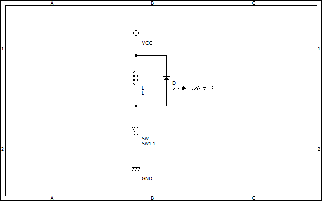
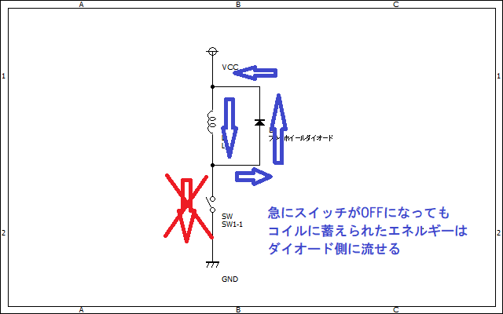

# フライホイールダイオード  

## 基本
フライホイールダイオードはリレーや電磁弁などのコイルに並列に入れられるダイオードのことです。  
  
コイル両端に発生する電圧は  

```math
V=L\frac{di}{dt}
```

という式から分かるように電流の微分値に比例します。  
では、例えばコイルに1Aの電流が流れている際に急にその電流を0にしようとするとどうなるでしょうか。はい、クソデカ電圧が発生して死にますね。というわけでそのエネルギーを受け流す経路を用意する必要があるわけです。  
そんなとき、上の図のようにコイルに並列にダイオードを挿入してあげればコイルの電流を下の図のように受け流すことができます。  
  

### ダイオードの選定  

基本的に、フライホイールダイオードに電流が流れるのは一瞬なので連続電流耐量はあまり必要ではありません。どちらかというとパルス電流耐性を重視して選ぶと良いでしょう。  
また、損失を減らすためにも速めのダイオード[^1]が良く選ばれる印象があります。  

## 備考  
多分フライホイールダイオードであってると思うけどフリーホイールダイオードとか還流ダイオードとか回生ダイオードとかダンパーダイオードとか別名が多すぎてワケワカンナイヨー

[^1]:実は遅いダイオードを使ったほうが良いという説もあります。まあ実験すればいいんじゃね。