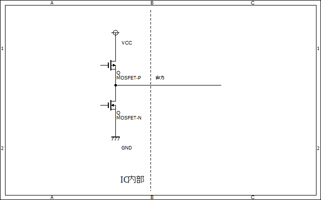
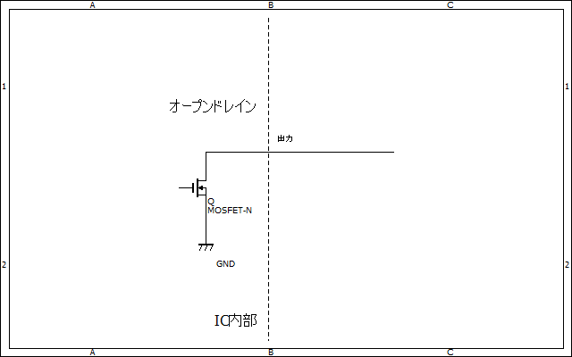
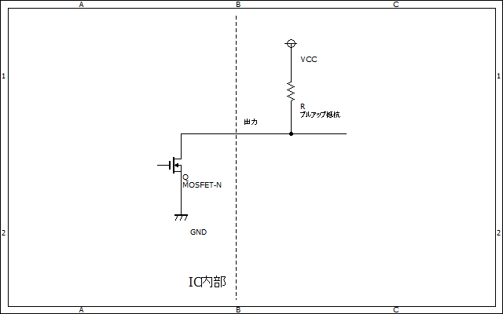

# オープンコレクタ・オープンドレイン  

オープンコレクタ・オープンドレインとは、ICの出力形態の1つである。
なお、ICがTTL（バイポーラトランジスタ）で構成されている場合はオープンコレクタ、CMOSの場合はオープンドレインと呼ばれる。  

この記事ではオープンドレインの解説をするがオープンコレクタは端子名が変わっただけなので基本同じと考えて良い。

## 概要  

一般的なICの出力は下図のような[プッシュプル](push_pull.md)回路で構成されている  
  

それに対してオープンドレインタイプの出力は次のようになっている。
  

見ての通りハイサイドのFETが消えて、ローサイドのFETのドレイン端子がどこにもつながっていない（＝オープン）。  
このような出力方式をオープンドレインと呼ぶ。  

出力状態を表にするとこのようになる  
|  | active | passive |
| -- | -- | -- |
| プッシュプル | HIGH | LOW |
| オープンドレイン | HiZ | LOW |
| （オープンソース） | HIGH | HiZ |

> Note  
> HiZ = ハイインピーダンス  
> 電流を吐き出しもしないし吸い込みもしない状態のこと  
> 等価的にはどこにもつながっていない状態なので予期せぬ動作を引き起こす可能性がある

## 結線方法  

オープンドレイン端子はハイサイドがどこにもつながっていないため、電流を吐き出すことができない。つまり、何もしないと出力がハイインピーダンス状態となってしまう。  
そのため一般的には[プルアップ抵抗](pull_up&pull_down.md)を外部に加することで出力がハイインピーダンス状態になることを避ける。  
  

## メリット  

[ワイヤードOR](wired_OR.md)接続ができる

## デメリット  

プルアップ抵抗を外付けしないといけないのでめんどくさい

***
## 余談  

上の状態表にオープンソースというものがあったが、あれはオープンドレインの逆で、プッシュプルのローサイド側の素子を無くしたものである。  
**なお僕が適当に作った単語なので実はそんなものは存在しないのかも知れない**
