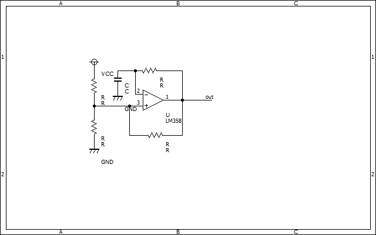
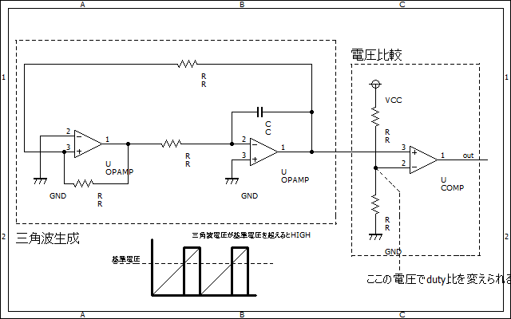
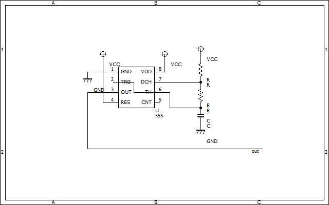

# 様々な発振回路  

DCDCコンバーターなどを組む際に発振回路が必要となる場面は数多くあります  
この記事ではロボコン・パワエレで使われるであろう0~1MHz程度の周波数の発振回路を紹介します。  

## オペアンプによる矩形波生成回路  

  
コンデンサによる積分とオペアンプによる比較をうまく組み合わせた回路  
多分これがトポロジ的には最小構成になると思う  
[参考記事](https://www.kairo-nyumon.com/rectangular_wave1.html)  

## 三角波生成から電圧比較  

  

[参考記事](https://zenn.dev/yakiimo121/articles/9f80ab6fb998ff)  
左側の回路で三角波を生成し、右側のコンパレータで比較することで矩形波を得る  
コンパレータの比較電圧により自由にduty比を変えられるのがメリット  

## 555による発振回路  

555は発振回路などによく使われる超有名ICなので知っておこう  
  
周波数などの計算は[こちらのサイト](https://www.zea.jp/audio/schematic/sc_file/018.htm)を参考にするとよい

