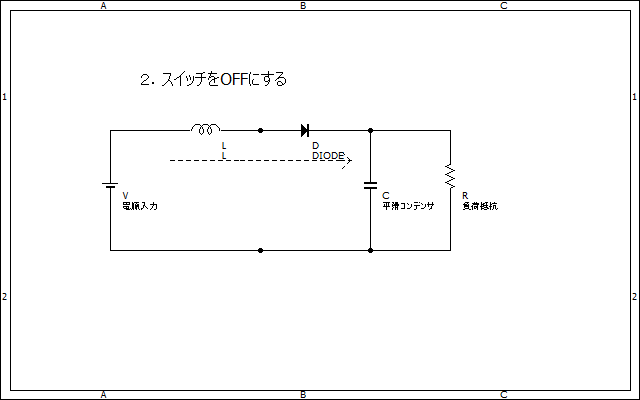

# 昇圧チョッパ（ステップアップコンバータ）の基本  

## 基本回路図  

  
上の図のような構造の回路が昇圧チョッパと呼ばれる物である  
図にも書いてある通りコイルに接続されたスイッチを高速でON/OFFすることで入力より高い電圧を得られる  

## 原理  

コイルには「電流を急に流せない・電流を急に止められない」という特性がある。この回路は後者の「急に止められない」特性を利用する（本質的には同じだけど）  

動作の流れは以下の通り

- スイッチをONにし、コイルに電流を流す（エネルギーを蓄える）
  

>NOTE
>コイルの持つエネルギーは  
>```math
>K=\frac{1}{2}HI^2
>```
>として表される  

- スイッチをOFFにする  
  
先ほども書いた通りコイル電流は急にゼロにはなれないのでダイオードを通してコンデンサ・負荷に流れることになる  

もしダイオードより右側の電圧が電源より高くても、コイルはエネルギーを放出しようとして無理矢理電流を流そうとする  
このような流れで電圧が上がる（＝昇圧）わけである  

またダイオードがあるので出力側から逆流することはない  
  

上記の動作を高速で行うことによって安定した出力電圧を得られる  

## ちなみに…  
高速でスイッチをON/OFFさせて電圧をあげれば昇圧チョッパと呼べる  
人力でやってくれてもええんやで…？  
↓名誉ある変態  
[https://twitter.com/86723nasogamat/status/1274670630495895554](https://twitter.com/86723nasogamat/status/1274670630495895554)