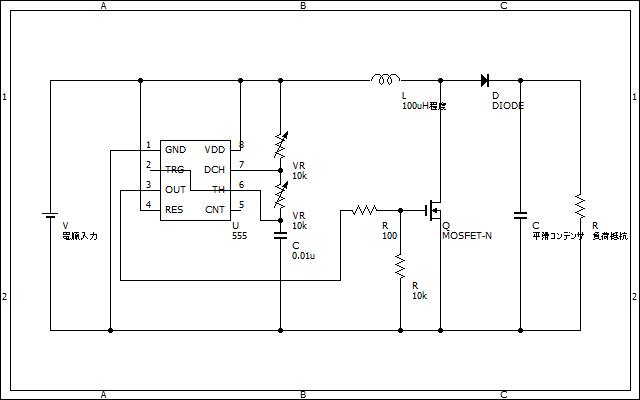
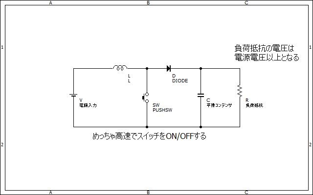

# 555を使用した昇圧チョッパ　その1  

555の使い方などは[こちら](oscillator.md)  
昇圧チョッパの基本は[こちら](step-up-converter.md)  

スイッチングレギュレータの制作には矩形波発振源が必要不可欠です。  
そして、555をは矩形波発振によく使われる有名なICであり、昇圧チョッパなどの電源回路に使用する例も時折見られます。  
この記事では、555を使用した最も基本的な昇圧チョッパの回路を紹介します。  

## 基本回路図  
  

あ、MOSFETって何ぞやってなった人は自分で調べてください（）  
トランジスタが分かるなら理解は難しくないはず。  
一応普通のNPNトランジスタに置き換えても動くはずである。  

回路的には見ての通り下の次の回路を組み合わせただけである  

- 555による発振回路  
  
- 昇圧チョッパの基本回路  
  

~~ちなみになんで一番上と一番下の回路図でGND記号を使っていないかと言うと、僕が小学生の時に書いた奴をそのまま持ってきてるからです。回路図写経小学生にGNDはきびちい~~  

## 電圧の調整法  

555に接続された二つの半固定抵抗を調整することで任意の出力電圧を得ることができる  

昇圧チョッパ（CCM）の出力電圧は次の式により与えられる  

$$ Vout=\frac{1}{1-D}Vin $$  
$$ D:duty比 $$  

つまり、duty比をいじれば任意の電圧を得られるわけである。  
[このサイト](https://www.zea.jp/audio/schematic/sc_file/018.htm)を参照するなどしておおよその値を計算すると良いだろう  

>Note  
>ただし、上記の式は電流連続モード、つまりコイルに電流が途切れることなく流れる場合にしか成り立たない（理解できなくても取敢えずOK）。  
>ので、あくまで目安程度に考えると良いだろう
>ちなみにDCM（電流不連続モード）のときの式はもうちょっとめんどくさい  

## この回路の問題点  

見ての通り（？）出力電圧のフィードバックがないため、電圧が出力が暴走しがちである。そのあたりの問題点を解決した回路は次回紹介する。