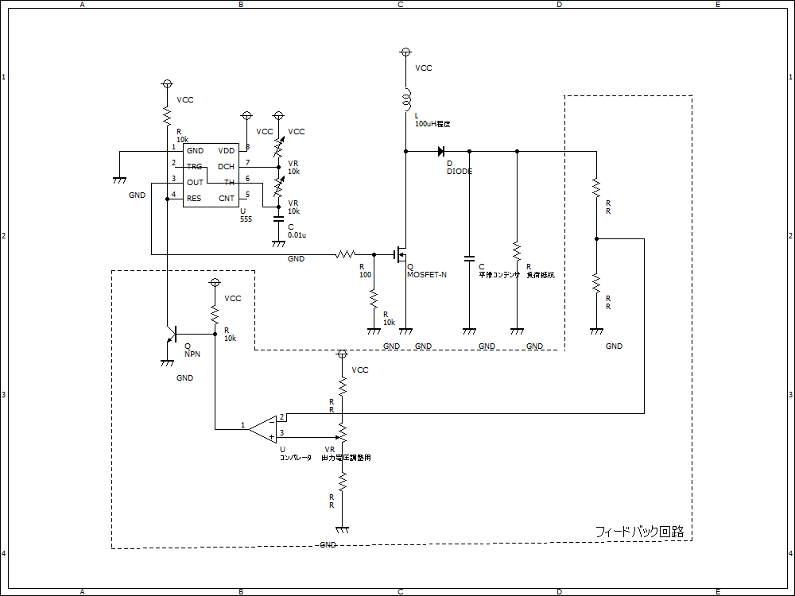
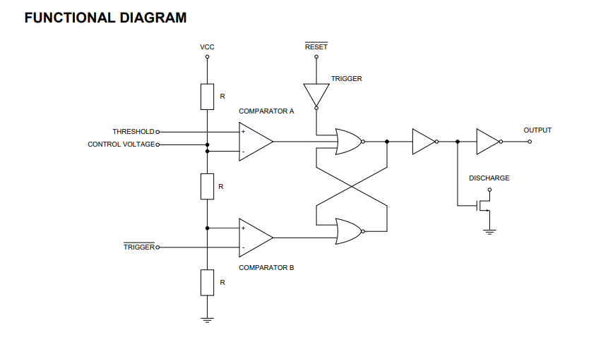
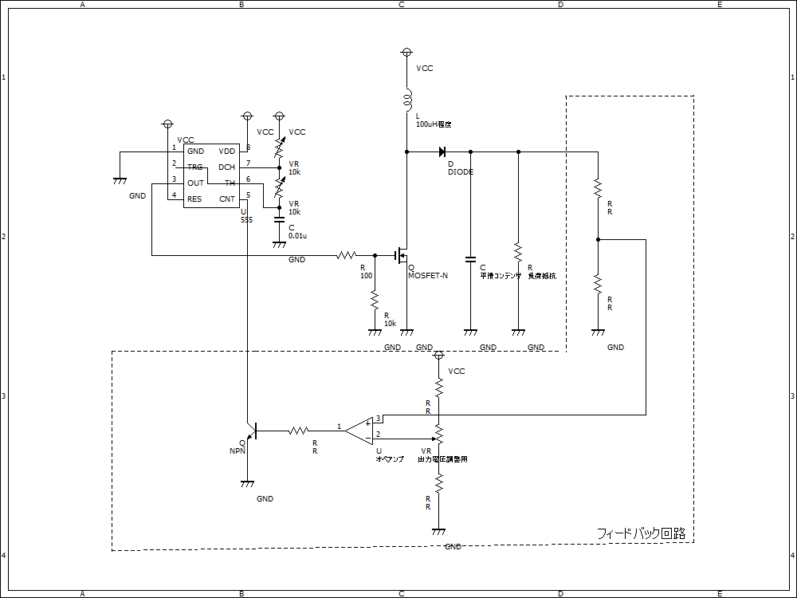

# 555を使用した昇圧チョッパ　その2  

その１は[こちら](step-up-converter_by_555_No1.md)  

## フィードバック  

前回の回路では負荷が急に大きくなった時（＝供給すべき電流が増えた時）や、急に小さくなった時（＝供給すべき電流が減ったとき）に出力電圧が急激に下がったり上がったりしてしまう可能性がある。  
そのあたりの問題を解決するためのフィードバック回路を紹介する。  

## ON/OFF制御  

まずは単純なON/OFF制御から。  
電圧が低かったら昇圧、高かったら昇圧を停止、と言った動作をするような回路を用意すればよい。  

というわけでコンパレータを使用して実現させる。  
555は4番ピンがリセットピンになっているので、電圧が高くなり過ぎたらリセットピン電圧が0Vになるような回路を組めばよいわけなので…  

  

前回の回路と書き方を変えたので全然違うように見えるかも知れないが、基本的には破線で囲った部分を追加しただけなので安心して欲しい  
コンパレータの使い方を知っていれば分かると思うが、単純に出力電圧と基準電圧を比較しているだけである。  

> Note  
> コンパレータの出力に10kΩのプルアップ抵抗がついているが、これは多くのコンパレータが[オープンドレイン出力](open_collector_drain.md)のためである。  
> 使用するコンパレータによっては必要ない

> Note  
> ちなみに555の中身はこのような回路になっている  
> 理解できると割と気持ちいいので頑張ってみるといいかもしれない
>  

## ちょっとまともなフィードバック制御  

...先に言い訳しておきますとですね、説明がだるいです。  
自分がノリと勢いで理解してしまってるのもあって上手く言語化できなかったので取敢えず回路図を投下！  
  
はい、さっき上げた回路のコンパレータをオペアンプに変更、そしてトランジスタでCNT端子を制御するようにしていますね。  

うーんなんて説明したらいいんだろうね。  
取敢えず要点は二つ  

- オペアンプはV+ = V-になるようないい感じの電圧を出力してくれる
- 555はCNT端子の電圧を下げることでduty比が下がる（周波数もあがる）

オペアンプがいい感じにしてくれるっていうのはイマジナリーショートの話。[この記事の最初の方](OPamp_circuit_example.md)が参考になるかも。  

555のCNT端子の話はシミュレータで遊んだほうが早いと思う。  
duty比が下がるとコイルに蓄えられるエネルギーが減るので出力も下がるんですねぇ。  

うーんまあこの辺って別にちゃんと理解できてなくてもどうせ専用IC使うんだしいいかw  
パワエレとかに興味がある人は頑張って勉強してみてね。  
以上クソ適当説明でした。めでたしめでたし。