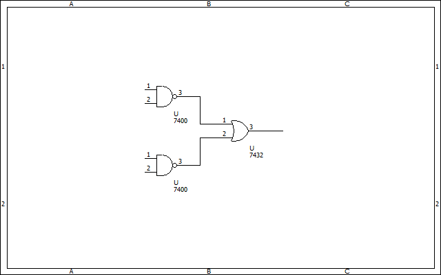
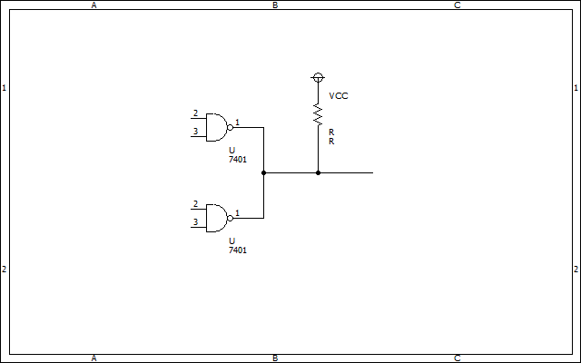

# ワイヤードOR接続  

二つのディジタル出力をまとめたいとき、一般的にはこのようにOR素子を挿入する。  
  

でもわざわざOR素子入れるのめんどいじゃん？そうでしょ？  
というわけでOR素子を入れずに直接配線を束ねてしまうのがワイヤードORである。  

  

## 注意点  

ワイヤードORするためには[オープンドレインタイプ](open_corrector_drain.md)の素子を使う必要がある  
[プッシュプルタイプ](push_pull.md)のICをつかうのはご法度だ。  

というわけで問題
### 問. なぜプッシュプル出力のICをワイヤード接続してはいけないのか。簡潔に説明せよ。  

ヒント：uartのtx同士を繋いではいけないのと同じ理由  

***
### 余談
プッシュプルタイプのICであってもダイオードを追加するだけでワイヤードORが可能になる（ダイオードORともいう）。  
どのようにダイオードを挿入すればいいか考えてみると面白いかも