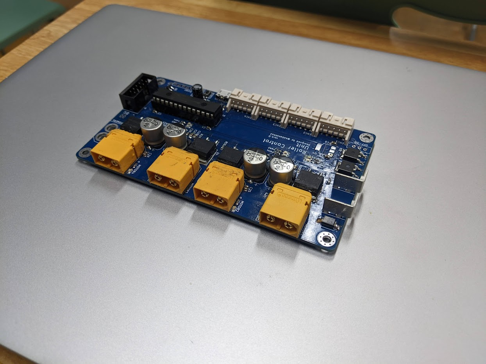

# ローラ用モタドラマニュアル

## 概要
ローラー用モタドラは単一方向にのみ回せば良い発射機構などのローラーを回すことを想定したモータードライバです  
  

700番台等の大電流が流れるモーターも仕様することができ、同時に4つのモーターを制御することができます。  

| 入力電圧 | 出力電流 | 通信 | 電源入力 |
|:--:|:--:|:--:|:--:|
| 12~24V | 30A（瞬間100A） | SPI（3.3V系） | XT60 or バスバー |

使用している部品は以下の通りです。  

| 部品 | 品番 | 備考 |
|:--:|:--:|:--:|
| マイコン | PIC32MX120F032B | 内部クロックを使用 |
| MOSFET | SUM70060E | 100V 131A |
| ゲートドライバ | MIC4604YM | デュアルローサイドドライバとして使用 |
| 通信コネクタ | MIL 10ピン | L6470とピンコンパチ |
| エンコーダーコネクタ | XA 5ピン | AMT10xを想定 |

回路図は[こちら](ローラー用モタドラ.pdf)を参照してください  


## 通信  
通信はSPIを用いて行います。
コネクタのピンアサインははステッピングモタドラのL6470（ストロベリーリナックス版）と同じなので同一形式のコネクタを用いて通信可能です  
SPIモードはMODE2(active state:HIGH, active to IDLE)です

### SPIプロトコル  
2byteのコマンドパケットと4byteのデータパケットを用いて通信を行います  

#### データ書き込み時  
| byte | 内容 | 備考 |
|:--:|:--:|:--:|
| 0 | モーター選択 | 0~3 |
| 1 | レジスタ選択 | レジスタアドレス |
| 2~5 | データ | uint32_tを分割送信 |  

#### データ読み取り時  
| byte | 内容 | 備考 |
|:--:|:--:|:--:|
| 0 | モーターID | 0~3 |
| 1 | レジスタID | 最上位bitを1に |
| 2~5 | データ | uint32_tを分割受信 |  

2byte目に(レジスタアドレス|0x80)を送信することでデータ読み取りモードとなります  

**Note**
読み取りコマンドを送ってからデータを受信できるようになるまでに100us程度必要です  
適当にdelayを入れてください

データ送信とデータ受信は同時に行うことも可能です。  

**Note**
なんか安定しないのでデータを送信せず読み取るのみの場合は0xFFを送信してください

レジスタマップは次の通りです  
| レジスタ名 | ID | 初期値 | 備考 |
|:--:|:--:|:--:|:--:|
| NOP_REG | 0 | x | 何もしない |
| MODE | 1 | 0 (STOP) | 動作モード |
| TARGET_RPS | 2 | 0 | 目標rps |
| CURRENT_RPS | 3 | x | 現在のrps |
| ENC_RESOLUTION | 4 | 512 | エンコーダーの分解能 |
| P_GAIN | 5 | 0 | PIDのPゲイン |
| I_GAIN | 6 | 0 | PIDのIゲイン |
| D_GAIN | 7 | 0 | PIDのDゲイン |
| ADC_VAL | 8 | x | ADCの値（実は未実装） |
| PWM_VAL | 9 | 0 | PWMの値（16bit） |

モーターIDは次のようになっています  
| モーター名 | ID | 備考 |
|:--:|:--:|:--:|
| L1 | 0 | 左回転モーター1 |
| R1 | 1 | 右回転モーター1 |
| L2 | 2 | 左回転モーター2 |
| R2 | 3 | 右回転モーター2 |

MODEは次のようになっています  
| モード | ID | 備考 |
|:--:|:--:|:--:|
| STOP | 0 | 動作停止 |
| UVLO | 1 | 低電圧による動作停止。外部からの指定不可 |
| PID | 2 | エンコーダーによるPID制御 |
| PWM | 3 | PWM値を直接指定 |

## teensy用ライブラリの使い方  
[teensy4.1向けのライブラリ](https://github.com/TNCTRobocon/roller_controler_master)を使用することで簡単にこのモタドラを使用することができます  

### 使用例  
- `roller_control.h`,`SPI.h`をインクルードする  
- インスタンスを生成する
  ```c
  //
  roller インスタンス名("ss_pin",roller_driver::"ドライバ","エンコーダの有無");

  //例
  roller R1(5,roller_driver::R1,true);
  roller L1(5,roller_driver::L1,true);
  ```

- SPIモジュールスタート  
  ```c
  SPI.beginTransaction(SPISettings(4000000,MSBFIRST,SPI_MODE2));
  SPI.begin();
  pinMode("ss_pin",OUTPUT);
  digitalWrite("ss_pin",HIGH);
  ```

- 初期設定をする  
  ```c
  //PIDモード
  L1.set_operate_mode(roller_mode::PID);
  L1.set_enc_resolution("エンコーダ分解能");
  L1.set_P_gain("P gain");
  L1.set_I_gain("I gain");
  L1.set_D_gain("D gain");
  //P:40,I:10,D:10ぐらいで実験してた

  //PWMモード
  R1.set_operate_mode(roller_mode::PWM);
  ```

- 回す  
  ```c
  //rps指定
  L1.set_target_rps("rps値");

  //pwm指定
  R1.set_pwm_val("pwm値");
  ```

### その他使いそうなコマンド  
- `uint32_t get_current_rps(void);`
    - 現在の速度を取得
