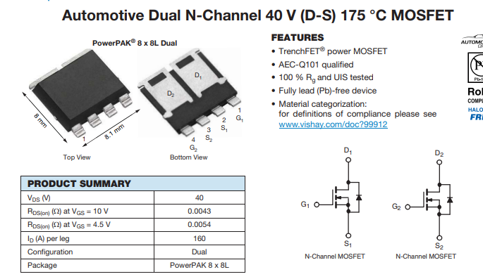
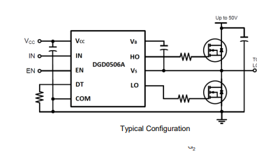
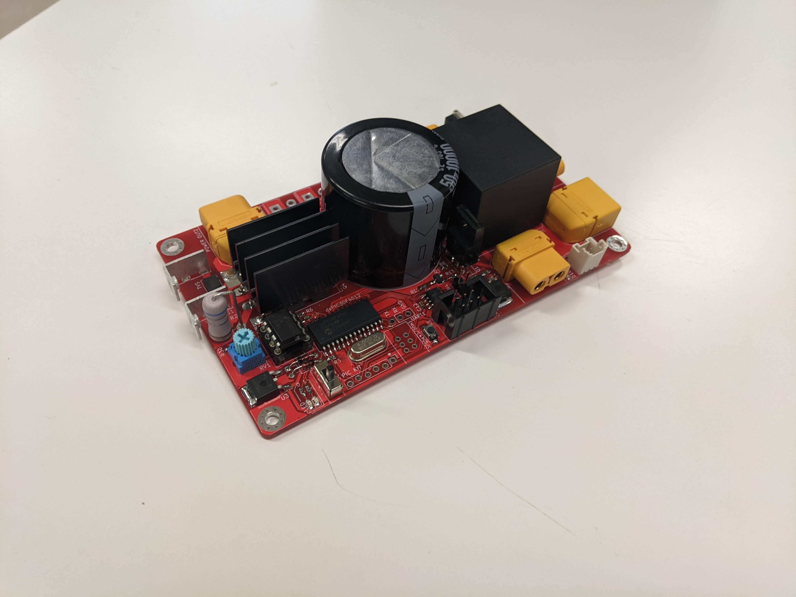
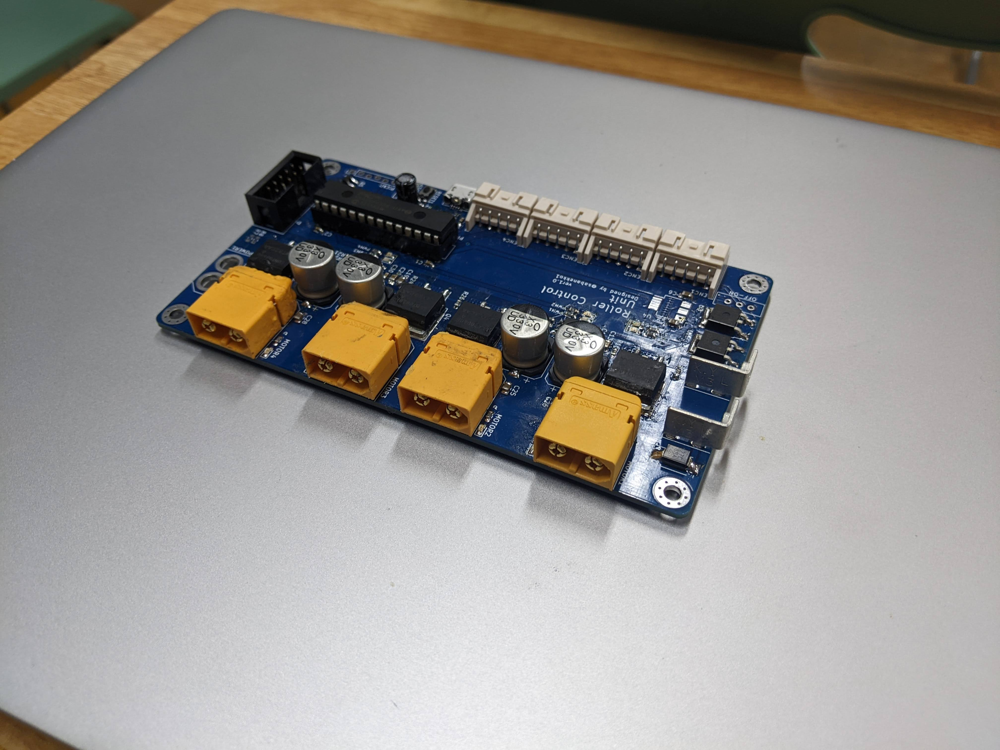
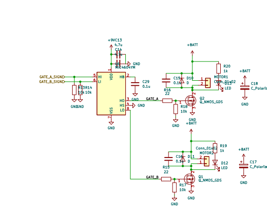
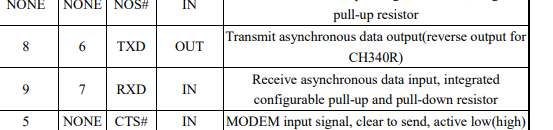
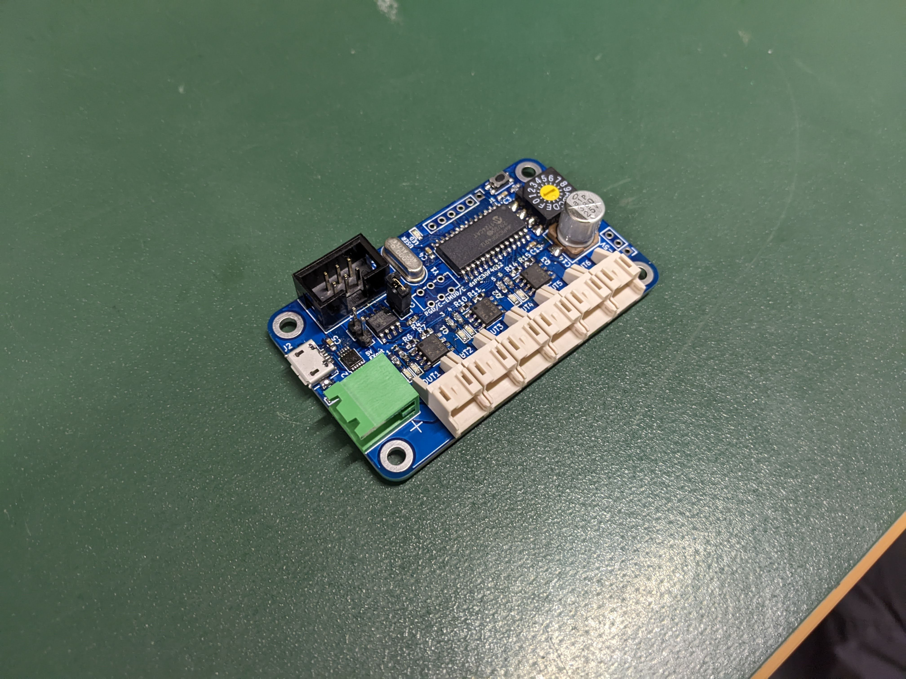
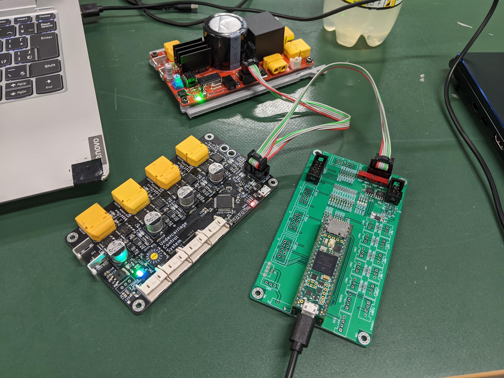
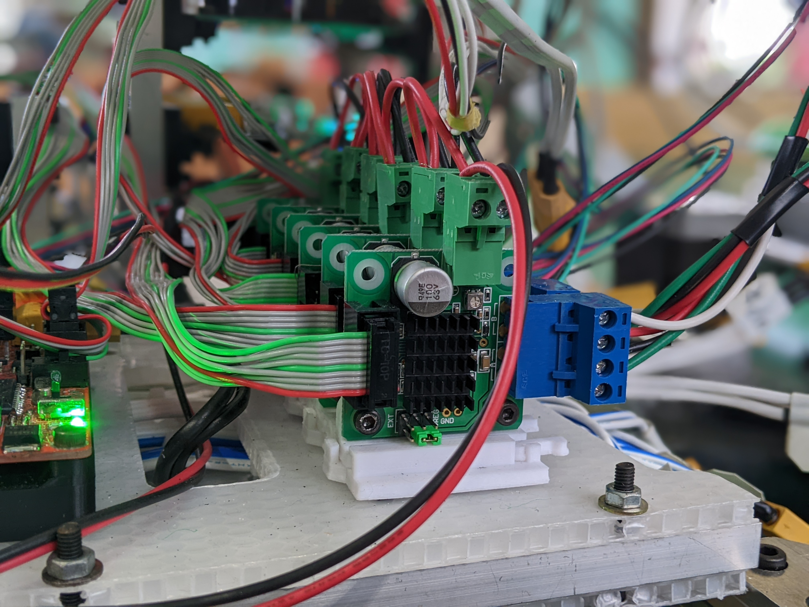

# 2022本ロボ回路の部品選定理由とか  

## モタドラ(UCS3.0)  

.jpg)  
回路図は[こちら](schematic/ucs3.pdf)  

 詳細

  

### マイコン  

STM32F446RE

#### 選定理由  

4つエンコーダー読めるし結構早いので。
あと初代UCSのころから446は(nucleoだけど)使っていたのでノウハウがあった。

#### 反省点  

半導体不足で入手性がｳﾝﾁ。素直にSTMのユニバーシティプログラムに入りましょう

### MOSFET  

[SQJQ906EL](data_sheet/SQJQ906EL.pdf)というつよつよデュアルMOSFET(40V160A)を使用  

#### 選定理由  

小さくて強い。これに限る。
というか160Aも流せるFETですら珍しいのにデュアルとかw。頭悪くないか。
値段は購入当時300円ぐらい。
あ、**MOSFETは電源電圧の二倍以上の耐圧の物を選びましょう**。~~いつか解説書く~~

#### 反省点  

小さすぎて熱がヤバい(ヤバい)。半導体不足でもう買えない。ON抵抗が大きめ(それでも4mΩだけど)が熱問題に拍車を掛けている。  
あとこれは基板設計の問題だけど絶望的に交換しづらい。  
フットプリントが特殊なので替えがないのがとってもつらい。

### ゲートドライバ  

[DGD0506A](data_sheet/DGD0506A.pdf)  
  

#### 選定理由  

圧倒的に安く(80円とか)、1.5A/2.0Aというそこそこな大出力、小さいパッケージ、そして**ブートストラップダイオードが内蔵**されているという理想的なゲトドラだったから。  

#### 反省点  

特になし。  
しいて言うならはんだ付けがちょっと難しい。  
あとデッドタイム調整抵抗に100kΩを使ってたけど多分デカすぎるので47kΩあたりに付け替えたい

### ゲート抵抗  

1/4W 22Ωのやつ  

#### 選定理由  

~~雰囲気。~~
というか100kHz超えるような回路でないなら18~47Ωのあたりの適当なやつを選んでおけば動く。  
あと1/10Wとかの一般的な1608抵抗だと燃えるので1/4品を使用  

#### 反省点  

流石に選定理由がひどすぎる。まあ動いてたからいいけど。  

### ブートストラップキャパシタ  

4.7uFの2012サイズのやつ  

#### 選定理由  

~~こいつも雰囲気。~~ というか本当はもうちょっと小さくてもいいはずだけどセラコンを使う以上[DCバイアス特性](Capasitor_DC_bias.md)とかで容量が減るので大きめのやつにした。  

#### 反省点  
特になし  

### ゲート電源  

前期型：12Vの3端子レギュレータ(7812)  
後期型：9Vの3端子レギュレータ(7809)  

#### 選定理由  

もともと12V品を使っていたが、5Vレギュレータへの負荷が大きくなり過ぎた(マイコン用電源生成用の5Vレギュはゲート電源の余りから引いてる)ので、急遽9V品に変更。  
一応1.5A品を使用しているが、もっと小さくても行けるはず  

#### 反省点  
特になし。  

### マイコン電源  
3.3Vレギュレータ([NJM2845](https://akizukidenshi.com/catalog/g/gI-11299/))  
5Vレギュレータ(バッテリー側から生成する用)([SPX3819M5-L-5-0/TR](data_sheet/spx3819.pdf)  

#### 選定理由  

3.3Vのやつは在庫が余ってたので  
5Vのやつは小さめでそこそこ電流取れるの無いかなーと思って探してたら見つけた  

#### 反省点  

3.3Vの方は特になし  
5Vの方は明らかに選定ミス。というかこのパッケージで1.4W((12V-5V)*0.2mA)消費させるという考えが頭悪すぎた。熱設計ちゃんと考えようか…。まあバッテリーから給電することは無かったのでギリセーフということで  

### CANトランシーバ  

[MAX3059](data_sheet/MAX3058-MAX3059-1512631.pdf)  

#### 選定理由  

なんとなく。たしか買った当時一番安かった。  
あと1Mbpsに対応してるやつってことで。

#### 反省点  

アーッ、半導体不足の音ォー！  

### バッテリーラインのツェナーダイオード  

詳細忘れた()。たしか39V5Wぐらいのやつ  

#### 選定理由  

モーターの回生電力が思いのほか大きく、モーターを急停止させたときにMOSFETが爆ぜる危険性があったため。  
ギリギリ40Vに達しないものを使用。  
TVSじゃないのは…なんでだっけ。というか後期型はTVSダイオードに置き換えた  

#### 反省点  

特になし。というか乗せといてマジでよかった。(実験中に回生電力で電源電圧が39Vぴったりに張り付く事故があった。無かったらFETが全部飛んでた)

### USB-シリアル変換IC  

[CH340E](https://akizukidenshi.com/catalog/g/gI-13543/)  
F446なら直接USB出せるじゃんというツッコミはNG。配線的にUSBのピンを持ってくるのが無理ゲーだったんや…。

#### 選定理由  

とにかく安い。そして小さい。ツメツメ設計するときに最適  

#### 反省点  

特になし。ただピンの名前がクソ過ぎて、のちにローラー用モタドラで痛い目を見るのであった。  

### コンデンサ  

前期型[35V270uFのアルミポリマー](https://www.digikey.jp/ja/products/detail/kemet/A768MS277M1GLAS022/13420068)
後期型[35V330uFのアルミ電解](https://akizukidenshi.com/catalog/g/gP-04648/)  

#### 選定理由  

アルミポリマコンデンサはESRが低くモタドラ向きなので採用した。ただ在庫が無くなったので入手性の良いアルミ電解に途中で変更した。  
あと電源基板にデカいコンデンサが乗ることを前提に設計しているので割と小さめの容量  

#### 反省点  
特になし。ただ初期のころは表面実装電解コンデンサのはんだ付けに慣れておらず、結構西永にもがれた。  

## 電源基板  

  

回路図は[こちら](schematic/power3.pdf)  

 詳細  

  

### マイコン  

[dsPIC30F4012](data_sheet/70046B_JP(dspic30f).pdf)  

#### 選定理由  

部室に大量にあって、CANが使えたから。  
あと5Vマイコンなので設計が色々楽。ノイズ耐性も強いし。  

#### 反省点  
特になし。しいて言うなら消費電力がデカい(120mAとか喰う)。  

### リレー  
詳細忘れちった。[たぶんこれ](https://amazon.co.jp/dp/B076J9R6D2)  
12V100Aのやつ  

#### 選定理由  
某松浦君が校内ロボコンで735 3つをストールさせたいなどと宣っていたのでつよいのにした。  

#### 反省点  
フットプリントが微妙に間違っていたので足をやすりで削るひつようがあった。というか足が長いので、そこも鋸で切っている。  

### ｸｿﾃﾞｶ電解コンデンサ  
[50V10000uF](https://akizukidenshi.com/catalog/g/gP-16232/)  

#### 選定理由  
なるべく背の低くて大容量の物を選んだ。  
モーターの始動電流と回生電力に耐えるために大きめの物を使っている  

### ハイサイドスイッチ  

[つよめのPch-MOSFET](https://akizukidenshi.com/catalog/g/gI-09041/)  

#### 選定理由  

なんかつよそうだったから

#### 反省点  

特になし。というかそもそもハイサイドスイッチで系統切る必要なかった説ある。  

### 放電用MOSFET(IGBT)  

[秋月のつよいIGBT](https://akizukidenshi.com/catalog/g/gI-07237/)  

#### 選定理由  
許容消費電力が大きく、手元に在庫があった(コイルガン用)から。  

#### 反省点  
特になし。しいて言うなら大きいので設計がめんどかった。  

### CANトランシーバ  
[MCP2551](data_sheet/20001667G(MCP2551).pdf)  

#### 選定理由  

MAX3059(UCSで使ってるやつ)の在庫が無かったから。  
割と一般的なICで使用例もたくさんあったので  

#### 反省点  

特になし。というか最初っからこっち使えば良かったくね。  

## ローラー用モタドラ  

  

回路図は[こちら](schematic/rolle_md.pdf)  

 詳細  

  

### マイコン  

[PIC32MX120F032](https://akizukidenshi.com/catalog/g/gI-05850/)  

#### 選定理由  

てるさんに推されたから。  
  

#### 反省点  

特になし。PIC大好き♡♡  

### MOSFET  

[SUM70060E](data_sheet/sum70060e.pdf)  
100V130Aのつよい子  

#### 選定理由  

部室に落ちてたから  
というか多分これは深津さんが昔モタドラを作ろうとしたときのやつだと思う。  

#### 反省点  
特になし。まあ山田の機構が壊れて一回燃えたけどそれはノーカン。  

### ゲートドライバ  

[MIC4604](data_sheet/20005852A(mic4604).pdf)  

#### 選定理由  

部室に落ちてたから  
というかこれも多分深津さんのやつ。  
ちなみにデュアルローサイドドライバとして使ってる  
  

#### 反省点  
特になし  

### フライホイールダイオ―ド  

品番わからない…

#### 選定理由  
部室に落ちてたから(n回目)  
たしか20Aぐらい流せるショットキーバリアダイオードだった気がする  

#### 反省点  
特になし。

### USB-シリアル変換  

UCSと同じなので割愛

…この画像を見て(主にピン名)一緒に泣いてくれる人がいたら、その人は結構回路に詳しい人だと思う  
  

## 電磁弁基板  

  

回路図は[こちら](schematic/air_valve.pdf)  

 詳細  

  

### マイコン  

[dsPIC30F4012](data_sheet/70046B_JP(dspic30f).pdf)  
電源基板と同じ  

### CANトランシーバ  

[MCP2551](data_sheet/20001667G(MCP2551).pdf)  
電源基板と同じ  

### MOSFET  
[NDS9936](https://akizukidenshi.com/catalog/g/gI-16757/)  
デュアルFET

#### 選定理由  
安くて小さくて電流流せてデュアルだったから

#### 反省点  

特になし。

### USB-シリアル変換  

UCSと同じなので割愛

### フライホイールダイオ―ド  

[SB34AFC](data_sheet/SB32AFC_SERIES.pdf)  

#### 選定理由  
ちょうどよさげなショットキーだったから  
ちなみにフライホイールダイオードの選定はパルス電流耐量を見て選定しても良い(一瞬しか電流は流れないので)。もちろん時と場合によるよ。

#### 反省点  

特になし  

## コネクタ類  

 詳細  

  

### CAN用MILコネクタ  

[6ピンMILコネクタ](https://eleshop.jp/shop/g/g79J413/)  

#### 選定理由  
小型で6線あるのは普通に便利だったから。
あとバス配線できるので(規格上OKかは謎)CANに最適だと思った。
  
あと圧着がとても楽(万力で挟むだけ)  

#### 反省点  

CANバスごとに接続される機器数や距離が異なるので、バスごとに専用ケーブルを作る必要があってめんどくさい。  
ただ一度作ってしまえばとても便利なんだけどね  

### ユーロブロック  

[秋月で購入](https://akizukidenshi.com/catalog/g/gP-11596/)  
ステッピングモタドラ周りの配線に使用  

#### 選定理由  
ターミナルブロックは毎回ねじを締めないといけなくてクソなのでどうにかしたかった。  
また電源バス配線を形成することもできて便利  
  

#### 反省点  

なんか秋月のユーロブロックは線が抜けやすい気がする。  
あとL6470の穴が小さかったのでそれに合わせて足をやすりで削って細くする必要があった。  

