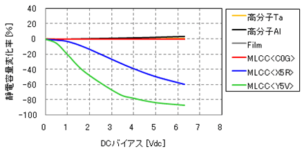

# セラミックコンデンサのDCバイアス特性  

セラミックコンデンサはサイズ・内部抵抗共に小さく周波数特性も良いので、一見万能な部品に見えてしまいます。しかしセラミックコンデンサにはDCバイアス特性という厄介な性質があります。  

### DCバイアス特性 is 何  

DCバイアスとはそもそも何かというと、部品に印加されている電圧の直流成分のことです。例えば5Vの電源ラインにセラミックコンデンサを挿入した時のDCバイアスは5Vです。当たり前ですね。  
で、DCバイアスが部品に掛かっているときの部品の特性がDCバイアス特性というわけです。  

## セラミックコンデンサの場合  

セラミックコンデンサにDCバイアスが掛かっている場合、コンデンサの容量が大幅に低下する危険性があります。  

[引用元(村田製作所)](https://article.murata.com/ja-jp/article/voltage-characteristics-of-electrostatic-capacitance)  
上のグラフを見てもらえればわかるように、コンデンサによっては80%程度も容量が減少してしまいます。ちなみにMLCCが積層セラミックコンデンサです。  
DCバイアスによってどれくらい容量が変化するかは、C0G,X5R,Y5Vなどのコンデンサの種類を表す記号からある程度予測することができます。  

## どれくらい気を付ければいいの？  

まあ普通のパスコン程度であればあまり気にする必要はありません。しかし、ブートストラップコンデンサなどのある程度容量を確保しておかなければならない用途や、部品サイズの割に容量が大きい製品（1608の1uFや1005の0.1uFなど）を使用する際は十分注意する必要があります。