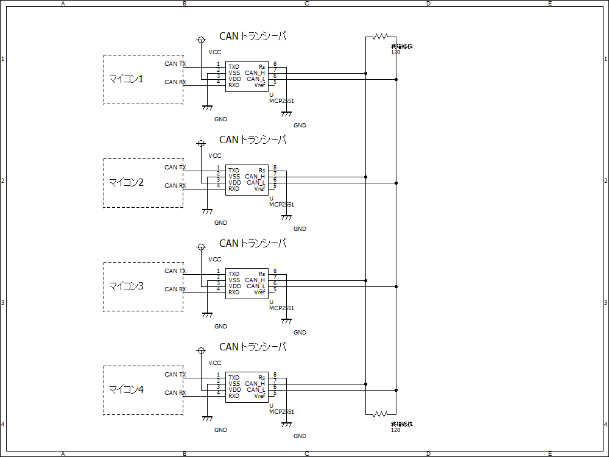

# CAN通信の基本  

CAN通信は2022年度現在、ロボコンAチームのメイン通信に使用されている通信規格である。  
この記事ではCANの物理レイヤーから実装例まで紹介する。  

## 特徴  

CAN通信の特徴として
- トランシーバ・終端抵抗が必要
- 差動通信なのでノイズにつよい
- 最高1Mbpsとそこそこ早い（UART、I2Cと比較して）
- エラー修正機能など圧倒的信頼性
- バス配線可能
- 正直ソフトはちょっとだるい
- IDとかの機能が便利
- マスタースレーブとかの概念が（基本的に）ない
といった点があげられる  

CAN通信は元々車載規格として策定されただけあってとにかく信頼性に重点がおかれた規格である。  
また、高機能なマイコンであれば元々ペリフェラルとして搭載されていたり（一部のSTM32,dsPICなど）、そうでなくてもSPI接続の制御IC（MCP2515等）を使用することで廉価なマイコンでも使用することができる。  

## 物理レイヤー  

配線例はこんな感じ  
  
このように1つの信号ラインに複数のデバイスを接続することができる  
また、信号線の始点・終点に120Ωの終端抵抗を設置する必要がある  

### 信号形式  

CAN通信では差動通信が採用されている  
差動信号とは二本の信号線の間の電位差を用いて通信を行う方式で、信号線とGNDの電位差で通信を行うUARTやSPIなどの規格と比較して圧倒的なノイズ耐性を実現している。  

|  | ドミナント | レセッシブ |
| -- | -- | -- |
| CAN H | 3.5V | 2.5V |
| CAN L | 1.5V | 2.5V |

あ、ドミナントは1,レセッシブは0ってことです。  

## 基本プロトコル  

CAN通信では1つのパケットで次のような情報が送られます  

### 標準フレームの場合  

- SOF
  - 通信開始
- 標準ID
  - 11bit
- RTR
  - リモートフレームか否か
  - リモートフレームでないので0
- コントロールフィールド
  - データ長
- データ
  - 0~8byte送信する
- CRCフィールド
  - ちゃんと受信できたか確認する部分
  - CRCシーケンス
    - データが正しいかの確認コード
  - CRCデリミタ
    - CRC終わり
- ACKフィールド
  - ACKスロット
    - 受信側が正しく受信できたらドミナントが帰ってくる
  - ACKデリミタ
    - ACK終わり
  - I2Cのやつと概念は一緒
- EOF
  - 通信終了

### 拡張フレームの場合  

IDが11bitから29bitに拡張できる

- SOF
  - 通信開始
- 標準ID
  - 11bit
- SRR
  - なんかよくわからんけど1らしい
- IDE
  - 拡張ID送るでござるよ～っていうやつ
  - **拡張IDなので1**
- 拡張ID
  - 18bit
  - 標準IDと合わせて29bitのIDとなる
- RTR
  - リモートフレームか否か
  - リモートフレームでないので0
- あとは同じ

### リモートフレームの場合  

データを要求したいときに送る  
I2Cのr/wビットみたいなかんじ（？）

- SOF
  - 通信開始
- 標準ID
  - 11bit
- （拡張IDのリモートフレームももちろんできる）
- RTR
  - リモートフレームか否か
  - **リモートフレームなので1**
- CRCフィールド
- ACKフィールド
- EOF

## フィルターID・マスク  

CANではフレームごとにIDがついているわけだが、いちいちソフト上で必要なフレームのIDかどうか判断するのはめんどくさい。  
というわけでフィルターやマスクを使って必要なフレームだけを受け取るようにしよう  

### 仕組み  

IDとマスクを設定することで、
```c
(受信ID & マスク) == (フィルターID & マスク)  
```
となった場合にのみデータを受け取るようにできる  

例えばマスクを0x0F0、フィルターIDを0x0A0としていた場合、IDの7~4bit部分が0xAならデータを受け取る  

つまり、  
受信IDが0x0A0 ~ 0x0AFならばデータを受け取るが、0x000 ~ 0x09Fや0x0B0 ~ 0x7FFのデータを受け取らない、ということ  


## マイコンごとの仕組みとか実装例とか  

### STM32(HAL)の場合  

僕はアンチSTM32（というかアンチcubeIDE+HAL）なのであんまり詳しくない  
[やっぱりここがわかりやすく参考になるのでおすすめ](https://hsdev.co.jp/stm32-can/)  

どうやらIDマスクモードとIDリストモードがあるらしい  
1つのCANモジュールごとに複数フィルターバンクがあり、そこにフィルターIDやマスクを設定する  

#### リストモード  

設定したフィルターIDと受信したIDが完全一致した時のみ受信するモード  1つのフィルターバンクごとに標準IDなら4つ、拡張IDなら2つのIDを設定できる  

**マスクを掛けずに直接比較するモードとも言える**  

#### マスクモード  

マスクとフィルターIDを設定するモード
1つのフィルターバンクごとに標準IDなら2つ、拡張IDなら1つのマスクとフィルターIDを設定できる  

ちなみにCANモジュールごとにFIFOが二つあり、フィルターバンクごとにどちらのFIFOに格納するか設定できる  

### dsPIC30F4012の場合  

こんな古のマイコン誰が使うんやって感じだが部室に大量に在庫があるので一応  
[こちら](https://github.com/TNCTRobocon/PCU3_control/tree/taichi/experiment/driver)は2022年度の電源基板のソフトだが一応動作確認済みである  

受信データレジスタが二つありそれぞれにIDとマスクを設定できる  

|  | マスク | フィルターID |
| -- | -- | -- |
| CAN RX0 | 1つ | 2つ |
| CAN RX1 | 1つ | 4つ |

また送信データレジスタは3つある

機能的にはSTM32に劣るが構造はシンプルなのでこっちの方がすき（個人の感想です）  

### teensyの場合  

現状[こちらのライブラリ](https://github.com/tonton81/FlexCAN_T4)を使用している  
結構手軽に扱えるのでいいぞ  

## ロボA内での現状  

コネクタ規格は[こちら](../roboA_rules/connector_rule.md)を参照  
基本的にボーレートは500kbpsを使用している  