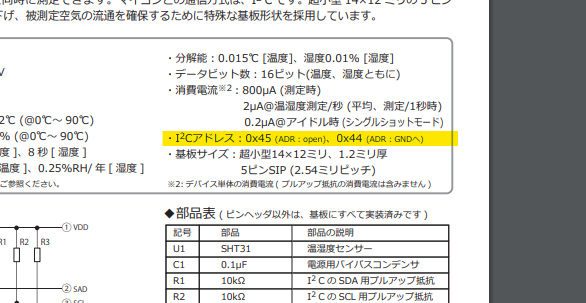

# I²C通信の基本  

I²C(Inter-Integrated Circuit)は、マイコンを用いた電子工作では良く登場する通信形式の一つです。  
この記事では簡単なプロトコル解説と配線方法、arduinoでの使い方の説明をしてこうと思います。  

## 特徴  
I2CはSCL（クロックライン、SCKとも）とSDA（データライン）の二つの通信線を用いて配線する同期通信の一種です。

特徴としては、  
- マスタースレーブ形式  
- 通信速度は100kbps~400kbps  
- 一つのバスラインにたくさんのスレーブ機器を接続できる  
- ノイズに弱い(基本的に基板内通信専用)  

といった特徴があります。  
また、I2C通信は多くのモジュールが採用しており、加速度センサー、カラーセンサー、温度センサーなどの各種センサー類や、LCDなどの表示機器においても使用されています。

## arduinoでの使用例  

arduinoではWire.hというライブラリを使用するのが一般的です。  
arduinoをマスタとして使用する際のプログラム例を下に示します。  

```c
#include<Wire.h>
const uint8_t slave_ID = 0x1E; //今回はスレーブのIDを0x1Eと仮定
uint8_t TX_data[4];  //送信するデータ
uint8_t RX_data[4];  //受信するデータ

void setup(){
    Wire.begin();  //通信開始
}  
void loop(){
    //送信
    Wire.beginTransmission(slave_ID >> 1);  //スタートコンディションを生成して送信先のIDを指定
    for(uint8_t i = 0; i < 4; i++){
        Wire.write(TX_data[i]);  //データを送信
    }
    Wire.endTransmission(); //ストップコンディションを生成
    
    //受信
    Wire.requestFrom(slave_ID,data_size); //"slave_ID"から4byte分のデータを受け取る
    for(uint8_t i = 0; i < 4; i++){
        RX_data[i] = Wire.read();
    }
}
```  

## 通信時の信号  
では、具体的にどのような信号が送信されているのか見ていきましょう。  
I2Cでの通信中、データラインはこのような信号が送られています。
  
~~絶対BSchで書くものじゃないんだよなあ~~  
送信の流れとしては、  
1. スタートコンディションの生成
2. データの送信
3. ACKの受信
4. ストップコンディションの生成  

という感じです。  
それぞれ詳しく見ていきましょう。  

#### 1. スタートコンディション  
スタートコンディションはI2Cでの通信の開始時に生成される信号のことです。「いまから通信するよ～～」という宣言ですね。  
上図を見てもらえれば分かるように**SCLがHIGHの時にSDAをLOW**にすればスタートコンディションになります。  

#### 2. データの送信  
これも上の図を見てもらえればわかるように、SCLが立ち上がったときのSDAの状態が1bit分のデータとなります。  

#### 3. ACK受信  
受信側がデータの受け取りを完了したら、受信側がSDAラインをLOWにすることで、ACK（アクノリッジ）を生成します。  
arduinoではWire.write()などの関数にACKの確認は含まれているので特に気にする必要はありません。  

#### 4. ストップコンディションの生成  
送信したいデータを全て送ったら**SCLがHIGHの時にSDAをHIGH**にすることでデータの送信が完了します。  
もし、複数byteのデータを送信したければストップコンディションを生成せずに連続でデータを送ればOKです。  

### アドレスの指定  
I2Cでは一つのデータバスに複数のデバイスが繋がることになるので、一対一で通信するときにはアドレスを指定してあげる必要があります。  
アドレスには7bitと10bitの二種類があります。  
送信するときはこんな感じ。

|  | 0 | 1 | 2 | 3 | 4 | 5 | 6 | 7 | 8 | 9 | 10 | 11 | 12 | 13 |
| :---: | :---: | :---: | :---: | :---: | :---: | :---: | :---: | :---: | :---: | :---: | :---: | :---: | :---: | :---: |
| 7bit | ⑥ | ⑤ | ④ | ③ | ② | ① | ⓪ | R/W | x | x | x | x | x | x | x | x |
| 10bit | 1 | 1 | 1 | 1 | 0 | ⑨ | ⑧ | R/W | ⑦ | ⑥ | ⑤ | ④ | ③ | ② | ① | ⓪ |  
あ、⑥とかってのはIDの6bit目ってことです。  
さて、R/Wとかいう良くわかんないものが出てきましたね。これはマスタが今から送信するのか、それとも受信するのかを伝えるビットです。**0でマスタが送信**で**1でマスタが受信**ですね。  
あと10bitアドレスの初めに0b11110が送信されてると思いますが、これは今から10bitのアドレスを送りますよ～～っていう宣言みたいなものですね。  

アドレスはこんな感じで部品の取説とかに書いてあるのでそこを参照しましょう。
  
[引用元（SHT31）](https://akizukidenshi.com/catalog/g/gK-12125/)
