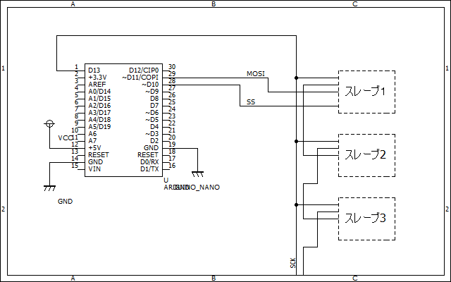

# SPI通信の基本  

SPI（Serial Peripheral Interface）はマイコンを用いた電子工作では良く登場する通信形式の一つです。  
この記事では簡単なプロトコル解説と配線方法、arduinoでの使い方の説明をしてこうと思います。  

## 特徴  
SPIは、MISO（スレーブ→マスタのデータ）、MOSI（マスタ→スレーブのデータ）、SCK（クロックライン）、SS（スレーブセレクト）の4本の線で通信する同期通信の一種です。  

  

特徴としては、  
- マスタースレーブ形式  
- 一つのバスラインにたくさんのスレーブ機器を接続できる  
- ノイズには…I2Cよりは強い(基本的に基板内通信用)  

といった特徴があります。  


## arduinoでの使用例  

arduinoではSPI.hというライブラリを使用するのが一般的です。  
arduinoをマスタとして使用する際のプログラム例を下に示します。  

```c
#include<SPI.h>
uint8_t TX_data; //送信データ
uint8_t RX_data; //受信データ
void setup(){
    SPI.begin();
}
void loop(){
    //送受信
    digitalWrite(SS,LOW); //通信開始
    RX_data = SPI.transfer(TX_data);
    digitalWrite(SS,HIGH); //通信終了
}
```  

## デイジーチェーン接続  
SPI通信ってI2Cとかと違って線が4本も必要で大変ですよねー。  
しかもひとつのデバイスに付きSSピンを1つ割り当てないといけないからIOポートもさらに消費してしまいます。  
ということでその辺をいい感じにできるのがデイジーチェーンです。  

  

こんな具合でスレーブデバイスを数珠つなぎに接続することで、配線を大幅に単純化することができます。  
ただもちろんスレーブからマスタへの送信はできませんし、途中のデバイスでエラーが起こればそれより後ろのデバイスも動かせなくなってしまうのであまりお勧めはしません。
