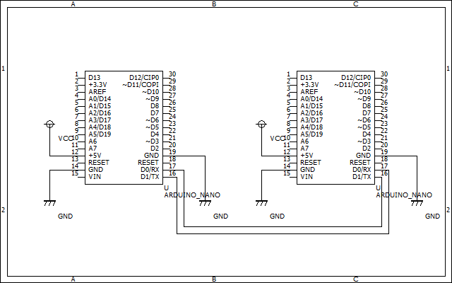
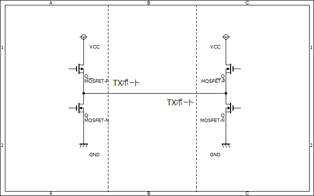
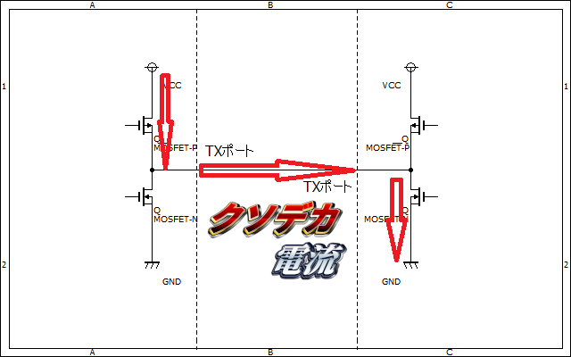
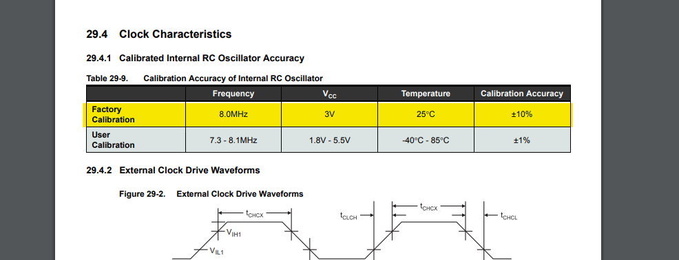

# UARTの基本  

UART（Universal Asynchronous Receiver/Transmitter）はマイコンやパソコンなどを用いた工作では良く登場する調歩同期式の通信を行うペリフェラルです。  

## 特徴  

UARTはRXとTXの二本の通信線で通信を行います。クロックラインは存在せず、通信を行うデバイス自体ののクロックをもとに情報を読み取ります。  

  

上の回路を見てもらえれば分かるように、基本的にRX→TX、TX→RXという風に配線します。  
特徴としては、
- 基本的に一対一通信  
- I2CやSPIよりノイズに強い（クロックラインがないから）  

といった特徴があります。  

## arduinoでの使用例  

arduinoではSerial.hというライブラリを使用するのが一般的です。  
arduinoをマスタとして使用する際のプログラム例を下に示します。  
```c
void setup(){
    Serial.begin(9600);  //ボートレートは9600bpsとする
}
void loop(){
    //送信
    Serial.write(TX_data);
    
    //受信
    if(Serial.available()){  //受信しているデータがあれば
        RX_data = Serial.Read();
    }
}
```  

## 信号レベルによる区分  
基本的にarduinoなどのマイコンから生成される信号はHIGHとして+5Vや+3.3V、LOWとして0Vの信号レベルになります。  
しかしこれではノイズ耐性的に微妙なので信号レベルを変換した通信規格が存在します。

### RS-232  
これは信号レベルを±5Vに変換したものです。  
昔のパソコンとかに良くついてたやつですね。まあ今ではUSBとかに置き換えられてしまっていますが。  
信号レベルの変換にはMAX232などのドライバICを使用しましょう。
秋月だったら[ADM3202ANZ](https://akizukidenshi.com/catalog/g/gI-09001/)などがいいんじゃないでしょうかね

### RS-422
これはRS-232を差動信号に変換したものです。  
なのでノイズにはかなり強いですね。  
信号の変換には秋月だったら[LT1785](https://akizukidenshi.com/catalog/g/gI-02791/)あたりのICがおすすめです。

### RS-485
基本的にRS-232やRS-422は一対一の通信でしか使用できません（まあRS-422は一方的な送信であれば複数の受信デバイスを接続できますが）。  
その辺を改良したものがRS-485です。  
RS-485はバスラインに最大32台までのデバイスを接続できます。

………ここまで偉そうに書いてきましたが正直この辺の規格、あんまりよくわかってないんですよねー。まあ[こちらのサイト](http://www.sacom.co.jp/lecture/rs422-rs485.html)が参考になるんじゃないかなーと思います。  

## 注意点  
### 配線時
上の配線例でも描いたように、TX→RX、RX→TXという風に配線します。  
ではもし逆に接続してしまった場合どうなってしまうのでしょうか。  
RX同士を接続してしまった場合は特に問題ありません。まあ意味不明な信号がは読み取られるかもしれませんけど。  
ではTX同士を接続した場合どうなってしまうのでしょうか。  
マイコンの内部の回路を考えてみましょう。  
  
マイコンのIOポートはこのようにプッシュプルで構成されています。では、この回路において、片方がHIGH、もう片方がLOWになってしまった場合、どうなるでしょうか。  
  
まあこんな感じでIOポートに定格を超えた電流が流れてしまいますよね。というわけで気を付けましょう。  

 
画像:@ouka_makeより  

### クロック精度  
UARTは歩調同期式で、デバイスごとのクロックを使用して通信を行うため、ある程度のクロック精度が無いと通信は行えません。一般的にUARTの通信に必要なクロック精度は2~3%だそうです。  
では、一般的なマイコンの内部クロックの精度はどの程度なのでしょうか。  
[ATmega328p](https://akizukidenshi.com/catalog/g/gI-12282/)（arduino uno等に使用）のデータシートを見てみるとこのようになっています。  
  
±10%…。うーん辛そうですね。もちろんマイコンによって精度はまちまちなのですが、水晶発振器やレゾネータ（セラロック）などの外部発振器を使用するのが無難でしょう。あ、もちろんarduinoにはちゃんと水晶発振器がついてますよ。

### USART  
UARTの派生型として同期通信に対応させた通信方式にUSART（Universal Synchronous Asynchronous Receiver Transmitter）が存在します。とはいってもほとんど使ってるところはみませんけどね。  
STM32などでペリフェラル名がUSARTになっていることがありますが、もちろんUARTとしてもつかえるのでご安心を。