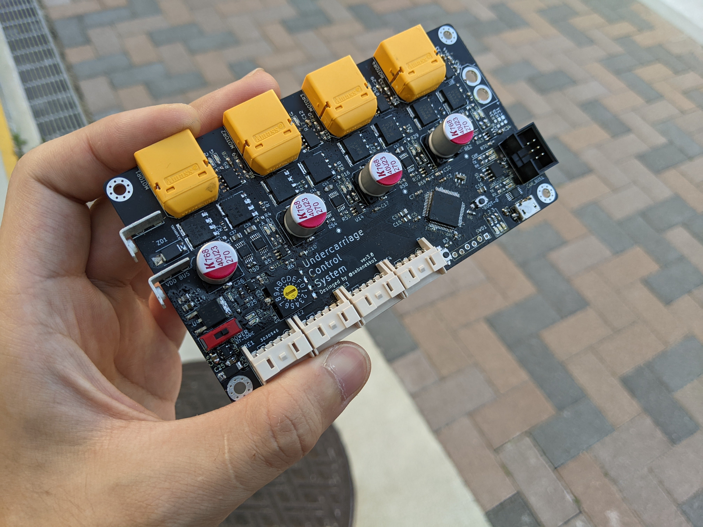

# モタドラを設計していく連載  
## Vol.1 コンセプトを決める

こんにちは。近藤大一です。  
このシリーズは僕がモタドラを設計しつつ、モタドラを設計する上での技術的なポイントを解説していく謎記事連載です。  
**飽きて止めるかもしれんので注意**

### 1 ロボAにおけるMDの現状  

現状ロボコンAで使われているモータードライバはこちらのUCS3.0というものです。  
  
まず初めに言わせてください  

**俺の基板エロすぎだろ！！！！！！！！**

卍圧倒的コンパクトさ卍 と †圧倒的性能† を備えたこちらの基板、わりと正解と言っても差支えない品であると自負しております。  

でもね、そんな~~自称~~最強モタドラにも欠点はいくつかあるんです。  

#### 1.1 UCS3.0の欠点  

そもそもこのモタドラ（というかUCS（Undercarriage Control System）シリーズ）の最初期の設計コンセプトは、**4輪オムニを一枚の基板で制御する**というものなんです。そのためにこちらの基板には、モータードライバからマイコンまで、足回り制御に必要な全ての機能を詰め込んでいます。  
しかし、その設計コンセプトが仇となってしまった点がいくつかあるんですよねー。

- 圧倒的メンテ性の低さ
  - 1つでも部品が死んだらモーター四つ分のドライバが同時に使用不可になってしまう
- 量産キツイ
  - 部品多杉だろ
- 熱的にきびちい
  - 部品密度が高いので仕方ないが700番台とかを使われるとちょっと怖い
- 長辺が約120㎜なので基板が少し高い
  - ALLPCBなら150㎜まで安価な設定で購入できるが最近はALLPCB自体が値上げしてきていやがる
- 使用している電流センサが雑魚
  - 700番台を回せる代物じゃない

とくにメンテ性の低さに関しては割と致命的ですよね。予備を作ればいい話ですが、部品点数が多いため手軽に量産はできません。  

そんなわけで今回新たにモタドラを設計していこうと思い立ったわけですね。  
で、ついでに技術的にどんな要素を考慮しつつ設計しているのか、並行して解説記事を書いていけたら一石二鳥ｼﾞｬﾝ、ってなったので書き始めたわけです。

### 2.コンセプトを考える  

#### 2.1 大まかな方針
というわけでUCSの反省を踏まえた新型モタドラの大まかな方針はこちら  

- もっとメンテ性をあげたい
  - ブリッジ部分を取り外せるようにするか、手軽に部品交換できる構造を作るかのどちらか
- 汎用性の高い部品を使う
  - UCSのMOSFETやマイコンが半導体不足で死んだ事の反省
- 熱を真面目に考える
  - 今回はちゃんと熱設計します。はい。
- **もっと江戸さを！！！！！！！**

ということでここからは具体的なモタドラの完成形を考えていきましょう。

#### 2.2 モタドラの形態  

現在高専ロボコンで使用されているモタドラの形態は、大雑把に分けると次のようになります（自分調べ）。  

- PWM式モタドラ  
  - フィードバック制御できないモタドラ
  - PWM信号やduty比など超低レイヤーの信号を受け取り動作する
  - システムへの組み込みなどの柔軟性が高い
  - ~~自作しなくても市販品でよくない？？~~
- 単純制御モタドラ  
  - エンコーダなどによるフィードバック制御可能なモタドラ
  - 外部から目標回転数などの低レイヤーな情報を受け取り制御する
  - 基本的にモタドラ基板とモーターは一対一対応
  - 多分自作モタドラ界隈では一番一般的
- 統括制御モタドラ  
  - 複数のモーターをフィードバック制御できるもの
  - 複数モーターによる複合的な動作もできるので、ロボット自体の移動量など中レイヤーな情報も（やろうと思えば）処理できる
  - 正にUCSと同じ

それぞれにメリットデメリットがあるわけですが、まあでもできればいいとこどりしたいですよね  

というわけで、今回は**単純制御モタドラをベースにした統括システム**を作ろうと思います（？）。  

#### 2.3 今回のコンセプト  

まず方針でも書いたように、とにかく**メンテ性のいい物が作りたい**わけです。この点に置いて最強なのは上でいうところの単純制御モタドラとなります。安いし量産も楽というのも美味しい所  
しかし、それでは面白くない、というか別に市販品を使えばいいだけの話なので

- 