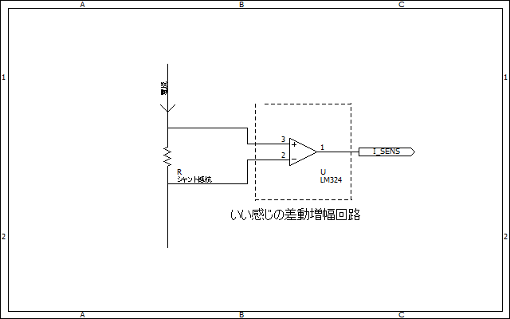

# モーターの電流センシング回路  

モータを制御していると、モーターに流れている正確な電流を測定したくなるときがあります。今回はそんな時に用いる検流回路について説明します。  

## 基本回路  

### シャント抵抗式  

シャント抵抗という、比較的小さい抵抗の抵抗器を回路上に設置し、その両端の電圧を測定することで間接的に電流を求める手法です。  

  

シャント抵抗はただの抵抗ですし、最近のマイコンだとオペアンプが内蔵されている事も多い（PIC16F17xx,STM32G4など）のでかなり安く作ることができますね。  

### ホールセンサ式  

コイルに計測したい電流を流し、そのコイルで発生した磁束を測定することで電流を測る手法です。  
  
最近だと安いICも出ていますし、測定したい回路と検出回路を絶縁できるのも大きなメリットですね。  

## 検流する場所  

### 直接測定方式（仮称）  

なんて呼べばいいのかわからんかった…  

  

こんな感じでハーフブリッジの中間部分に検流回路を設置し、直接出力電流を測定する手法です。  

#### メリット  

山・谷のどちらで検流しても良い（後述）のでプログラム側で考えることが減る  
多少検流アンプの周波数帯域が低くても問題ない。  

#### デメリット  

電流検出アンプ（この回路ならMAX40056）にそこそこの耐圧が求められる。  
高コスト化しがち。  
ただしホールセンサ式のセンサであればあまり関係ない  

### ローサイド検流方式  

  
※この回路は間違っています。リファレンスにはVDDA/2を入れてあげましょう。  

こんな感じでブリッジの下にシャント抵抗を入れてあげる方式です。  

#### 動作のイメージ  

ローサイド検流は、一見ブリッジが電流を吸い込んでいるときしか電流を測定できないように思えますが、ちゃんと電流を吐き出している時も測定することができます。  

  

こんな感じの回路を考えてみます。  

検流ブリッジが電流を吸い込む場合は、こんな感じで素直に電流を測定することができます。  

  

では、吐き出し時はどうなるのでしょうか。  

はじめはこのような経路で電流が流れますね。  

  

そして、ブリッジは一定周期ごとに上下のON/OFFが切り替わるので、一定時間後にはこのような状態になるはずです。

  

ちゃんとシャント抵抗に電流が流れるので電流も測定できそうですね。  

もちろん負電圧を測定できるアンプは必要になりますが、大抵の電流検出アンプは対応しているので大丈夫です。  

#### メリット  

耐圧はいらないので安い検流アンプを使用できる。  

#### デメリット  

それなりに帯域周波数が広いアンプを使用する必要がある。  
最低でもPWM周波数の5倍ぐらいは欲しい。  
ここの数値  
  
https://www.ti.com/product/ja-jp/INA199  

理由は[ローパスフィルタを入れるべきか](ローパスフィルタを入れるべきか)に書いた通り。

ローサイドがONのタイミングでADCしてあげないと上手く測定できないため、制御が少し面倒。  

### ハイサイド検流方式  

ローサイドとほとんど変わらない。ただし直接測定方式と同じくセンサーにそれなりの耐圧が必要なので余り使うメリットを感じないのが現実。  

## ADCのタイミング  

モーターを制御する際、特にベクトル制御などをしたい場合はADCするタイミングに気を使う必要があります。  

...書くのめんどくさくなった！！！ここの辺の記事読め！！！れ！！

https://ioloa.com/blog/archives/339
https://blog.mmaakkyyii.com/posts/post24/

ちょこちょこ出てきた山谷割込みとかもこの記事で学びやがれください。

ちなみに、ローサイド検流回路でADCするタイミングを間違えるとこんな感じの電流波形が観測されたりします。  

  

ゴミですね。  
あ、ブラシレスモータの電流波形です。  
見事に負電流（吐き出し電流）が測定できていませんね。  

## ローパスフィルタを入れるべきか  

ノイズ対策を目的としてセンサー出力にローパスフィルタを入れることは良く行われると思います。では、モータードライバ回路でも同じようにすべきでしょうか。  

結論はNO、特にローサイド検流の場合は絶対にNOです。  

上でも述べたようにブリッジが電流を吐き出している際は、シャント抵抗に電流が流れる時と流れない時が存在します。そのため、ローパスフィルタで平均電流を取ってしまうとこのように非常に歪んだ波形が測定されてしまいます。  

  

ローパスフィルタを入れるのであればADCした後にソフト側で入れるようにしましょう。  
