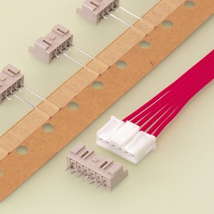
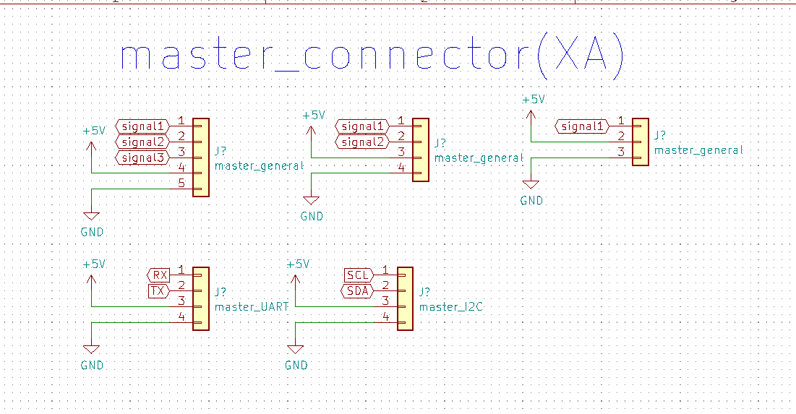
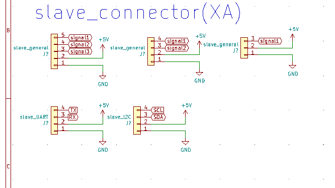
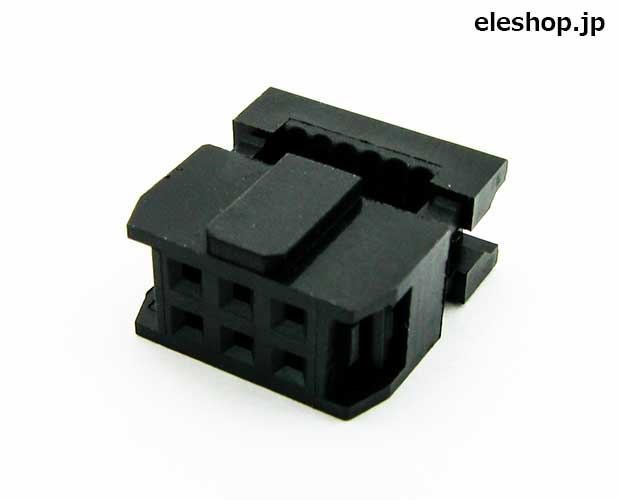
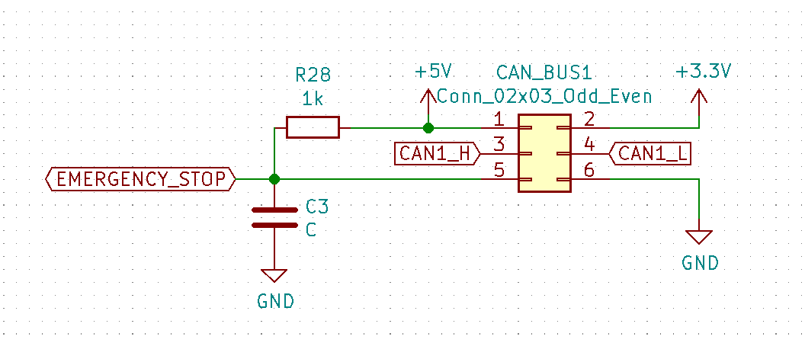
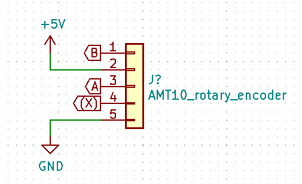
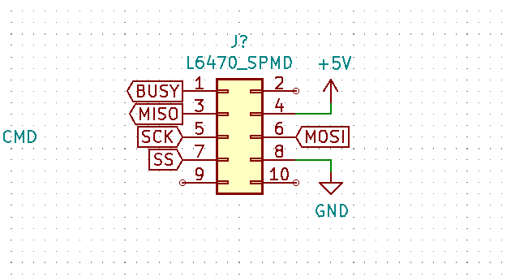
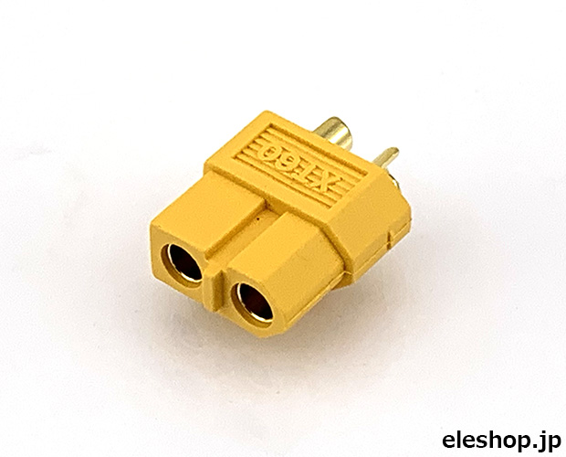
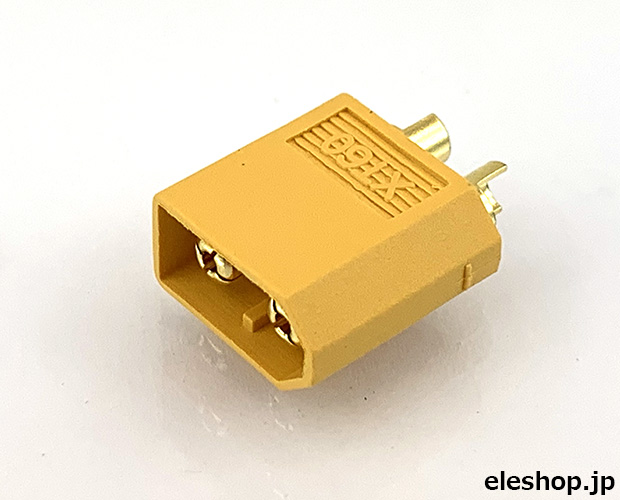

# ロボコンA　コネクタ・通信規格  

## 弱電系コネクタ  

基板間の通信など、情報のやり取りを目的としたコネクタの設計  

### XAコネクタ系ピンアサイン  

XAコネクタを使用したコネクタには、マスタ端子とスレーブ端子の区別が存在します。  
  
ロボAでは2~5ピンのXAコネクタが在庫として用意されています。  

#### マスタコネクタ  

マスタ側の基板のコネクタピンアサインは次のようになります。  

  

基本的に電源には5Vをつなぎましょう。ただし、3.3Vのマイコンにリミットスイッチを接続する3ピンポートを用意するときは電源を3.3Vにもできるよう、スイッチやジャンパなどで電源電圧を切り替えられるようにすると良いと思います。  
また、回路図上ではラベルなどが左側に来るように書くとわかりやすいです。  
上の図には書かれていませんがI2Cのプルアップ抵抗はマスタ側に入れると良いでしょう。後述の通り3.3Vでプルアップしてください。。  

#### スレーブコネクタ  

スレーブ側の基板のコネクタピンアサインは次のようになります。  

  

基本的にピンアサインがマスタ側と逆順になります。  
回路図上ではラベル等が右側に来るように書くとわかりやすいです。  

#### マスターとスレーブの判断基準  

基板同士のマスタ-スレーブ関係に明確な規則は無いですが、下の表を基準に判断すると良いでしょう。  

|  グループ1  |  グループ2  |  グループ3  |
| ---- | ---- | ---- |
|  中央制御系  |  モーター制御基板 電源基板 無線基板など  |  モタドラ センサ基板など  |

序列としてはグループ1＞グループ2＞グループ3と言った具合になります。  
基本的に同一グループ内での通信は避けるべきです。中央処理系が全ての状況を把握できるようにするとよいでしょう。  

### CAN通信用コネクタ  

CAN通信には基本的に6ピンのMILコネクタを使用して通信します。  
  
ピンアサインは次のようになります。  
  
MILコネクタ系ケーブルにマスタ-スレーブ等の区別はありません  
それぞれのピンの機能は次のようになります。

|  名称  |  機能  |
| ---- | ---- |
|  5V  |  5V入力/出力  |
|  3.3V  |  3.3V入力/出力  |
|  CAN_H  |  CAN H信号  |
|  CAN_L  |  CAN L信号  |
|  EMERGENCY STOP  |  非常停止信号 アクティブLOW 信号が発報されたら機能を停止させること  |
|  GND  |  GND  |

非常停止信号は基本的に非常停止スイッチが押されたときや電源電圧に以上が発生した際に発報されます。基本的にはマイコンの入力ピンを使用して常に状態を監視しておくようにしましょう。  
また、5Vや3.3Vを電源入力として使用する場合は消費電流が100mA以下に収まるようにしましょう。  

### その他の特殊コネクタ

#### ロータリーエンコーダー  

AMT10xロータリーエンコーダーの接続には5ピンのXAコネクタを使用します。  
  
部室に存在するAMT10系エンコーダーは5V入力でしか動かせないので注意が必要です。  
また、信号も5Vなので5Vトレラントでないマイコンに接続する際はレベルシフタを挟みましょう  
X相の接続は任意です  

#### ステッピングモータ用（L6470）  

ストロベリーリナックス製のL6470ステッピングモタドラの通信には10ピンのMILコネクタを使用します  
ピンアサインは次のようになります  
  
もし、接続先のマイコンが3.3V駆動なのであれば5Vピンを3.3Vに変更しましょう。L6470のロジック系は3.3V系での駆動も可能です（モタドラ側のジャンパの変更が必要です）  

### 通信の電圧レベルについて  

基本的に、UART,SPI,I2Cなどの通信信号は**すべて3.3V**に統一してください。  
**arduinoからUART通信をする場合は、TX端子にレベルシフタを挿入して3.3Vまで降圧しましょう**  
まあ今のロボAでメインで使っているのは3.3V系のマイコンだけなので多分大丈夫ですが、故障の原因になり得るので気を付けてください。  

## 強電系コネクタ  

基本的に強電系の配線にはXT60コネクタを使用します  
|  XT60 オス  |  XT60 メス  |
| ---- | ---- |
|  電源入力 モーター（基板側） 非常停止スイッチ（スイッチ側）  |  リポバッテリー 非常停止スイッチ基板側 モーター（モーター側） 電源出力  |

ちなみにですが、XT60のメスはこれで、  
  
オスはこれです  
  
勘違いしやすいのでちゃんと覚えておきましょう  
