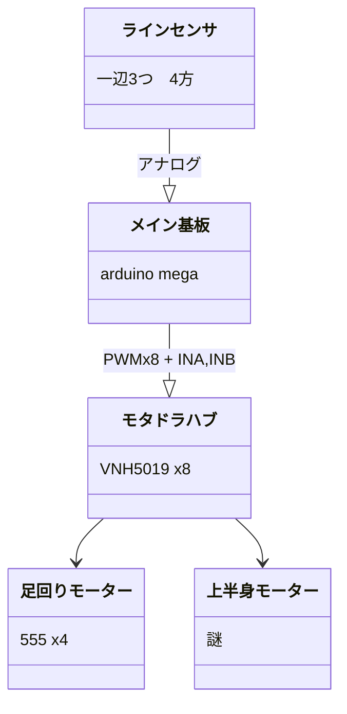
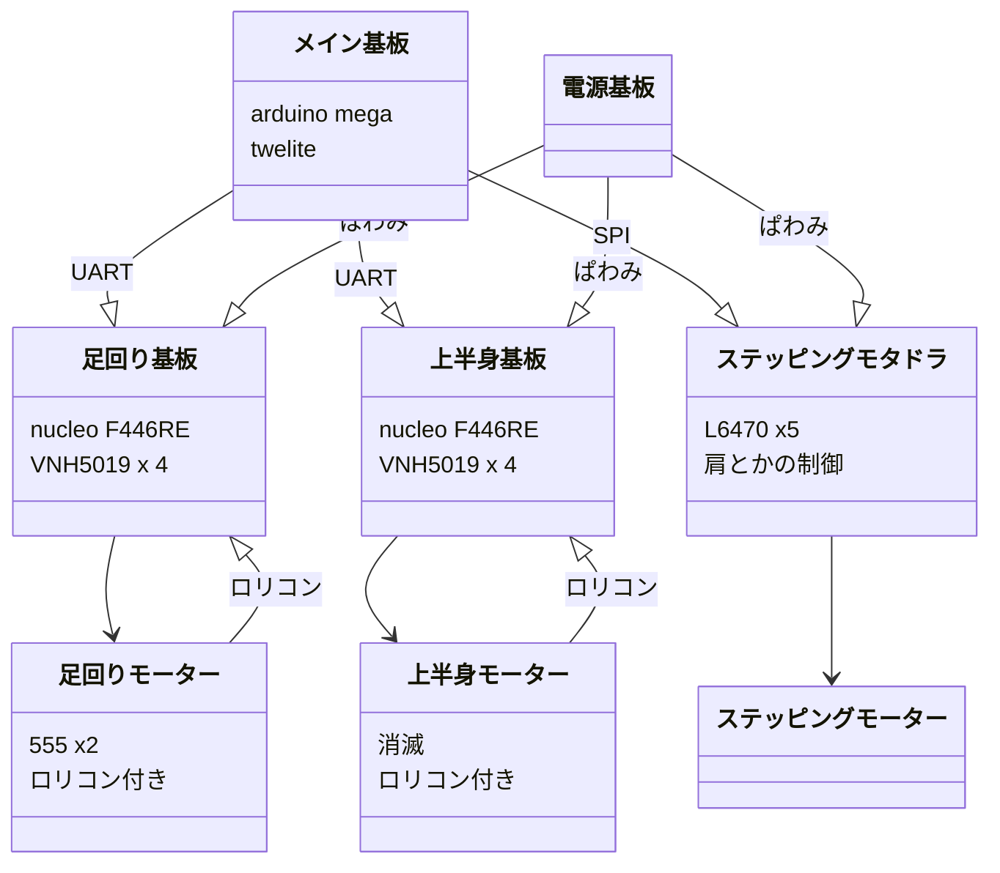
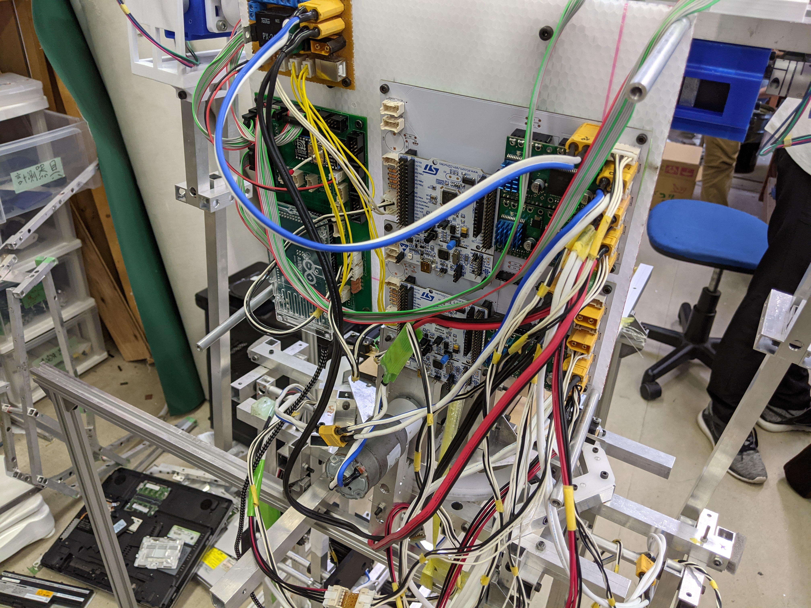
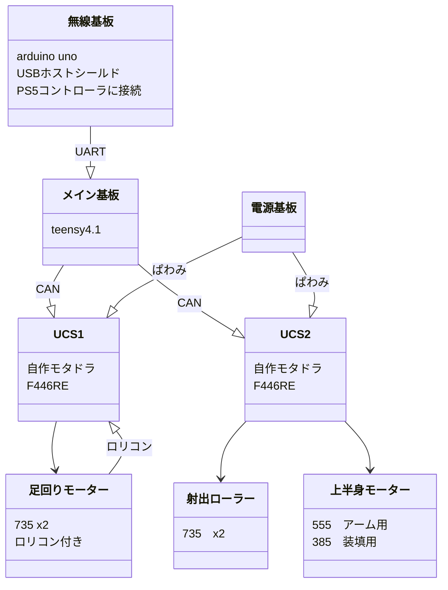
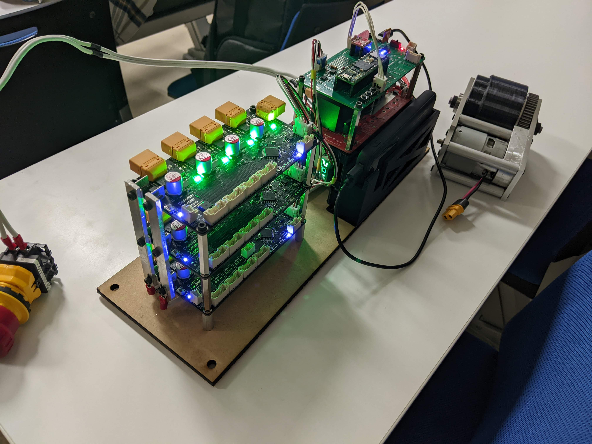
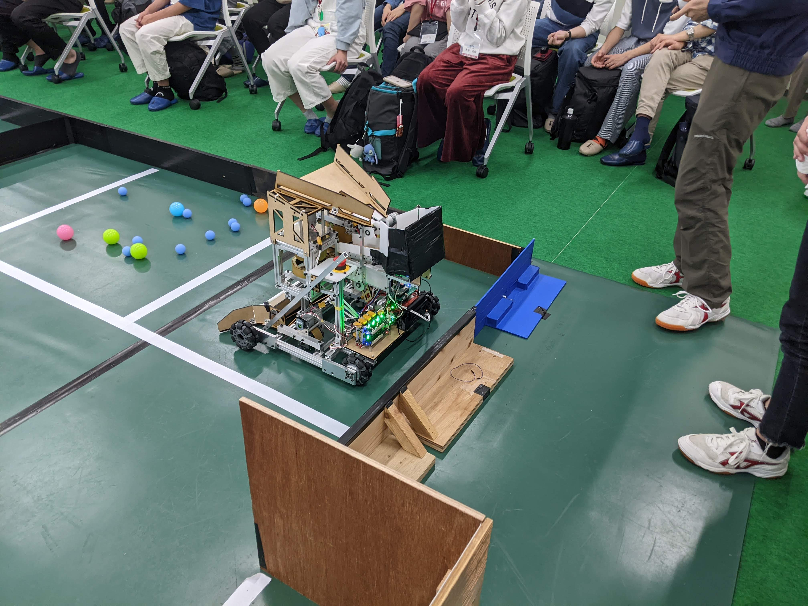
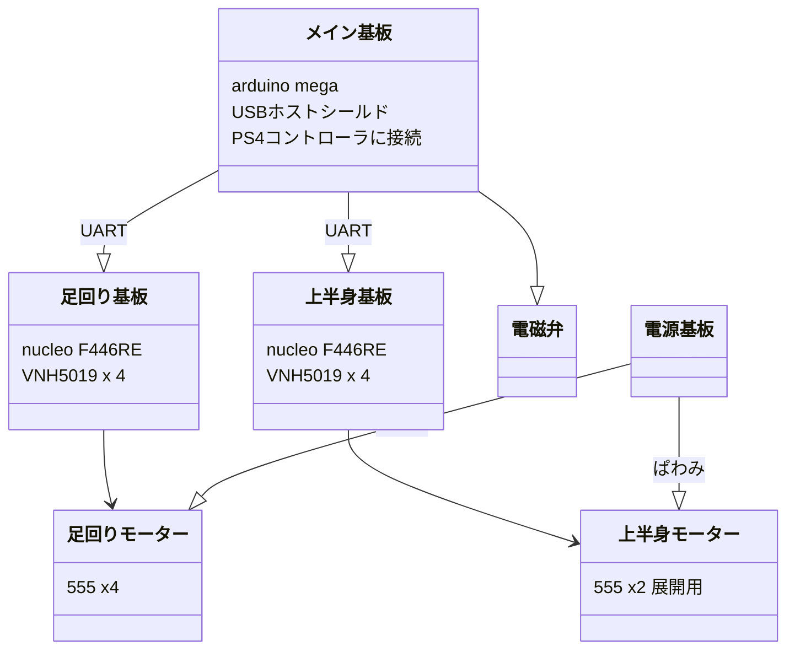
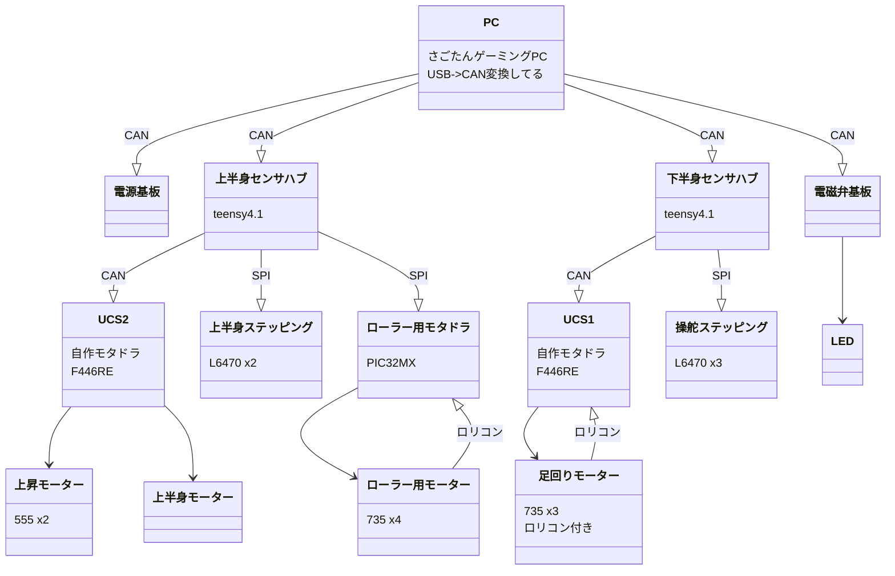
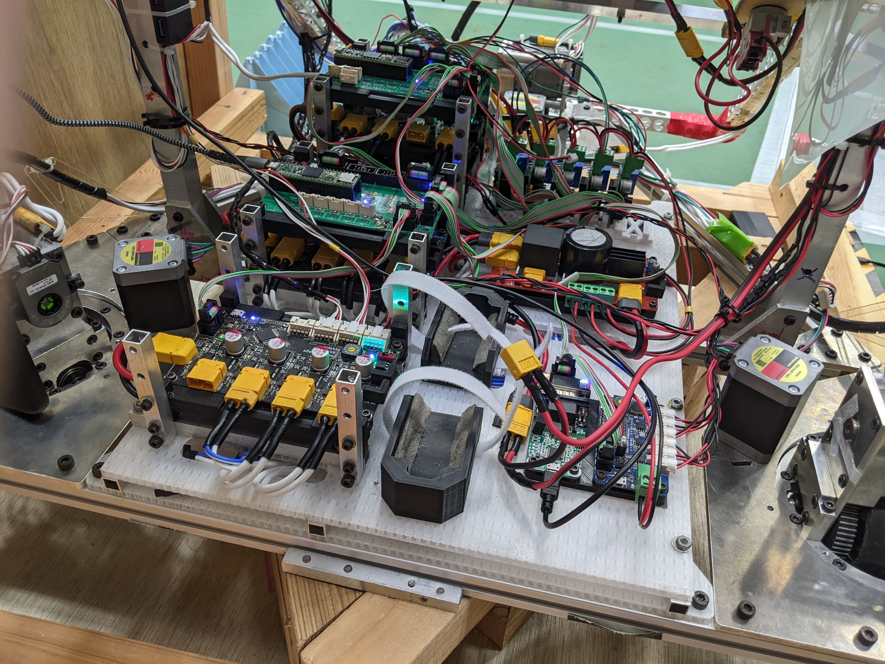

# ロボットの回路構成  

ロボットを動かすためには当然回路が必要なわけですが、やっぱりどんなマイコンをどこに使うべきかって悩みますよね。
ということで僕が見たことのあるブロック図を紹介します。

## 豊田高専  

### 2021年度校内ロボコン Aチーム  

伝説の~~産廃~~ロボット。全てはここから始まった。

ロリコン？そんなものついてるわけないじゃないですかやだなー。  
実物はこんな感じ。もちろん全部ユニ基です。  
  

まあでも実働部員5人＋教育ほぼなしという劣悪な環境（？）で動かすところまで持って行ったのは褒めてほしい。というか入部してから3か月やぞ。  
まあけなしてくれてもいいんですけど。  

### 2021年度本ロボ　Aチーム  

オルテンシアの悪口はそこまでだ！

なお本番で使ったDCモーターは足の二つだけの模様。~~あとロリコンが上手く動かなかったので実際はフィードバックしてないです。~~  

  

### 2022年度校内ロボコン Aチーム #虚無の生成  

（製作時）2年生チーム  
回路的には結構先進的なことができたので満足…  

この時ロボAで3年ぶりに自作モタドラが使われたらしい。  
ちなみに表面実装部品も3年ぶり(?)  
  
この校内ロボコンでモタドラ、電源、teensy4.1、CAN通信の動作実証が行われ、本ロボに繋がってゆくことになる。  
  
なお、arduino unoの問題か無線の遅延が結構やばめだった。

### 2022年度校内ロボコン Aチーム しぐれ弐  

（設計時）1年生チーム  

僕は写真撮ってないので提供求ム  
モーター制御基板は2021本ロボで使用したものの流用  
メイン基板はarduin megaとユニ基で作成。無線が結構切れてて大変そうだった  

### 2022年度本ロボ Aチーム  

なかなかに複雑な感じになってますね。まあこれは図がびみょい感もある。あ、ﾊﾟﾜﾐ系統は省略してます。  
基本的に上半身、下半身、電源、LEDの四系統にCANバスを介して分かれています。  
  

また追記しますね