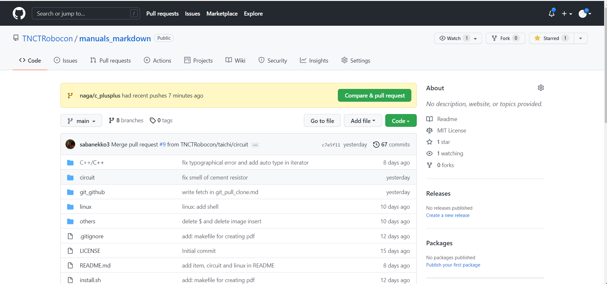
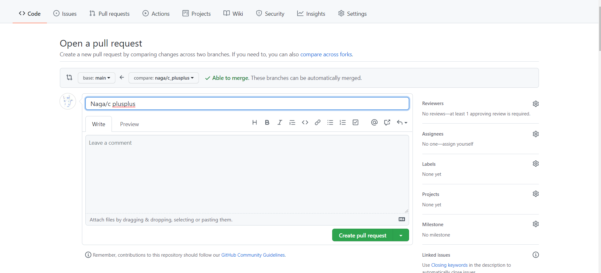
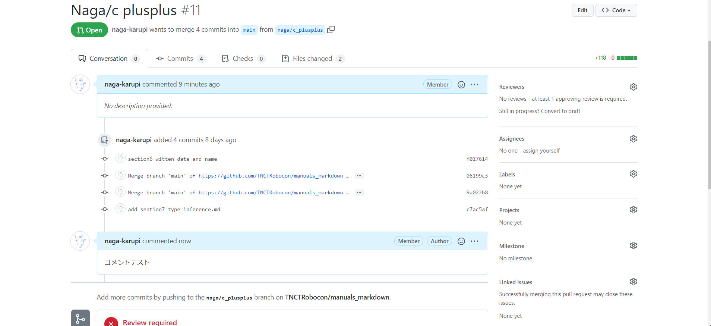
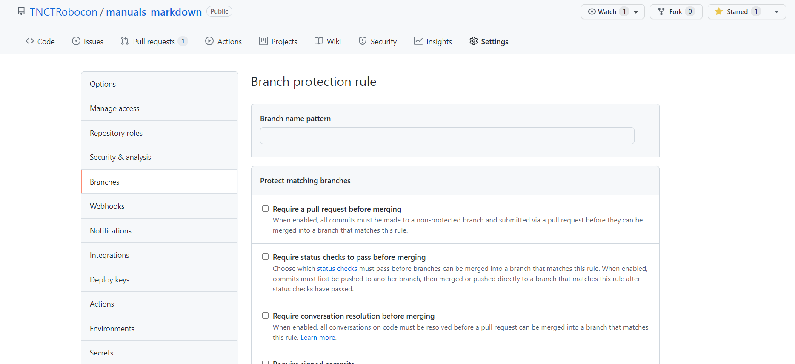

# pull request

pull requestについて詳しく学ぼう

## pull requestの出し方

pushしたらまずはpushしたページを見てみよう

`compare & pull request`というボタンを押す

すると、このページに遷移する

下にスクロールすると

となるのでコメントを適当に打ち込んでpull requestを作る

これでpull requestはできる

## コメントのつけ方

pull requestを作るとこのような画面に遷移する

今回はこのテキストボックスにコメントテストと打ち込んでコメントしてみる

`Comment`を押すとコメントした内容がそのまま記録される

見つけた疑問や問題点などはこうして書き込んでみよう  
pushされたコードにコメントを残すこともできるが、今は説明はしないでおく  

## プルリクエストの設定

`Setting`項を選んで`Branch`を選択

そこから`add rule`で下の写真に飛ぶ

`branch name pattern`で保護したいブランチ名  
`protect matching branches`で保護する内容を確定する  

### 項目の説明

使いそうな項のみ説明していく

- Require pull request reviews before merging  
保護しているブランチに対してマージする前に、プルリクエストによるレビューを必須にする設定。この設定を有効化すると、プルリクエストに対して、承認(Approve)されるまではマージできなくなる
これにチェックを入れると二つの項目が出る

  + Require approvals
  マージに必要な承認してくれる人の数

  + Dismiss stale pull request approvals when new commits are pushed  
これはプルリクエストが承認(Approve)されたあとは、すぐにマージせずコミットを追加することができる。そのような場合に、改めてレビューを必須にする設定。改めて承認(Approve)されるまではマージできなくなる。

  + Require review from Code Owners  
  コードオーナーのレビューを必須にする設定です。コードオーナーはつい先日(2017年7月)に追加された機能。.github/CODEOWNERS に、以下のようなフォーマットで記載すると、ファイル単位でコードオーナーを指定できる。コミット対象のファイルのコードオーナーから承認(Approve)されるまでは、マージできなくなる

- Include administrators  
管理ユーザーに、プルリクエストを強制的にマージさせることを許可するかしないかを設定できる。この項目にチェックを入れると、管理ユーザーであろうとも、承認(Approve)されるまでは、マージできなくなる。

こんなものだろうか  
必要になればまた各自で調べるようにしてほしい

writen by 西永
2021/12/14
