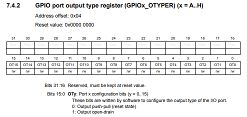
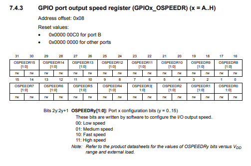
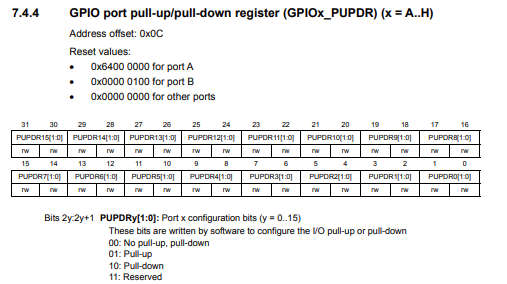
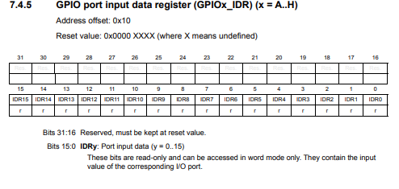
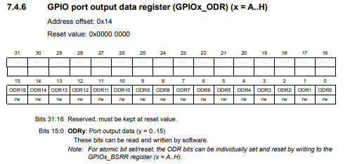
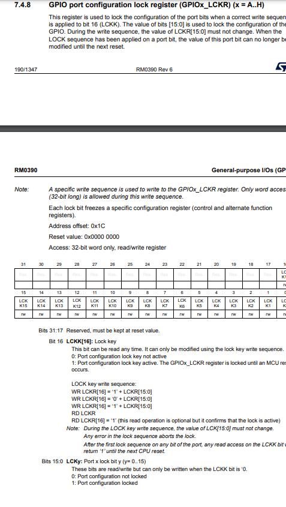

# GPIOピン

LチカでおなじみのIOピンに関する関数やマクロを紹介していく  
マイコンは`stmf446re`を使う

プログラム方面から実装を確認したりしているから見たければどうぞ

## MXでの設定

こうやって設定する 

今回はPA13を`output`、PA12を`input`に設定する


### output

PA13押して


こうやって出るから`GPIO_Output`押して


設定終わり


### input

PA12を押して


`GPIO_Input`押して終わり


## 光らせたり消したり

早速だがLチカ

### `HAL_Delay`関数

一定時間待機する関数

指定時間の単位は[ms]

使い方

```c++
HAL_Delay(ms);
```

#### 実装を見てみようか

<details><summary> 少し詳しい内容になるのでみたい人のみ</summary><div>

実際に何をしているのか見てみようじゃないか  
難しいと思うなら読み飛ばしてもらって構わない

それではコピペしたものがこちら

```c++
__weak void HAL_Delay(uint32_t Delay)
{
  uint32_t tickstart = HAL_GetTick();
  uint32_t wait = Delay;

  /* Add a freq to guarantee minimum wait */
  if (wait < HAL_MAX_DELAY)
  {
    wait += (uint32_t)(uwTickFreq);
  }

  while((HAL_GetTick() - tickstart) < wait)
  {
  }
}
```

なんだこの実装となった人もいるだろう

とりあえず上から解説していこう

##### `__weak`

<details><summary> ここからそれなりに長い解説</summary><div>
マクロである

```c++
#define __weak   __attribute__((weak))
```

実装はこうなっている

`__attribute__`は関数に属性を与える効果がある

今回は`weak`属性が与えられているがどういう意味だろうか

結論から言うと弱い関数定義が行われるというもの  
別に同じ名前の関数を定義するとその定義した方が実行されるもの

例えば`hello.c`と`main.c`があったとして

```c++
//sum.h
void hello();

//sum.c
void hello(){
    printf("hello");
}

//main.c
#include"sum.h"
int main(){
    hello();
}
```

これだと出力は当然`hello`になる

ではこれはどうだろうか

```c++
//sum.h
void hello();

//sum.c
void hello(){
    printf("hello");
}

//main.c
#include"sum.h"

void hello(){
    printf("hello!!!!!!");
}

int main(){
    hello();
}
```

多重定義でコンパイルエラーだ  
これはあくまでどちらの実装を優先したいかにもよるけど今回は`main.c`の実装を優先しよう

```c++
//sum.h
void hello();

//sum.c
__atteribute__((weak)) void hello(){
    printf("hello");
}

//main.c
#include"sum.h"

void hello(){
    printf("hello!!!!!!");
}

int main(){
    hello();
}
```

これの結果は`hallo!!!!!!`だね

見事に`main.c`で定義した関数が優先されているね  
これは拡張子で気がついてる人がいるかもしれないがCでも使える機能である

ライブラリを書くときにユーザー側でも定義できるような余地を残すことができるようにできるから便利だね

他にもつけられる属性があるがそれはあとで出てきたときに別で説明しよう

あくまで`GCC`の拡張機能なので他のコンパイラなら使えなくなるので注意

</div></details>

##### `HAL_GetTick();`

なんというか名前通りな気がするけど一応

現在のタイマの値を取る

関数の定義見る？

<details><summary> 特に難しいことは書いてないはず</summary><div>

```c++
__weak uint32_t HAL_GetTick(void)
{
  return uwTick;
}
```

非常に単純な関数

さて、`uwTick`とはなんだろうか

1msごとに一回割り込まれて増えるグローバル変数

はい以上正直これ以上でもこれ以下でもない

`SysTick`で1kHz割り込まれてるとかなんとかこれ以上踏み込むのは命の危険を感じたので各々で頑張ってくれ

</div></details>

##### if (wait < HAL_MAX_DELAY)

<details><summary> これはまぁ簡単だね</summary><div>

HAL_MAX_DELAYの定義を探ると

```c++
#define HAL_MAX_DELAY      0xFFFFFFFFU
```

32bitの最大値をいれられてる  
つまり4294967296ms以上待っては行けないんですね()
ちなみに大体50日に相当する

この中の実行されるコードは

```c++
wait += (uint32_t)(uwTickFreq);
```

uwTickFreqを追っていこう

```c++
HAL_TickFreqTypeDef uwTickFreq = HAL_TICK_FREQ_DEFAULT;  /* 1KHz */

//======================
typedef enum
{
  HAL_TICK_FREQ_10HZ         = 100U,
  HAL_TICK_FREQ_100HZ        = 10U,
  HAL_TICK_FREQ_1KHZ         = 1U,
  HAL_TICK_FREQ_DEFAULT      = HAL_TICK_FREQ_1KHZ
} HAL_TickFreqTypeDef;
```

うーんこの

1じゃんけ

何らかの条件で別のものが呼ばれるのだろうか  
もしも詳しいひとがいたら教えてください

</div></details>

#####   while((HAL_GetTick() - tickstart) < wait)

中身のないwhile

指定の時間まで中身のないwhileを回し続けるのが本質だったんですね！

なんか拍子抜けした人も多いんじゃないでしょうか  
世の中そんなもんだ()

</div></details>

### マクロ

`GPIO`ピンを設定するには切れない関係にあるやつ  

`Pin`の`Output`を設定するのに必要

例えば  
`PB4`についてポートは`GPIOB`として、ピン番号は`GPIO_PIN_4`として設定されている

`Pin`の`Input`の設定にも必要なので覚えたほうがいい

`PXa`というピンはお察しの通り

ポートは`GPIOX`、ピンは`GPIO_PIN_a`となる

#### ピンに名前をつける

ピンに名前をつけることができる

設定したピンに右クリックして`Enter User label`を押して名前を入力(スクショできなかったので写真がない)

結果がこうなる


そうして保存してコードを生成するとマクロが生成される

マクロがさっきの説明にあったようにポートとピンの2つが生成される

ポートは`Out_GPIO_Port`、ピンは`Out_Pin`となる

#### 実装を見よう

恒例行事になりそう

<details><summary> 少し詳しい内容になるのでみたい人のみ</summary><div>

##### マクロの実装

まぁ特に何もないマクロ

```c++
#define GPIOA               ((GPIO_TypeDef *) GPIOA_BASE)
#define GPIOB               ((GPIO_TypeDef *) GPIOB_BASE)
#define GPIOC               ((GPIO_TypeDef *) GPIOC_BASE)
#define GPIOD               ((GPIO_TypeDef *) GPIOD_BASE)
#define GPIOE               ((GPIO_TypeDef *) GPIOE_BASE)
#define GPIOF               ((GPIO_TypeDef *) GPIOF_BASE)
#define GPIOG               ((GPIO_TypeDef *) GPIOG_BASE)
#define GPIOH               ((GPIO_TypeDef *) GPIOH_BASE)
```

おやおやおや

キャストされてますねぇ

たどっていきましょう

###### GPIO_TyoeDef型

<details><summary> `GPIO_TypeDef`型の中身</summary><div>

```c++
typedef struct
{
  __IO uint32_t MODER;    /*!< GPIO port mode register,               Address offset: 0x00      */
  __IO uint32_t OTYPER;   /*!< GPIO port output type register,        Address offset: 0x04      */
  __IO uint32_t OSPEEDR;  /*!< GPIO port output speed register,       Address offset: 0x08      */
  __IO uint32_t PUPDR;    /*!< GPIO port pull-up/pull-down register,  Address offset: 0x0C      */
  __IO uint32_t IDR;      /*!< GPIO port input data register,         Address offset: 0x10      */
  __IO uint32_t ODR;      /*!< GPIO port output data register,        Address offset: 0x14      */
  __IO uint32_t BSRR;     /*!< GPIO port bit set/reset register,      Address offset: 0x18      */
  __IO uint32_t LCKR;     /*!< GPIO port configuration lock register, Address offset: 0x1C      */
  __IO uint32_t AFR[2];   /*!< GPIO alternate function registers,     Address offset: 0x20-0x24 */
} GPIO_TypeDef;
```

まずは`__IO`からかな

###### `__IO`

`CMSIS`という`ARM`が決めた規格がある

`CMSIS`では、変数が単なる参照用なのか、それともプログラムが変更を行うものなのかを明示するために、変数を宣言する際にIOタイプ識別子を付けることとなっている

定義は下の通り

|       __I        |    __O     |    __IO    |
| :--------------: | :--------: | :--------: |
| `volatile const` | `volatile` | `volatile` |

`__I`は読み込みのみ  
`__O`は書き込みのみ  
`__IO`は読み書き
fdfgesr
</div></details>

その他はレジスタなので省略  
レジスタの解説なんてやってたらきりないし……

え？ やれって？

しょうがないなぁ  
いずれレジスタを直接いじってLチカする変態的な後輩が現れるかもしれないからその子のためにもやってあげるかぁ

###### GPIOのレジスタ

<details><summary>沼へようこそ</summary><dev>

さてここからは私が[データシート](https://www.st.com/content/ccc/resource/technical/document/reference_manual/4d/ed/bc/89/b5/70/40/dc/DM00135183.pdf/files/DM00135183.pdf/jcr:content/translations/en.DM00135183.pdf)とにらめっこですかね

説明の引用は全てデータシートから

- `__IO uint32_t MODER;`
- `__IO uint32_t OTYPER;`
- `__IO uint32_t OSPEEDR;`
- `__IO uint32_t PUPDR;`
- `__IO uint32_t IDR;`
- `__IO uint32_t ODR;`
- `__IO uint32_t BSRR;`
- `__IO uint32_t LCKR;`
- `__IO uint32_t AFR[2];`

これらが今あるIO系のレジスタ一覧

- MODER

`GPIO port mode register`のこと


英語ですねサクッと読んでいきましょう

ピンのモード

00で`Input`モード  
01で`Output`モード  
11で`analog`モード 

では`PA4`を出力に設定したい

レジスタで`MODER4`を出力をする設定にすることを考えてみよう

そうなると`output`が01で  
`MODER4`のレジスタは8, 9ビット目があたるので

書くべきコードは

```c++
GPIOA->MODER |= (01 << 8);
```

他のピンを設定するときも同じように書けば問題ないのである

しかし、このコードでは可読性が高くないことがわかるだろうか  
だが`HAL`には素晴らしいマクロが定義されているので活用していこう

`Drivers/STM32F4xx_HAL_Driver/Inc/stm32f4xx_hal_gpio.h`にある

```c++
#define GPIO_MODE_Pos                           0U
#define GPIO_MODE                               (0x3UL << GPIO_MODE_Pos)
#define MODE_INPUT                              (0x0UL << GPIO_MODE_Pos)
#define MODE_OUTPUT                             (0x1UL << GPIO_MODE_Pos)
#define MODE_AF                                 (0x2UL << GPIO_MODE_Pos)
#define MODE_ANALOG                             (0x3UL << GPIO_MODE_Pos)
```

なるほどなるほど

また、こんなレジスタもある

```c++
#define GPIO_MODER_MODER0_Pos            (0U)                                  
#define GPIO_MODER_MODER0_Msk            (0x3UL << GPIO_MODER_MODER0_Pos)       /*!< 0x00000003 */
#define GPIO_MODER_MODER0                GPIO_MODER_MODER0_Msk                 
#define GPIO_MODER_MODER0_0              (0x1UL << GPIO_MODER_MODER0_Pos)       /*!< 0x00000001 */
#define GPIO_MODER_MODER0_1              (0x2UL << GPIO_MODER_MODER0_Pos)       /*!< 0x00000002 */
#define GPIO_MODER_MODER1_Pos            (2U)                                  
#define GPIO_MODER_MODER1_Msk            (0x3UL << GPIO_MODER_MODER1_Pos)       /*!< 0x0000000C */
#define GPIO_MODER_MODER1                GPIO_MODER_MODER1_Msk                 
#define GPIO_MODER_MODER1_0              (0x1UL << GPIO_MODER_MODER1_Pos)       /*!< 0x00000004 */
#define GPIO_MODER_MODER1_1              (0x2UL << GPIO_MODER_MODER1_Pos)       /*!< 0x00000008 */
//続いていく
```

とりあえず`GPIO_MODER_MODERx_Pos`だけを使う方針で行こう  
そうするとこう書ける

```c++
GPIOA->MODER |= (MODE_OUTPUT << GPIO_MODER_MODER4_Pos);

かなり可読性が良くなっただろう
```

- OTYPER

`GPIO port output type register`のこと



`push-pull`とはなにか、`open-drain`とはなにかは回路に説明を投げるとして  

基本は`push-pull`にしておきましょう

- OSPEEDR

`GPIO port output speed register`のこと



I/Oの出力速度をいじれる  
HALライブラリの設定を覗いたけどコメントアウトによると

| Low speed |       Medium speed       |       Fast speed        |  High speed   |
| :-------: | :----------------------: | :---------------------: | :-----------: |
|   2MHz    | range 12,5 MHz to 50 MHz | range 25 MHz to 100 MHz | 50 MHz to 200 |

らしい

詳しくは製品データシートを確認してくれとのこと

デフォルトで`Low speed`に設定されてるから好きにしてくださいな

- PUPDR

`GPIO port pull-up/pull-down register`



`pull up`か`pull down`されてるならこれを変える必要がある  

回路班に必要なのか聞いてきなさいね

基本的に`input`のときに必要

- IDR

`GPIO port input data register`



こいつらはリードオンリーなので無視無視

一応説明だけすると対応するI/Oポートの入力の値が出る  
つまりInputのときだけこれを読めばいい

- ODR

`GPIO port output data register`



出力を司る大事なレジスタ  
丁重に扱い給えよ

当然0が何もなくて1が出力

- BSRR

`GPIO port bit set/reset register`

上の`ODR`を設定するための~~どこで使えばいいのかわからない~~レジスタ

BR(おそらく`Bit Reset`)を1にすればそこのレジスタの対応するODRが0になる  
BS(おそらく`Bit Set`)を1にするとそのレジスタに対応するODRの値が1になる

- LCKR

`GPIO port configuration lock register`



ピン設定をロックしたい人のためのレジスタ

特に使うことはないかなぁ

- AFR

`GPIO alternate function low register`

変わりの関数を見つけるために必要なのかな  
使ったことをみたことないからパスで(使いたかったら調べてね)

これでIO系のレジスタの説明は以上

</dev></details>

</div></details>

### つけて、消して、またつけて

ようやく光らせることができるようですね(実装見てない人には短かったと思うが)

まずはつけることから
```C++
HAL_GPIO_WritePin(Out_GPIO_Port, Out_Pin, GPIO_PIN_SET);//つける
HAL_GPIO_WritePin(Out_GPIO_Port, Out_Pin, GPIO_PIN_RESET);//消す
```

ちなみにこれはまとめてつけたり消したりできて

同じポートなら別のピン番号を同時につけたり消したりできる

たとえばPA5とPA8を同時につけたければ

```c++
HAL_GPIO_WritePin(GPIOA, GPIO_PIN_5|GPIO_PIN_8);
```

のようにまとめて設定できる

消すときも同様にすれば良い

ただし、別のポートではこの方法は使えないので注意(実装見てる人は知ってるとは思うけど`GPIOA`とか`GPIOB`がポインタだからだね)
