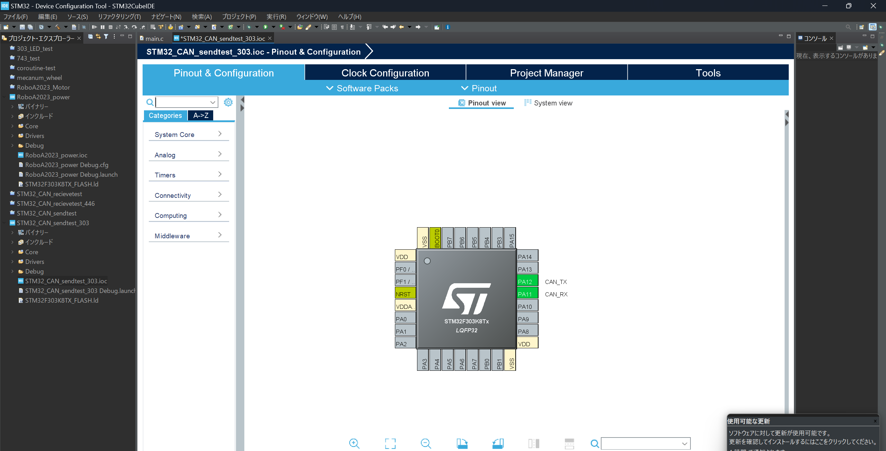
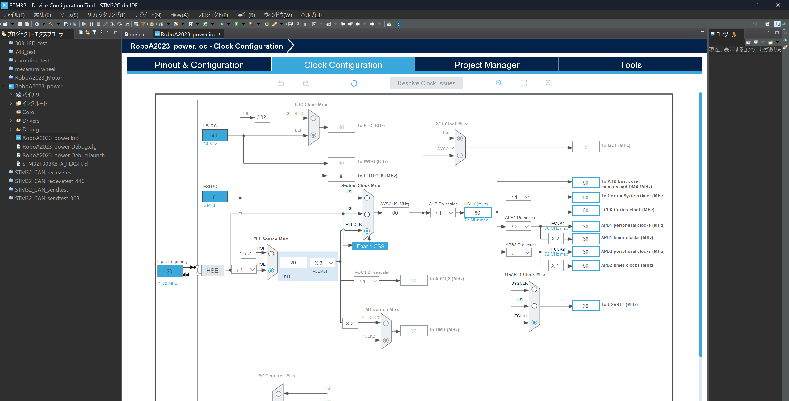
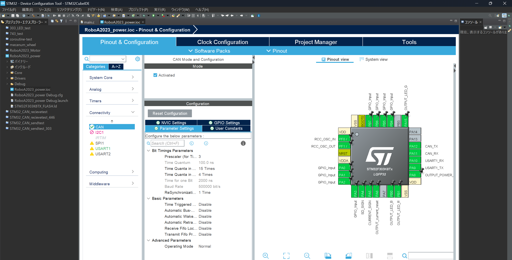
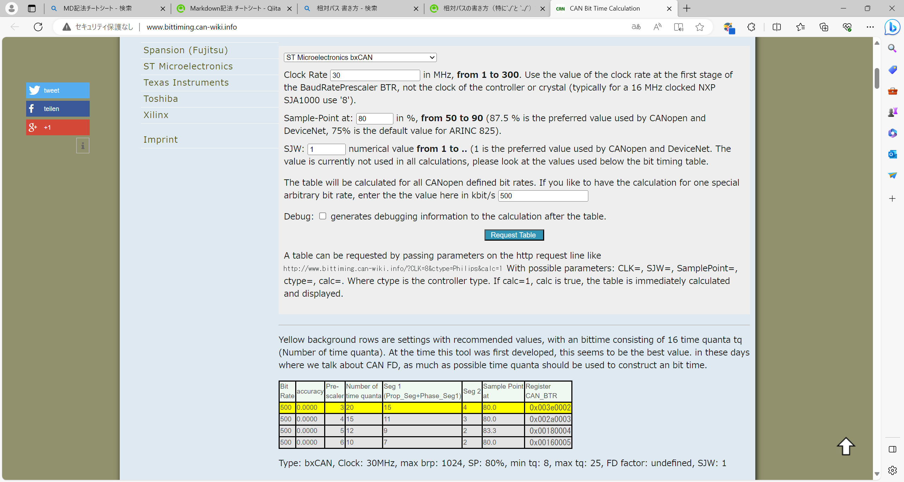
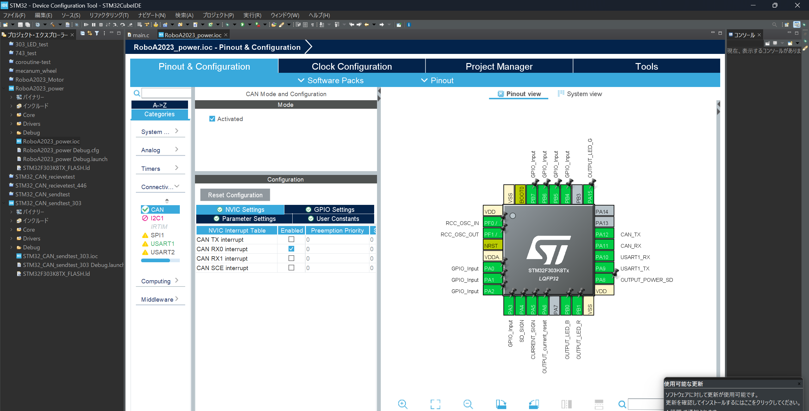
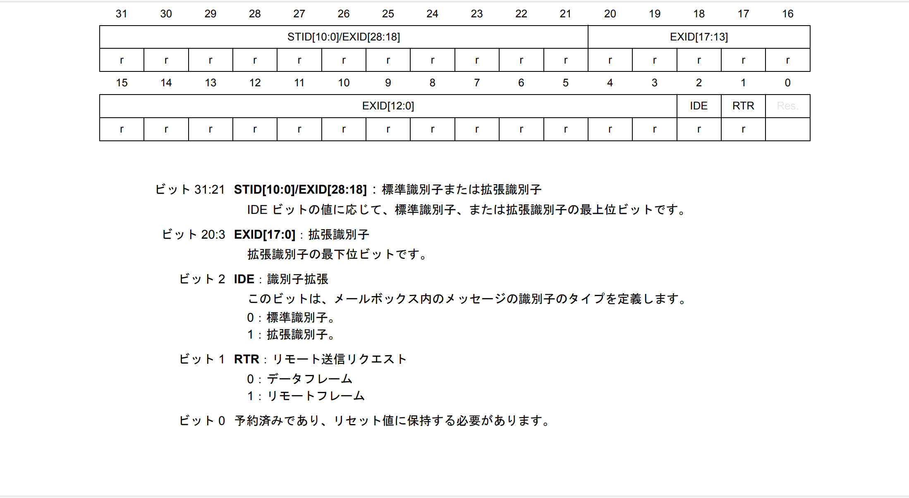
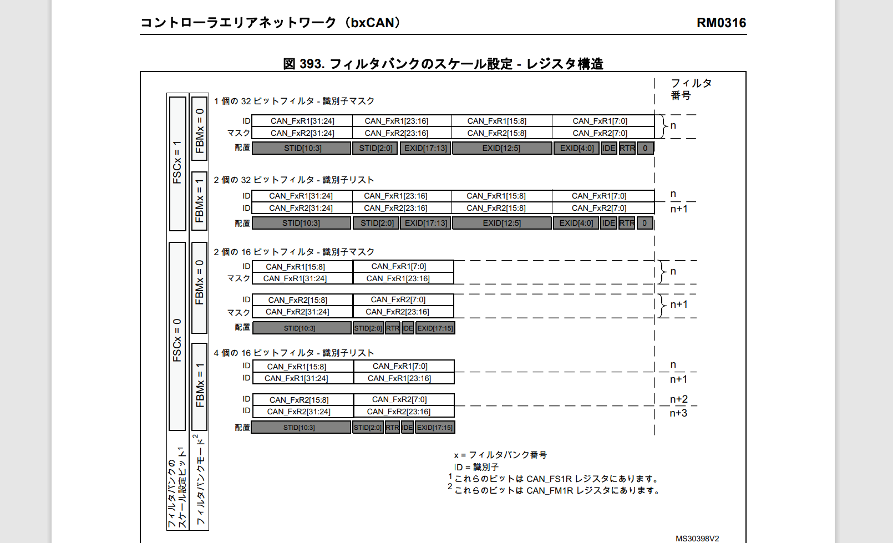

# まえおき

とりあえずCANを触りたいけど資料がねえ！かと言ってソースコード見ても何がなんだかわからん！という人向け
STM32F303Kを基本に説明していきます。

追伸：~~dual CANとか触ったことないから間違えてたらごめん~~

# CAN通信とは

- ノイズに強くてそこそこ早い(基板どうしの通信に向いている)
- 複数の機器を１本の配線にまとめて繋ぐことができる(1対1通信に比べて配線の削減が可能)
- 通信には専用のIC(CANトランシーバー)が必要
- ~~デリケート(UART比)~~

# STM32で実装する

## プログラムを書く前の初期設定
ピン割り当てとボーレート(通信速度)を設定します

ピン割り当ては回路の人に聞きましょう。回路の人にピン割り当ての設定をお願いしてもいいでしょう。下画像はあくまで一例。



ピン割り当てが終わったら通信速度の設定。まずはマイコン内部のクロックの設定。

`APB1`がCAN通信で使用されるクロックです。不安な人はデータシートで確認しましょう。

この画像では30MHzで合わせていますが、ボーレートが合っていれば必ずしも30MHzである必要はありません。


2023年度本ロボでは500kbpsで設定しました。




クロックの設定が終わったらパラメータを設定します。変更するパラメータは`Prescaler`,`Time Quanta in Bit Segment 1`,`Time Quanta in Bit Segment 2`の三ヶ所です。

三か所を設定したら`Baud Rate`の値がお目当ての値になっているかを確認しましょう。

設定する値が分からねえという方は後述するサイトで計算しましょう。



<br>

パラメータを計算する便利なサイトの使い方


[ボーレート計算サイト](http://www.bittiming.can-wiki.info/)
＜クロックとボーレートを入力すると設定パラメータが出てくる

- 一番上のパラメータを`ST Microelectronics bxCAN`に設定
- `Clock Rate`にクロックの設定画面で確認したAPB1の値を入力
- `Sample-Point`を適当に入力(80%ぐらい？機器どうしで統一するのが無難か。)
- `SJW`をスルー
- 最後の枠に設定したいボーレートを入力
- `Request table`をポチる
- 表をもとにパラメータを設定。

`Seg 1`が`Time Quanta in Bit Segment 1`に、`Seg 2`が`Time Quanta in Bit Segment 2`に対応しています。



受信プログラムを実装する時は、`NVIC Settings`で割り込み処理を設定しましょう。

FIFO0を使う場合は`CAN RX0 interrupt`,FIFO1を使う場合は`CAN RX1 interrupt`にチェックを入れます。



保存してコード生成すれば完了です。

 
 ## プログラムでの初期設定(送信編)

 while()ループに入る前に以下の関数を呼びましょう。

- `HAL_CAN_Init(CAN_HandleTypeDef *hcan);`
- `HAL_CAN_Start(CAN_HandleTypeDef *hcan);`

`CAN_HandleTypeDef`構造体は自動生成されているはずです。

 ## プログラムでの初期設定(受信編)

 while()ループに入る前に以下の関数を呼びましょう。

 - `HAL_CAN_Init(CAN_HandleTypeDef *hcan);`
 - 受信ボックスのフィルタを設定しましょう(後述)
 - `HAL_CAN_Start(CAN_HandleTypeDef *hcan);`
 - `HAL_CAN_ActivateNotification(CAN_HandleTypeDef *hcan, uint32_t ActiveITs);`

`CAN_HandleTypeDef`構造体は自動生成されているはずです。

`HAL_CAN_Activate…`は割り込み処理を開始する関数です。例えばFIFO0を使用する場合は`uint32_t ActiveITs`に、`CAN_IT_RX_FIFO0_MSG_PENDING`のようなマクロがあるのでそれを渡しましょう。

 ## プログラムでの送信(送信編)

**何回も呼び出す処理になるので関数として置いておくのがおすすめです。**

 - `HAL_CAN_GetTxMailboxesFreeLevel(const CAN_HandleTypeDef *hcan)`を呼び、返り値が1以上であることを確認しましょう。ここではCANの送信に必要なメールボックスが空いているかを確認しています。
 - `CAN_TxHeaderTypeDef`型の構造体を定義します。この構造体に必要なパラメータを入れていきます。
 - `uint8_t`型の配列を定義します。これに送るデータを入れます。
 - 送信先のIDを設定します。使える範囲は標準IDの場合は0x0~0x7ff、拡張IDの場合は0x0~0x1fffffffまでです。標準IDを使用する場合は`TxHeader.StdId`に、拡張IDを使用する場合は`TxHeader.ExtId`に入れましょう。**ただし、現状では動作確認が取れていないため拡張IDは非推奨です。**
 - この通信が、相手にデータを送っているのか、相手にデータを要求しているのかを設定します。`TxHeader.RTR`に入れましょう。データフレームなら`CAN_RTR_DATA`、リモートフレームなら`CAN_RTR_REMOTE`とマクロが定義されているので、指定する際に活用しましょう。
 - CANのIDが標準か拡張かを設定します。`TxHeader.IDE`に入れましょう。標準IDなら`CAN_ID_STD`、拡張IDなら`CAN_ID_EXT`とマクロが定義されているので、指定する際に活用しましょう。
 - 送るデータの長さを設定します。`TxHeader.DLC`に入れましょう。バイト数で指定するので、例えばuint8_t型の要素数2の配列を送りたい時は2と指定します。
 - タイムスタンプ関係と思われる謎の設定があるので無効化しておきましょう。`TxHeader.TransmitGlobalTime`に`DISABLE`を設定すればおけ。
 - 最後に`HAL_CAN_AddTxMessage(CAN_HandleTypeDef *hcan, const CAN_TxHeaderTypeDef *pHeader,const uint8_t aData[], uint32_t *pTxMailbox)`を呼んで送信します。`pTxMailbox`には使用したメールボックスの番号が入れられますので、適当な変数を宣言して指定して渡してあげましょう。

<br>

 <details><summary>サンプルコード</summary>


```C
/*CAN送信*/
uint32_t CAN_write(uint32_t StdID, uint32_t RTR, uint32_t DLC, uint8_t Data[]) {
	if (HAL_CAN_GetTxMailboxesFreeLevel(&hcan) > 0) {
		CAN_TxHeaderTypeDef TxHeader; //CANのデータを突っ込む構造体
		uint32_t TxMalibox; //送信に使用したメールボックスの番号を突っ込む

		//IDを設定
		//範囲0x0000~0x7ff
		TxHeader.StdId = StdID;

		//フレームの種類を設定
		//データフレーム:CAN_RTR_DATA
		//リモートフレーム:CAN_RTR_REMOTE
		TxHeader.RTR = RTR;

		//標準IDor拡張ID
		//標準ID:CAN_ID_STD
		//拡張ID:CAN_ID_EXT
		TxHeader.IDE = CAN_ID_STD;

		//送信したデータ長
		//範囲0x0~0x8
		TxHeader.DLC = DLC;

		//タイムスタンプを送るかどうかの設定
		//無効でよいかと
		TxHeader.TransmitGlobalTime = DISABLE;

		//送信
		HAL_CAN_AddTxMessage(&hcan, &TxHeader, Data, &TxMalibox);

		return TxMalibox;
	} else {
		return 3;
	}
}
```
</details>


 ## プログラムでの受信(受信編)

 割り込み処理を利用します。
 **割り込み処理時に呼ばれる関数は、関数名が固定です。**
 注意しましょう。

 この割り込みはFIFO0もしくはFIFO1のそれぞれ対応する方にデータを受信した場合に発動します。
 また、CAN1とCAN2のように複数のCANモジュールを持つマイコンでも、共用のようです。
 
 `FIFO0`を利用する場合の関数名は

 ```C 
 void HAL_CAN_RxFifo0MsgPendingCallback(CAN_HandleTypeDef *hcan){}
 ```
  `FIFO1`を利用する場合の関数名は
  ```C
 void HAL_CAN_RxFifo1MsgPendingCallback(CAN_HandleTypeDef *hcan){}
  ```
以上の関数を定義し、その中に割り込み処理を書きましょう。
 
 <br>

注意：`stm32f3xx_hal_can.c`等に
 ```C
__weak void HAL_CAN_RxFifo0MsgPendingCallback(CAN_HandleTypeDef *hcan){}
 ```
 のような関数がありますが、ここに処理を書いてはいけません。`__weak`がついている関数はユーザーが同名の関数を定義した際にユーザーの定義が優先される関数です。

 <br>

 - `CAN_RxHeaderTypeDef`構造体を定義します。この構造体に受信したデータが入ります。
 - `uint8_t`型の配列を定義します。ここに受信したデータが入ります。**受信データのサイズを気にしましょう。**
 - `HAL_CAN_GetRxMessage(CAN_HandleTypeDef *hcan, uint32_t RxFifo,CAN_RxHeaderTypeDef *pHeader, uint8_t aData[])`を呼び、受信データを受け取ります。
 - ID等の情報は先ほど定義した`CAN_RxHeaderTypeDef`型の構造体に入っています。ただしIDは標準IDか拡張IDかで読みだす変数が違いますので注意しましょう。
 - 受信データは`uint8_t`型の配列に入りますので、後は好きに使いましょう。ただし、割り込み関数に長い処理を書くことは非推奨です。

 <br>

 <details><summary>サンプルコード</summary>


```C
/*CAN受信*/
uint32_t id;
uint32_t dlc;

void HAL_CAN_RxFifo0MsgPendingCallback(CAN_HandleTypeDef *hcan) {
	SET_LED_B();
	CAN_RxHeaderTypeDef RxHeader;
	uint8_t RxData[8];
	if (HAL_CAN_GetRxMessage(hcan, CAN_RX_FIFO0, &RxHeader, RxData) == HAL_OK) {
		id = (RxHeader.IDE == CAN_ID_STD) ? RxHeader.StdId : RxHeader.ExtId; // ID
		//このプログラムでは三項演算子で実装している
		dlc = RxHeader.DLC;                                               // DLC
		
		//ここから処理を書く
		system_data[RxData[0]] = RxData[1];

	}
}
```
</details>

## CANの受信フィルタについて
STM32には、受信したデータを、IDで判断して勝手に取捨選択してくれる機能があります。

これらの処理はハードウエアで行われるため、CPUの処理が軽くなります(らしい)

`CAN_FilterTypeDef`型の構造体に設定項目を入れて関数に渡す形になっています。レジスタをいじるのは関数がやってくれます。

### IDについて

IDは11bitの標準IDもしくは29bitの拡張IDを使用することができる。ロボコンでは標準IDで十二分だと思われます。拡張IDは動作確認が取れていないため非推奨です。

### リストモードとマスクモード

リストモード：予め登録したIDと一致した時にデータをFIFOに格納する。フィルタバンク一個あたり、標準IDでは4個、拡張IDでは2個登録できる。

マスクモード：予め設定したマスクデータとの
**論理積をとり、**
登録したIDと一致した時にデータをFIFOに格納する。フィルタバンク一個あたり、標準IDでは2組、拡張IDでは1組のマスクデータとIDを登録できる。

### フィルタバンク
FIFOに格納するデータのID、FIFO0とFIFO1のどちらに格納するか？といった情報を格納する。
1枠で2個のIDを登録でき(リストモード、拡張IDの場合)、CANモジュールが一個のものには14枠、二個のものには28枠(ただしCAN1とCAN2で共用)ある。

### フィルタースケール

標準ID(11bit)なのに拡張ID(29bit)と同じレジスタの使い方だと無駄が多いよね

じゃあ余っているスペース使ってもう一個設定できるようにしよう！

…とSTmicroが言ったかは知らないが、32bitモードと16bitモードがあり、標準IDを使用する場合は16bitモードを使用することで、拡張IDの時よりも設定できるIDやマスクデータを増やす事ができる。

### 設定項目

- `filter.FilterIdHigh`
- `filter.FilterIdLow`
- `filter.FilterMaskIdHigh`
- `filter.FilterMaskIdLow`

IDやマスクデータを入れます。ただしちょっと面倒。

リファレンスマニュアルより該当するレジスタの例がこちら。下位ビットに別の役割が割り当てられています。



じゃあ関数が上手いことやって…くれたらよかったんだけどなあ。
```C
関数のレジスタ操作個所を抜粋
can_ip->sFilterRegister[sFilterConfig->FilterBank].FR1 =
    ((0x0000FFFFU & (uint32_t)sFilterConfig->FilterIdHigh) << 16U) |
    (0x0000FFFFU & (uint32_t)sFilterConfig->FilterIdLow);
```
**下位3ビットのことを考えていねえ！**
ということで
**ユーザーがその辺を考慮しなければなりません。**

また、標準IDか拡張IDかという問題のほかにフィルタースケールという要素もあり、ややこしいことこの上ないです。
さらに上位ビットと下位ビットで分かれており、地味に面倒

要するに

1. レジスタの下位側に別のレジスタが3bitあるからそれ考慮しよう(スケール16bitで標準IDの時は下位5bit)
2. 標準ID or 拡張IDという要素とフィルタスケールの2個の要素によって設定可能な数が違う
3. 同じレジスタのはずなのに、上位16ビット(○○High)と下位16ビット(○○Low)で分かれている
4. 関数に渡したときレジスタに代入されるのは(○○High)、(○○Low)ともに下位16bit(上位16bitは無視)

以上の4点を考慮して設定しましょう。よくわからない方は後述するサンプルコードを併せて読んでみてください。

- `filter.FilterScale`

先述したフィルタスケールを設定します。`CAN_FILTERSCALE_32BIT`もしくは`CAN_FILTERSCALE_16BIT`を指定しましょう。

- `filter.FilterFIFOAssignment`

使用するFIFOを指定します。`CAN_FILTER_FIFO0`もしくは`CAN_FILTER_FIFO1`を指定しましょう。

- `filter.FilterBank`

設定を割り当てるフィルタバンクの番号を指定します。CANモジュールが一個のものには14枠(0~13)、二個のものには28枠(0~23)あります。

- `filter.FilterMode`

フィルタモードを指定します。`CAN_FILTERMODE_IDMASK`もしくは`CAN_FILTERMODE_IDLIST`を指定しましょう。

- `filter.SlaveStartFilterBank`

CAN1とCAN2があるマイコンでもフィルタバンクは共用であるため、何番のフィルタバンクからをCAN2に割り当てるかを指定します。CANが1系統しかないマイコンでは2系統あるマイコンとの互換性維持のために置いているだけでレジスタには反映されないので、適当に設定しているよいです。

- `filter.FilterActivation`

フィルタの有効or無効を指定。`ENABLE`もしくは`DISABLE`を指定しましょう。

- `HAL_CAN_ConfigFilter(CAN_HandleTypeDef *hcan, const CAN_FilterTypeDef *sFilterConfig); `

これに構造体を渡してレジスタ設定をやってもらいます。

1回で1個のフィルタバンクしか設定できないので、複数設定したい場合は構造体を設定して関数に渡すという流れを複数回おこなう必要があります。


**＜ID・フィルタスケール・モード対照表(拡張ID非推奨)＞**

| ID | スケール | モード | フィルタバンク1個あたり設定可能数 | シフト数 |
| :-:| :-:| :-: | :-: | :-: |
|標準|32bit|リスト|2個のID| HIGH：左21シフト後右16シフト
|||||LOW：左21シフト
|標準|32bit|マスク|1組のIDとマスク| HIGH：左21シフト後右16シフト
|||||LOW：左21シフト
|標準|16bit|リスト|4個のID|HIGH：左5シフト
|||||　LOW：左5シフト
|標準|16bit|マスク|2組のIDとマスク|HIGH：左5シフト
|||||　LOW：左5シフト
|拡張|32bit|リスト|2個のID|HIGH：左3シフト後右16シフト
|||||LOW：左3シフト
|拡張|32bit|マスク|1組のIDとマスク|HIGH：左3シフト後右16シフト
|||||LOW：左3シフト
|拡張|16bit|リスト|不可|
|拡張|16bit|マスク|不可|

<br>


<サンプルコード集(動作確認できたものから追加)>


 <details><summary>サンプルコード(標準ID,32bit,リストモード,フィルタバンク複数使用)</summary>

```C
	uint32_t fId1 = 0x000 << 21; // フィルターID1
	uint32_t fId2 = 0x010 << 21;  // フィルターID2

	CAN_FilterTypeDef filter;
	filter.FilterIdHigh = fId1 >> 16;            // フィルターID1の上位16ビット
	filter.FilterIdLow = fId1;                  // フィルターID1の下位16ビット
	filter.FilterMaskIdHigh = fId2 >> 16;            // フィルターID2の上位16ビット
	filter.FilterMaskIdLow = fId2;                  // フィルターID2の下位16ビット
	filter.FilterScale = CAN_FILTERSCALE_32BIT; // フィルタースケール
	filter.FilterFIFOAssignment = CAN_FILTER_FIFO0; // フィルターに割り当てるFIFO
	filter.FilterBank = 0; // フィルターバンクNo
	filter.FilterMode = CAN_FILTERMODE_IDLIST; //フィルターモード
	filter.SlaveStartFilterBank = 14; //スレーブCANの開始フィルターバンクNo
	filter.FilterActivation = ENABLE; //フィルター無効／有効
	HAL_CAN_ConfigFilter(&hcan, &filter); //設定を確定

	fId1 = 0x020 << 21; // フィルターID1
	fId2 = 0x030 << 21;  // フィルターID2


	filter.FilterIdHigh = fId1 >> 16;            // フィルターID1の上位16ビット
	filter.FilterIdLow = fId1;                  // フィルターID1の下位16ビット
	filter.FilterMaskIdHigh = fId2 >> 16;            // フィルターID2の上位16ビット
	filter.FilterMaskIdLow = fId2;                  // フィルターID2の下位16ビット
	filter.FilterScale = CAN_FILTERSCALE_32BIT; // フィルタースケール
	filter.FilterFIFOAssignment = CAN_FILTER_FIFO1; // フィルターに割り当てるFIFO
	filter.FilterBank = 1; // フィルターバンクNo
	filter.FilterMode = CAN_FILTERMODE_IDLIST; //フィルターモード
	filter.SlaveStartFilterBank = 14; //スレーブCANの開始フィルターバンクNo
	filter.FilterActivation = ENABLE; //フィルター無効／有効
	HAL_CAN_ConfigFilter(&hcan, &filter); //設定を確定

	HAL_CAN_Start(&hcan);
	HAL_CAN_ActivateNotification(&hcan,CAN_IT_RX_FIFO1_MSG_PENDING);
	HAL_CAN_ActivateNotification(&hcan,CAN_IT_RX_FIFO0_MSG_PENDING);
```
</details>

<details><summary>サンプルコード(標準ID,32bit,マスクモード)</summary>

```C
	uint32_t fId1 = 0x7f0 << 21; // フィルターID1
	uint32_t fId2 = 0x7f0 << 3;  // フィルターID2
	//0x7f0~0x7ffがフィルタを通過できる

	CAN_FilterTypeDef filter;
	filter.FilterIdHigh = fId1 >> 16;            // フィルターID1の上位16ビット
	filter.FilterIdLow = fId1;                  // フィルターID1の下位16ビット
	filter.FilterMaskIdHigh = fId2 >> 16;            // フィルターID2の上位16ビット
	filter.FilterMaskIdLow = fId2;                  // フィルターID2の下位16ビット
	filter.FilterScale = CAN_FILTERSCALE_32BIT; // フィルタースケール
	filter.FilterFIFOAssignment = CAN_FILTER_FIFO0; // フィルターに割り当てるFIFO
	filter.FilterBank = 0; // フィルターバンクNo
	filter.FilterMode = CAN_FILTERMODE_IDMASK; //フィルターモード
	filter.SlaveStartFilterBank = 14; //スレーブCANの開始フィルターバンクNo
	filter.FilterActivation = ENABLE; //フィルター無効／有効
	HAL_CAN_ConfigFilter(&hcan, &filter); //設定を確定

	HAL_CAN_Start(&hcan);
	HAL_CAN_ActivateNotification(&hcan, CAN_IT_RX_FIFO1_MSG_PENDING);
```
</details>
<br>

# 資料
- [CAN通信を解説しているサイト](https://hsdev.co.jp/stm32-can/)

数少ない日本語解説サイト。データシートやリファレンスマニュアルを読む前に読むと、それらが何を言っているのか分かりやすいと思われる。

- [公式リファレンスマニュアル](https://www.stmcu.jp/design/document/reference_manual_j/)

レジスタ設定について記載。HALライブラリのソースコードとあわせてどうぞ。
ブラウザのpdf内語句検索機能がものすごく使える。

- 公式データシート

ピン割り当てなどを知りたい時にどうぞ。~~ピン割り当て設定画面で良くね。~~

- HALライブラリソースコード

プロジェクトファイルが置かれている階層から見て`Drivers\STM32F3xx_HAL_Driver`のようなフォルダにCAN関係の関数が書かれているソースファイルやヘッダファイルが置かれている。
分からない時は気になる変数や構造体をダブルクリックして選択し、右クリックして宣言を開くをクリックすると該当箇所まで飛んでくれる。
**特にヘッダファイルには、HALライブラリに限らず関数や構造体の説明が書かれていることが多いので詰まったら読んでみよう。**
