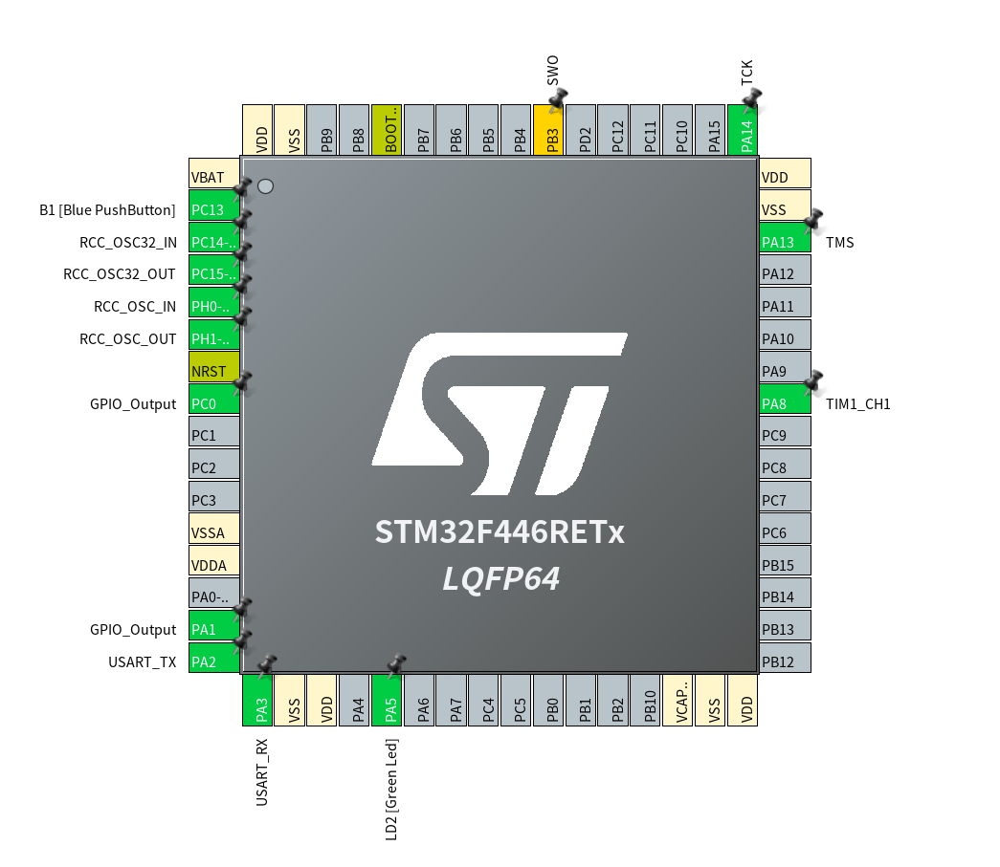
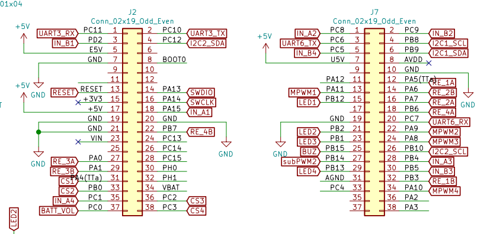
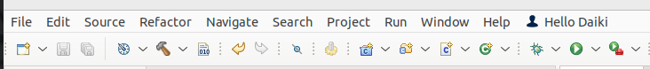

## Section 1 モーターとエンコーダーの基礎的な使い方
### 必要なもの
* C言語の知識(苦C 11章の自作関数の話がわかると良い)
* STM32 CubeIDE
* モーターを回せて、エンコーダーが読み取れる基板

### モーターの使い方
ここではモーターの回し方について説明する
#### CubeMXの設定
まず、CubeIDEにてプロジェクトを作成してCubeMX(.iocファイル)を開いてほしい、この画面が出るはず。  
 

次に基板の回路図を見てみよう。  
この基板のどこがモーターを回すために必要なピンになっているか、考えてみよう。  
  
正解は、MPWM IN_A IN_B の3つである(それぞれ 1~4まである)

それぞれのピンがどんな働きをするか、以下に示す
* MPWM  
MotorPWMの意味 モータードライバーに、PWM波形を送る  
それのDuty比が、モーターにかかる電圧の割合となる
* IN_A IN_B  
このピンは、 モーターの回転方向をかえるのに使う  
NAND素子を使って、ひとまとめにDIRECTIONなどと称している例もある  
どちらかに電圧をかけると、正転・逆転  
両方にかけるとブレーキ、両方にかけないとフリーランとなる  

さて、ピンの場所と役割がわかったところで、CubeMXに戻ろう  
今回はこの基板で1番のモーターを回すことを目的にする  
(設定するのは MPWM1 IN_A1 IN_B1)  
まずは、PA11(MPWM1)をクリック、そうすると色々出てくると思う  
(STM32は高機能なので、一つのピンでいろいろなことができるようになっている。)  
今回はこの中から TIM1_CH4を選ぼう
次に、IN_A IN_Bのピン設定をしよう  
それぞれに対応したピンを選択して、GPIO_OUTPUTを選択するようにする

ピンの機能の選択をしたら、次は機能の設定をする  
横にあるTimerの部分を展開して、TIM1を選ぶ
clock_sourceを internal_clockにせっていし、次にChannel4 を PWM_Generation_CH4 にする

下にある parameter settingsにある counter period が 65535になっていることを確認して.iocファイルをセーブし、コードを生成する

#### モーターを回すコード
##### セットアップ
早速モーターを回す関数を呼び出したいところだが、実はまだPWM波形を出力できる状態ではない  
そこで、user_code_2 の部分に以下のコードを追加する
```cpp
HAL_TIM_PWM_Start(&htim1, TIM_CHANNEL_4);
```
この関数を使うとチャンネルが有効化されて、PWM波を生成するようになる  

##### 出力
これでようやくモーターが準備ができたので、実際に回すための命令を書いていこう  
user_code2 ないしは while文の部分に以下のコードを追加する(今回はwhileに書く)
```cpp
//回転方向を決める
HAL_GPIO_WritePin(GPIOA, GPIO_PIN_15, GPIO_PIN_SET);
HAL_GPIO_WritePin(GPIOD, GPIO_PIN_8, GPIO_PIN_RESET);
//出力値を決める
__HAL_TIM_SET_COMPARE(&htim1, TIM_CHANNEL_4, 5000);
```
さて、これで準備ができた。さぁ、コンパイルして書き込んでみよう  
上の方にあるツールバーの、トンカチがコンパイル 再生ボタンが書き込みだ。
  
初回は再生ボタンを押すとなんか出るけど、一旦無視してOKを押すと書き込まれる

モーターは回っただろうか？

### エンコーダーの使い方
#### CubeMXの設定
再度、CubeMXを開いてほしい  
そうして、もう一度回路図を見てみよう エンコーダーで使うピンはどれだろうか？
  
正解は、RE_xA RE_xBの2つである(それぞれ 1~4まである)
他の書き方では、 ENCx_Aなどとも書かれることがある

ロータリーエンコーダーの詳細な説明は他の記事に任せるとして(たぶんPI制御の時に私が書くことになるが)  
これらのピンの設定は、  
まず、先程と同じようにそれぞれのピンをCubeMX上でクリックする  
すると色々出てくるが、記事で使用している基板の場合は、TIM2_CH1 or CH2 をクリックする  
2ピンとも選択したら、先程のモーターと同じようにタイマーの設定画面を開く(今回はTIM2)    
設定画面のCombined Channelsを展開する  選択肢の中に"Encoder Mode"があるはずなのでそれを選択する  
おそらくEncoder Modeを選択すると、CH1とCH2のモード選択部分が灰色になって選択できないようになる  
仕上げに、prameter settings内にある counter period を 65536 に、 Encoder Modeを Encoder Mode TI1 and TI2に設定する  
これでCubeMX上での設定は終わりなので、.iocファイルをセーブしてコードを生成する

#### エンコーダーを読み取ってみる
##### 下準備・セットアップ
こちらも、読み取る関数を書く前に、準備するものがある  
1つは、エンコーダーの読み取りを始める命令を出す関数
もう一つは、読み取ったデータを、PCに送信するための関数である
  
まずは、エンコーダーの読み取りを始める関数を user_code2の部分に書く
```cpp
HAL_TIM_Encoder_Start(&htim2, TIM_CHANNEL_ALL);
```

次に読み取ったデータをPCに送信するための関数だが、今回はこの関数を使用する
```cpp
int __io_putchar(int ch) {
    HAL_UART_Transmit(&huart2, (uint8_t *)&ch, 1, 100);
    return ch;
}
```
これをuser_code0の部分に書く  
(やっていること: syscall.cにある関数を上書きしている((システムコールの上書き)))  
なお、nucleoF446reを使用していると仮定してUARTの設定を省略している、  
ほかの基板だと設定されていない可能性があるので、各自で調べてほしい(それか section2をチェック)  
さらに、user_code2の部分にこれを書いておく
```cpp
setbuf(stdout, NULL);
```
(やっていること:標準出力のバッファをなくす)
  
これらを使うと、UART2からの出力をおなじみのprintfで行うことができるようになる  
なので、stdio.hのインクルードを忘れずに  

##### エンコーダーの値を読む
では、エンコーダーの値を読んで、PCで読ませてみることにしよう  
エンコーダーの値を読むには
```cpp
__HAL_TIM_GET_COUNTER(&htim2);
```  
関数を使う(実際はマクロだが)
この関数の戻り値は uint32_t ではあるが、先程 counter periodを16bitの範囲に収めたので 戻り値の格納はuint16_tで十分である  
よってprintfによる出力を含めて user_code2は次のように書く
```cpp
uint16_t encoder_count = __HAL_TIM_GET_COUNTER(&htim2);
printf("%d", encoder_count);
HAL_Delay(100); //処理を100ms止める関数
```

さて、エンコーダーをくるくる回したら、値が変化しただろうか？

### 課題
エンコーダーを回転させると、現在のところ値が累積していき、counter periodに達するとリセットされるようになっている  
これを次のように機能させるようにプログラムを変更せよ

1. 1周期の間に何カウント分回転したかを表示する
2. 回転方向を判別して、counter periodを超えても値を累積し続けられるようにする