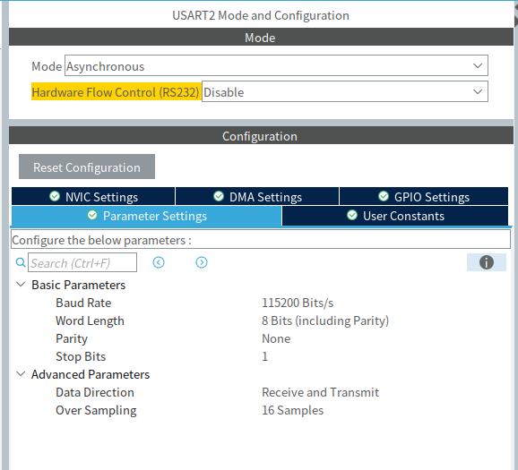

## Section 2 UART on STM32 (割り込みとかのテクニック))
### UART通信のやりかた(送信)
前回のモーターと同じ要領で、基板のピン設定をしよう  
選択するのは USARTx_RX/TX もしくはUARTx_RX/TX  
ボーレートなどの設定は、parameter settingsを開き、
送信側と受信側で速度を同一にして設定するようにする  
基本的には、 9200 bit/s や 115200 bit/sなどに設定することが多い。  
  
これで送信向けのCubeMXの設定はおわり  
.iocファイルを保存して、main.cを生成しよう  

いつものように生成したら、
今回使用する関数を紹介する
```cpp
HAL_UART_Transmit(UART_HandleTypeDef *huart, const uint8_t *pData, uint16_t Size, uint32_t Timeout);
```
これが、今回使用する関数である。
使い方を出しながら、引数について見てみよう
```cpp
//on 2024 honrobo R2-3v2 board
void im920_ch_select(){
  //stch setup
	uint8_t setup_data[] = "STCH 12\n\r";
	uint8_t stth_data[] = "STTH AA\n\r";
  for(int i=0; i<1; i++){
    HAL_UART_Transmit(&huart2, setup_data, sizeof(setup_data), 100);
    HAL_UART_Transmit(&huart2, stth_data, sizeof(stth_data), 100);
  }
}
```
第1引数の *huartは、UARTハンドラをポインタ渡しする モーターとのときと同じ  
第2引数の *pDataは、送信する配列(uint8 or uint16)の先頭アドレスを入れる  
第3引数の Sizeは、送信する配列の要素数を入れる  
第4引数の Timeoutは、送信時のタイムアウト時間を入れる  

この関数を実行するだけで、送信はできる  
送信割り込みとか色々高度なことは可能だけど、まぁ一旦このくらいで

### UART通信のやりかた(受信)
実は送信より受信のほうが難しい  
というわけで、受信処理について学ぼう  
まず、受信の関数はこれ
```cpp
HAL_UART_Receive(UART_HandleTypeDef *huart, uint8_t *pData, uint16_t Size, uint32_t Timeout);
```
これを使えばかんたんに受信できる...というわけではない  
詳しいことは省くが、このポーリングという受信のやり方は、受信漏れが起きることがあるので、  
あまりおすすめしない  
  
だったらどうやって受信するの？？？？？？？  
私なら 「割り込み」を使う  
ここで突然ですが、「割り込み」について知っていますか？  
割り込みとは、進んでいる処理を一度中断して、  
優先度の高い他の処理を先に実行することです(処理が終わったら、途中から続ける)  (適当)  

...ということで、UART通信の割り込みについて知っておこう  
まずはこの関数について、
```cpp
HAL_UART_Receive_IT(UART_HandleTypeDef *huart, uint8_t *pData, uint16_t Size);
```
この関数は、さっきのものに  「IT」 がついただけだ  
この 「IT」 勘の良いひとは築くかもしれないが、 interrupt の意味だと思います  

この関数の使い方は、今までと少し違うので、実際に使ってる部分を見てほしい  
```cpp
//on code space 2
uint8_t rx_buffer; //配列でもよい
HAL_UART_Receive_IT(&huart2, rx_buffer, 1); //uart2 , バッファ, 受信サイズ(この分)

//other code space
void HAL_UART_RxCpltCallback(UART_HandleTypeDef *huart){
	//UART callback
	HAL_GPIO_TogglePin(LED1_GPIO_Port, LED1_Pin);
  if (huart->Instance == USART2){
   //処理 
  }
  rx_buff=0;
  HAL_UART_Receive_IT(&huart2, &rx_buff, 1); //もう一回トリガーをかける
}
```